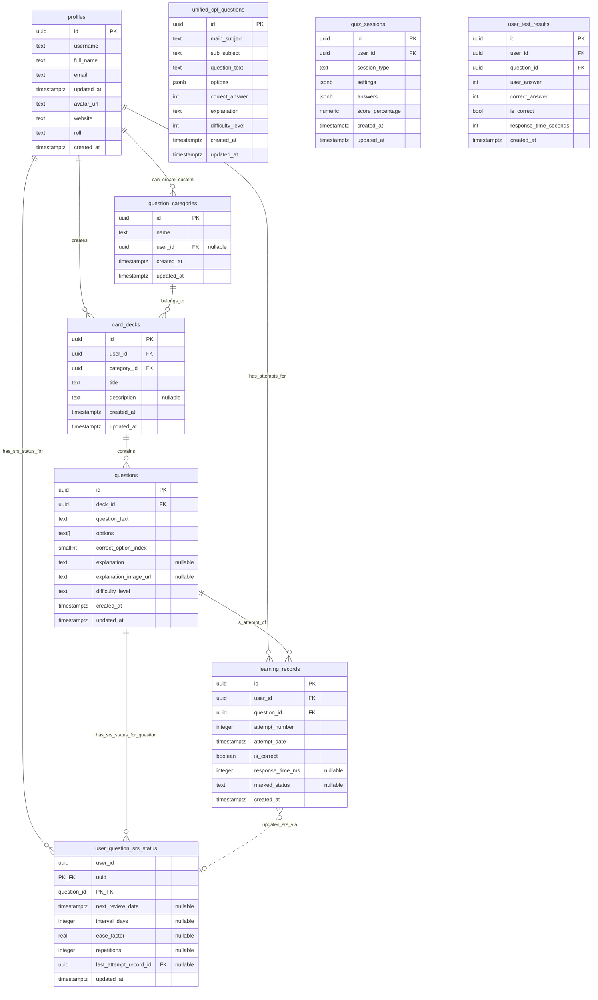
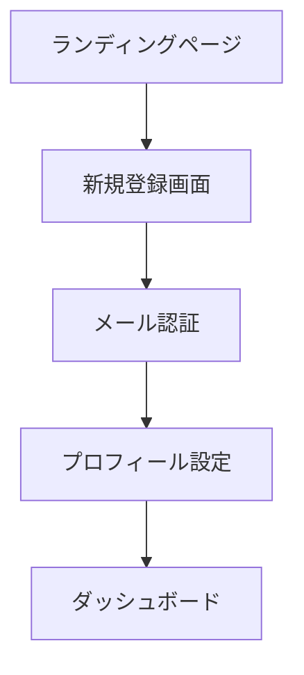
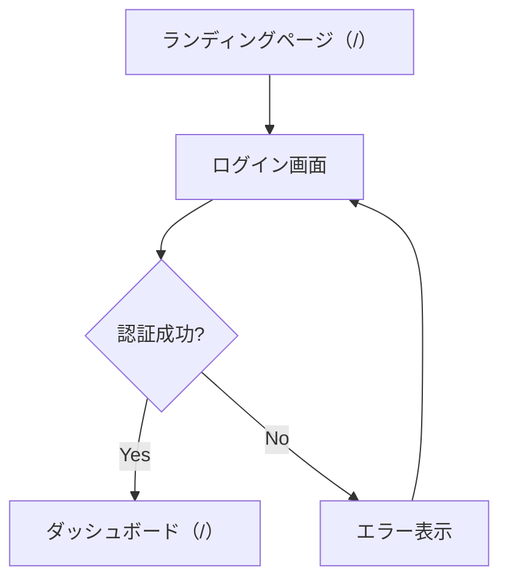
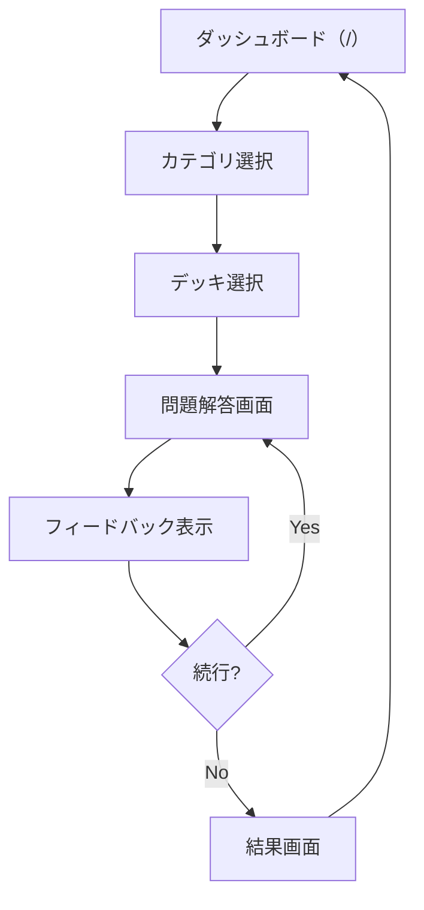

# FlightAcademyTsx 設計仕様書

## 📋 概要

このドキュメントは、FlightAcademyTsxプロジェクトの詳細な設計仕様、API仕様、データベース設計、UI/UX仕様について包括的に説明します。

**最終更新**: 2025年11月30日（Whisky Papa Phase 1-4実装完了）
**バージョン**: Design Specification v3.0

---

## 📚 記事システム設計（Phase 5実装済み）

### **記事メタデータ管理**

#### **ArticleMeta型定義**
```typescript
export type ArticleMeta = {
  type: 'article';
  title: string;
  slug: string;
  tags: string[];
  series?: string;
  order?: number;
  readingTime?: number;
  excerpt?: string;
  publishedAt?: string;
  author?: string;
  heroImage?: string;
};
```

#### **記事インデックスシステム**
- **ファイルベース管理**: `import.meta.glob`による動的記事収集
- **型安全なインデックス**: `ArticleIndexEntry`による構造化管理
- **キャッシュ機能**: パフォーマンス最適化のための記事インデックスキャッシュ
- **検索・フィルタリング**: タグ、シリーズ、著者による高度な検索機能

#### **記事フォーマット仕様（2025年1月15日 追加）**

##### **参考書籍セクション**
書籍を引用した記事には、記事末尾に「参考書籍」セクションを追加する：

```mdx
## 参考書籍

- [『書籍タイトル』（著者名）](https://www.amazon.co.jp/dp/ASIN/?tag=your-tag-here)
```

##### **書籍引用のガイドライン**
- **適正な引用範囲**: 主従関係の明確化、引用部分の明確な区別、出典の明示
- **引用形式**: `<Highlight>`タグまたはカギ括弧（『』）で明示
- **Amazonアソシエイトリンク**: 記事末尾の参考書籍セクションに配置

##### **著作権対策**
- **映画・作品コンテンツ**: 直接的なタイトル・キャラクター名の使用を避け、オマージュ・パロディとして表現
- **英語セリフ**: 直接引用を避け、キャラクター設定に沿った日本語要約を使用

### **記事表示システム**

#### **コンポーネント構成**
```
ArticleDetailPage
├── ReadingProgressBar (残り時間表示・進捗管理、プログレスバー非表示)
├── MDXLoader (動的記事読み込み)
│   └── MDXContent
│       ├── ArticleHeader (メタ情報表示)
│       ├── TableOfContents (目次・ナビゲーション)
│       ├── MDXContentWithTheme (記事本文)
│       └── RelatedArticles (関連記事推薦)
├── CommentSection (コメント機能)
│   ├── CommentForm (コメント投稿・編集フォーム)
│   └── CommentItem (個別コメント表示)
├── PrevNextNav (前後記事ナビゲーション)
└── ScrollToButtons (スクロール支援)
```

#### **主要機能**
- **読書進捗追跡**: スクロール位置による進捗計算
- **残り時間表示**: 画面右上に動的な読了時間予測を表示
- **目次生成**: 見出しの自動抽出・アンカーリンク生成
- **関連記事推薦**: タグ・シリーズベースの自動推薦
- **SEO最適化**: JSON-LD、OGタグの自動生成
- **コメント機能**: 記事に対するコメント投稿・編集・削除・閲覧（2025年10月13日実装）

### **学習進捗システム（2025年10月13日実装）**

#### **データベース設計**
```sql
-- learning_progressテーブル
CREATE TABLE learning_progress (
  id UUID PRIMARY KEY DEFAULT gen_random_uuid(),
  user_id UUID REFERENCES auth.users(id) ON DELETE CASCADE,
  content_id TEXT NOT NULL,
  completed BOOLEAN DEFAULT false,
  progress_percentage INTEGER DEFAULT 0 CHECK (progress_percentage >= 0 AND progress_percentage <= 100),
  last_position INTEGER DEFAULT 0,
  last_read_at TIMESTAMPTZ,
  read_count INTEGER DEFAULT 0,
  created_at TIMESTAMPTZ DEFAULT now(),
  updated_at TIMESTAMPTZ DEFAULT now(),
  CONSTRAINT learning_progress_user_id_content_id_key UNIQUE (user_id, content_id)
);
```

#### **進捗追跡機能**

**useArticleProgress Hook**
```typescript
// Supabaseとの連携
- ページ離脱時に進捗を自動保存（95%以上で完了判定）
- 既存レコードの更新、新規レコードの挿入（UPSERT）
- ユーザーログイン時に全進捗データを自動読み込み
- ローカル状態とSupabase状態の同期管理
```

**ReadingProgressBar Component**
```typescript
// 進捗保存タイミング
- ページ離脱時（unmount時）のみ保存
- 5%未満の誤クリックは保存しない
- 95%以上のスクロールで自動的に完了マーク
- ログインユーザーのみ保存対象
```

**ProgressSidebar Component**
```typescript
// ダッシュボード表示
- カテゴリー別進捗の集計（記事のtags[0]から判定）
- 実際の進捗データに基づく統計表示
- 完了記事数、総記事数、達成率の可視化
```

#### **進捗データフロー**
```
1. ユーザーが記事を読む
   ↓
2. ReadingProgressBarがスクロール進捗を追跡
   ↓
3. ページ離脱時（別ページへ遷移、ブラウザを閉じる）
   ↓
4. useArticleProgress.updateArticleProgress()が呼ばれる
   ↓
5. Supabase learning_progressテーブルにUPSERT
   - 既存: progress_percentage, completed等を更新
   - 新規: 新しいレコードを挿入
   ↓
6. ArticlesDashboardで進捗を表示
   - useArticleProgress.loadInitialData()で全進捗取得
   - ProgressSidebarでカテゴリー別進捗を集計
```

#### **完了判定ロジック**
- **95%以上のスクロール**: 自動的に`completed = true`
- **5%未満のスクロール**: 保存しない（誤クリック防止）
- **5%〜95%**: 進捗のみ保存、未完了として記録

### **テーマ統合**
- **CSS変数活用**: `--hud-primary`, `--text-primary`, `--panel`
- **レスポンシブ対応**: モバイル・デスクトップ最適化
- **アクセシビリティ**: ARIA対応、キーボードナビゲーション

### **記事コメント機能（2025年10月13日実装）**

#### **データベース設計**
```sql
-- learning_content_commentsテーブル
CREATE TABLE learning_content_comments (
  id UUID PRIMARY KEY DEFAULT uuid_generate_v4(),
  content_id TEXT NOT NULL REFERENCES learning_contents(id) ON DELETE CASCADE,
  user_id UUID NOT NULL REFERENCES profiles(id) ON DELETE CASCADE,
  content TEXT NOT NULL,
  created_at TIMESTAMPTZ DEFAULT CURRENT_TIMESTAMP,
  updated_at TIMESTAMPTZ DEFAULT CURRENT_TIMESTAMP,
  CONSTRAINT learning_content_comments_user_content UNIQUE (id)
);

-- インデックス
CREATE INDEX idx_learning_content_comments_content_id ON learning_content_comments(content_id);
CREATE INDEX idx_learning_content_comments_user_id ON learning_content_comments(user_id);
```

#### **型定義**
```typescript
export interface ArticleComment {
  id: string;
  article_id: string;
  user_id: string;
  content: string;
  created_at: string;
  updated_at: string;
  user: {
    id: string;
    email: string;
    display_name: string;  // usernameを優先、未設定時は「名無しさん」
    avatar_url?: string;
  };
}

export interface CreateCommentRequest {
  article_id: string;
  content: string;
}

export interface UpdateCommentRequest {
  comment_id: string;
  article_id: string;
  content: string;
}

export interface DeleteCommentRequest {
  comment_id: string;
  article_id: string;
}
```

#### **機能仕様**

**ログインユーザー**:
- コメントの投稿（最大1000文字）
- 自分のコメントの編集
- 自分のコメントの削除（確認ダイアログ付き）
- 全コメントの閲覧
- ユーザー名未設定時は「名無しさん」と表示され、プロフィール設定へのリンクを表示

**ゲストユーザー**:
- コメントの閲覧のみ
- ログイン促進メッセージ表示

**セキュリティ**:
- ユーザーIDによる権限チェック
- 自分のコメントのみ編集・削除可能
- データベースクエリで `user_id` による二重チェック
- RLS（Row Level Security）ポリシー適用

**UI/UX**:
- テーマ対応（Day/Dark/Night）
- アバター画像表示（未設定時はイニシャル）
- 相対時間表示（「○分前」「○時間前」等）
- 編集済み表示
- リアルタイム文字数カウント
- バリデーション（空文字・最大文字数チェック）
- レスポンシブデザイン

#### **useArticleStats Hook**
```typescript
const {
  comments,              // Record<string, ArticleComment[]>
  loadComments,          // コメント一覧取得
  createComment,         // コメント投稿
  updateComment,         // コメント編集
  deleteComment,         // コメント削除
} = useArticleStats();
```

### **シリーズ順次アンロック機能（2025年11月2日実装）**

#### **概要**
シリーズ記事を順次読了で解放するゲーミフィケーション機能。ユーザーのモチベーション向上と学習継続を促進。

#### **ロジック**
- **未ログインユーザー**: 各シリーズの1話（最小order）のみ閲覧可能。2話以降はユーザー登録/ログインを推奨。
- **ログインユーザー**: シリーズ内の直前話が読了（completed=true、95%以上スクロール）で次話が解放。
- **シリーズ外記事**: 常に解放（seriesが未設定の記事）。

#### **実装コンポーネント**
```
useSeriesUnlock Hook
├── シリーズ別記事リストの構築（series/orderベース）
├── 解放判定ロジック（isUnlocked）
├── ロック理由の取得（getLockedReason）
└── 前話/1話の取得（getPreviousArticleInSeries, getFirstArticleInSeries）

ArticleDashboard
├── ロック判定の適用
└── カードへのlockedプロパティ付与

EnhancedArticleCard
├── ロックオーバーレイ表示
├── ロックバッジ表示
└── 未ログインユーザー向けCTAボタン

ArticleDetailPage
├── ロック時の遷移ガード
├── ロック理由の表示
├── 前話への導線
└── ログイン/登録CTA表示
```

#### **進捗更新**
- `ReadingProgressBar`: スクロール中（1秒ごと）に進捗を自動更新
- 95%以上到達時に自動で`completed=true`に設定
- ログインユーザーのみ進捗保存

### **記事コンテンツ一覧（2025年11月2日時点）**

#### **メンタリティーカテゴリー**

**戦闘機乗りの心構えシリーズ（完結）**:
1. `1.3.1_SingleSeatMentality.mdx` - Single Seat Mentality
2. `1.3.2_WingmanMentality.mdx` - Wingman Mentality
3. `1.3.3_DebriefingMentality.mdx` - Debriefing Mentality
4. `1.3.4_ShurabaMentality.mdx` - 修羅場Mentality
5. `1.3.5_ResultsAreEverything.mdx` - 結果がすべて
   - 宮本武蔵の「千日の稽古を鍛とし、万日の稽古を練とす」
   - 最終検定前夜のメッセージ
   - 圧倒的な準備という確固たる自信
6. `1.3.6_BlessingAndAdmonition.mdx` - **祝福と諫言（NEW）**
   - ジェット機課程修了を祝福し、「慣れ」という悪魔と戦い続ける覚悟を説く
   - 初心を忘れず、背負う翼の重みを知る重要性
   - パイロットが背負う「日常」の重みと責任

**７つの習慣シリーズ**:
- `1.1.1_UnconsciousSuccess.mdx` - 主体性
- `1.1.2_EndWithFuture.mdx` - 終わりを思い描くことから始める
- `1.1.3_PrioritizingMostImportant.mdx` - 最優先事項を優先する
- `1.1.4_WinWinThinking.mdx` - Win-Winを考える
- `1.1.5_SeekFirstToUnderstand.mdx` - まず理解に徹し、そして理解される
- `1.1.6_Synergize.mdx` - シナジーを創り出す

**その他メンタリティー記事**:
- `1.2.5_RightPeopleOnBoard.mdx` - ビジョナリー・カンパニー
- `1.2.6_GiveAndTake.mdx` - GIVE&TAKE その１
- `1.2.7_GiveAndTake2.mdx` - GIVE&TAKE その２

#### **思考法カテゴリー**
- `2.1.1_Thinking.mdx` - 思考法入門
- `2.1.2_ConcreteAbstract.mdx` - 具体と抽象
- `2.2.1-2.2.4_LogicalPresentation.mdx` - 論理的プレゼンテーション（4部作）
- `2.3.1-2.3.3_AnalogyThinking.mdx` - アナロジー思考（3部作）
- `2.4.1-2.4.4_MillionaireTeaching.mdx` - Millionaire Teaching（4部作）

---

## 🎯 プロジェクト概要

### **目的**
本プロジェクトは、Webベースの4択問題アプリケーションを開発することを目的とします。特に、最新の脳科学や学習理論を取り入れ、効率的な暗記と長期記憶への定着を支援する機能を盛り込むことを目指します。

### **技術スタック**
- **フロントエンド**: React, TypeScript, Vite, Tailwind CSS
- **バックエンド**: Supabase (PostgreSQL, Auth, Edge Functions)
- **開発環境**: Cursor IDE, GitHub Actions, Vercel

### **開発プロセス**
- 開発チームが効率的に機能開発を進められるよう、詳細な仕様と設計を提供
- AI開発支援ツール（GitHub Copilot Workspace、LLM等）がMVP開発を効率的に進められるよう構造化
- プロジェクトの技術的な意思決定と設計根拠を文書化

---

## 👥 ターゲットユーザー

### **主要ユーザー**
- FlightAcademyの既存ユーザー
- 事業用操縦士（飛行機）国家試験の学習者
- その他、資格試験や専門知識の習得を目指す学習者全般

### **ユーザーロール**
1. **Student (一般ユーザー)**
   - 自身のプロファイル編集（一部）
   - 問題の解答
   - 自身の学習履歴・進捗の閲覧
   - 問題へのマーク付与

2. **Teacher**
   - Studentの全権限
   - （担当する）Studentの学習情報・進捗の閲覧
   - Studentへのフィードバック機能（将来検討）
   - 特定のStudentグループへの課題割り当て（将来検討）

3. **Admin**
   - Teacherの全権限（実質的に全Studentの情報を閲覧可能）
   - システム全体のユーザー管理（ロール変更など）
   - 問題カテゴリの作成・編集・削除
   - カードデッキの作成・編集・削除
   - 問題の作成・編集・削除（CSVインポート含む）
   - システム設定変更（将来検討）

---

## 🔧 機能要件

### **必須機能（MVPのコア）**

#### **ユーザー認証機能**
- ✅ ユーザー登録（メールアドレス、パスワード、ユーザー名）
- ✅ ログイン・ログアウト
- ✅ パスワードリセット（Supabase Auth標準機能利用）

#### **問題カテゴリ機能**
- ✅ 事前定義されたカテゴリ表示（例: 航法, 航空法規, 気象, 機体, 通信）
- 🔄 （Admin向け）カテゴリ作成・編集・削除機能

#### **カードデッキ機能**
- ✅ カテゴリに紐づくデッキの一覧表示
- ✅ デッキ選択機能
- 🔄 （Admin向け）デッキ作成・編集・削除機能

#### **4択問題解答機能**
- ✅ 問題文と4つの選択肢の表示
- ✅ 解答選択機能（ラジオボタン形式など）
- ✅ 解答送信機能
- ✅ 正誤判定とフィードバック表示（正解の選択肢、解説文、解説画像）
- ✅ 次の問題へ進む機能

#### **スコア・進捗管理機能**
- ✅ 学習セッションごとのスコア表示（正解数/問題数, 正解率）
- ✅ （ダッシュボード）総学習問題数、平均正解率、学習日数の表示
- 🔄 リーダーボード機能（MVP範囲外、将来検討）

### **便利機能（MVPに含める学習支援機能）**

#### **学習支援機能**
- ✅ 難易度レベル設定（問題ごとに 'easy', 'medium', 'hard' を設定）
- ✅ タイマー機能
  - システム全体で一律の規定時間（例: 60秒/問）からカウントダウン表示
  - 残り時間0秒になっても解答は続行可能
  - 解答にかかった時間を記録（`learning_records.response_time_ms`）
- ✅ 復習機能
  - 間違えた問題の再出題
  - SRS（間隔反復学習システム）による復習問題の提示
- ✅ 解説文への画像添付機能（問題作成時）

#### **エンゲージメント向上機能**
- ✅ （ダッシュボード）カテゴリ別正答率レーダーチャート（苦手分野の可視化）
- 🔄 デイリーチャレンジ（MVP範囲外、将来検討）
- 🔄 報酬・バッジシステム（MVP範囲外、将来検討）
 - ✅ Lessons 検索/タグ/タブ（URL同期・A11y）［2025-08 追加］
 - ✅ レッスンカード共通化（進捗リング/TEST CTA/スクロールイン演出）［2025-08 追加］

### **脳科学的機能（SRS: 間隔反復学習システム）**

#### **間隔反復スケジューリング**
- ✅ ユーザーの解答履歴（正誤）に基づき、各問題の最適な復習タイミングを計算（簡略版SM-2アルゴリズムベース）
- ✅ 復習間隔は徐々に広げていく（例: 1日後, 3日後, 7日後, 16日後...）
- ✅ `user_question_srs_status` テーブルで管理

#### **復習問題の提示**
- ✅ （ダッシュボード）「今日の復習」セクションに、復習時期が来た問題の通知
- ✅ 学習セッション内で、復習対象の問題を優先的に出題

### **AIパーソナライズ機能**

#### **苦手カテゴリ推薦**
- ✅ ユーザーの解答履歴から、カテゴリごとの正答率と解答数を集計
- ✅ 正答率が一定以下（例: 60%）かつ解答数が一定以上（例: 10問）のカテゴリを「苦手カテゴリ」として判定
- ✅ （ダッシュボード）苦手カテゴリをいくつか推薦し、学習を促す

#### **学習状況の可視化**
- ✅ （ダッシュボード）カテゴリ別正答率レーダーチャート
- ✅ （ダッシュボード）全体的な学習進捗サマリー

---

## 🗄️ データベース設計

### **ER図（Mermaid）**



### **主要テーブル定義**

#### **profiles テーブル**
```sql
-- Supabase Authのusersテーブルと連携
CREATE TABLE profiles (
  id uuid REFERENCES auth.users(id) ON DELETE CASCADE PRIMARY KEY,
  updated_at timestamp with time zone DEFAULT timezone('utc'::text, now()) NOT NULL,
  username text UNIQUE,
  full_name text,
  avatar_url text,
  email text,
  roll text DEFAULT 'student'::text
);
```

#### **question_categories テーブル**
```sql
CREATE TABLE question_categories (
  id uuid DEFAULT gen_random_uuid() PRIMARY KEY,
  name varchar(255) NOT NULL,
  description text,
  parent_category_id uuid REFERENCES question_categories(id),
  display_order integer DEFAULT 0,
  created_at timestamp DEFAULT now(),
  updated_at timestamp DEFAULT now()
);
```

#### **card_decks テーブル**
```sql
CREATE TABLE card_decks (
  id uuid DEFAULT gen_random_uuid() PRIMARY KEY,
  name varchar(255) NOT NULL,
  description text,
  category_id uuid REFERENCES question_categories(id),
  difficulty_level integer DEFAULT 1,
  is_active boolean DEFAULT true,
  created_by uuid REFERENCES profiles(id),
  created_at timestamp DEFAULT now(),
  updated_at timestamp DEFAULT now()
);
```

#### **questions テーブル**
```sql
CREATE TABLE questions (
  id uuid DEFAULT gen_random_uuid() PRIMARY KEY,
  deck_id uuid REFERENCES card_decks(id) ON DELETE CASCADE,
  question_text text NOT NULL,
  option_a text NOT NULL,
  option_b text NOT NULL,
  option_c text NOT NULL,
  option_d text NOT NULL,
  correct_answer char(1) NOT NULL CHECK (correct_answer IN ('A', 'B', 'C', 'D')),
  explanation text,
  difficulty_level integer DEFAULT 1,
  tags text[],
  image_urls text[],
  created_at timestamp DEFAULT now(),
  updated_at timestamp DEFAULT now()
);
```

#### **learning_records テーブル**
```sql
CREATE TABLE learning_records (
  id uuid DEFAULT gen_random_uuid() PRIMARY KEY,
  user_id uuid REFERENCES profiles(id) ON DELETE CASCADE,
  question_id uuid REFERENCES questions(id) ON DELETE CASCADE,
  user_answer char(1) CHECK (user_answer IN ('A', 'B', 'C', 'D')),
  is_correct boolean,
  answer_time_seconds integer,
  session_id uuid,
  created_at timestamp DEFAULT now()
);
```

#### **user_question_srs_status テーブル**
```sql
CREATE TABLE user_question_srs_status (
  id uuid DEFAULT gen_random_uuid() PRIMARY KEY,
  user_id uuid REFERENCES profiles(id) ON DELETE CASCADE,
  question_id uuid REFERENCES questions(id) ON DELETE CASCADE,
  ease_factor real DEFAULT 2.5,
  interval_days integer DEFAULT 1,
  repetitions integer DEFAULT 0,
  next_review_date date DEFAULT CURRENT_DATE,
  last_review_date date,
  created_at timestamp DEFAULT now(),
  updated_at timestamp DEFAULT now(),
  UNIQUE(user_id, question_id)
);
```

---

## 🌐 API仕様

### **航空気象API（METAR/TAF）**

#### **概要**
NOAA Aviation Weather Center APIを使用して、リアルタイムの航空気象情報を取得します。サーバーサイドプロキシを介してCORS問題を回避します。

#### **エンドポイント: /api/aviation-weather**

**リクエストパラメータ**:
- `type` (string, required): `metar` または `taf`
- `icao` (string, required): 空港のICAOコード（3-4文字、例: RJFF）

**METARリクエスト例**:
```
GET /api/aviation-weather?type=metar&icao=RJFF
```

**TAFリクエスト例**:
```
GET /api/aviation-weather?type=taf&icao=RJFF
```

**METARレスポンス例**:
```json
[
  {
    "icaoId": "RJFF",
    "receiptTime": "2025-11-01T04:07:32.707Z",
    "obsTime": 1761969600,
    "reportTime": "2025-11-01T04:00:00.000Z",
    "temp": 20,
    "dewp": 11,
    "wdir": 300,
    "wspd": 15,
    "visib": "6+",
    "altim": 1011,
    "metarType": "METAR",
    "rawOb": "METAR RJFF 010400Z 30015KT 9999 FEW030 SCT040 20/11 Q1011 TEMPO 29016G26KT",
    "lat": 33.584,
    "lon": 130.452,
    "elev": 7,
    "name": "Fukuoka Arpt, 40, JP",
    "fltCat": "VFR",
    "clouds": [
      {
        "cover": "FEW",
        "base": 3000
      },
      {
        "cover": "SCT",
        "base": 4000
      }
    ]
  }
]
```

**TAFレスポンス例**:
```json
[
  {
    "icaoId": "RJFF",
    "issueTime": "2025-10-31T23:05:00.000Z",
    "validTimeFrom": 1761955200,
    "validTimeTo": 1762063200,
    "rawTAF": "TAF RJFF 312305Z 0100/0206 29012KT 9999 FEW030 TEMPO 0100/0106 29016G26KT...",
    "lat": 33.584,
    "lon": 130.452,
    "elev": 7,
    "name": "Fukuoka Arpt",
    "fcsts": [...]
  }
]
```

**エラーレスポンス**:

- **400 Bad Request**: パラメータ不正
```json
{
  "error": "Missing required parameters",
  "message": "Both \"type\" and \"icao\" parameters are required"
}
```

- **404 Not Found**: データなし
```json
{
  "error": "No data found",
  "message": "No METAR data available for RJFF",
  "data": []
}
```

- **504 Gateway Timeout**: タイムアウト
```json
{
  "error": "Gateway Timeout",
  "message": "Request to NOAA API timed out"
}
```

#### **実装詳細**

**開発環境**: `scripts/dev-weather-server.ts`
```typescript
// ローカルAPIサーバー（ポート3001）
app.get('/api/aviation-weather', async (req, res) => {
  const { type, icao } = req.query;

  // NOAA APIへのプロキシリクエスト
  const noaaUrl = `https://aviationweather.gov/api/data/${type}?ids=${icao}&format=json`;

  // タイムアウト: 10秒
  // CORSヘッダー: 全オリジン許可
});
```

**本番環境**: `api/aviation-weather.ts`
```typescript
// Vercel Serverless Function
export default async function handler(req: VercelRequest, res: VercelResponse) {
  // 同様のロジック
}
```

#### **型定義（`src/types/aviation.ts`）**

**METARData型**:
```typescript
export interface METARData {
  icaoId: string;
  receiptTime: string;
  obsTime: number; // Unixタイムスタンプ
  reportTime: string;
  temp: number; // 摂氏
  dewp: number; // 露点温度
  wdir: number; // 風向（度）
  wspd: number; // 風速（ノット）
  visib: string; // 視程
  altim: number; // 高度計規正値（ミリバール）
  metarType: string;
  rawOb: string; // 生METARテキスト
  lat: number;
  lon: number;
  elev: number;
  name: string;
  fltCat: 'VFR' | 'MVFR' | 'IFR' | 'LIFR'; // フライトカテゴリー
  clouds?: CloudLayer[];
  wxString?: string; // 天気現象
}
```

**TAFData型**:
```typescript
export interface TAFData {
  icaoId: string;
  issueTime: string;
  validTimeFrom: number; // Unixタイムスタンプ
  validTimeTo: number; // Unixタイムスタンプ
  rawTAF: string; // 生TAFテキスト
  lat: number;
  lon: number;
  elev: number;
  name: string;
  fcsts?: TAFForecast[]; // 予報期間の配列
}
```

#### **対応空港**
- **日本国内主要空港**: ICAOコードが`RJ`で始まる空港
  - 福岡空港（RJFF）
  - 成田空港（RJAA）
  - 羽田空港（RJTT）
  - 関西空港（RJBB）
  - 新千歳空港（RJCC）
  - など

#### **キャッシュ戦略**
- **有効期間**: 30分（1800秒）
- **ストレージ**: `WeatherCacheContext`（React Context API）
- **並列取得**: 一般気象情報とMETAR/TAFを同時取得

#### **運用コスト**
- **NOAA API**: 認証不要・完全無料
- **Vercel Serverless Function**: 無料枠内で十分（月額$0）

---

### **認証（Supabase Auth）**

FlightAcademyTsxでは、Supabaseの組み込み認証機能を全面的に利用します。

#### **対応フロー**
- メールアドレスとパスワードによるサインアップ
- メールアドレスとパスワードによるサインイン
- パスワードリセット（Magic Link または 確認メール経由）
- サインアウト
- セッション管理（JWTベース、Supabaseクライアントが自動処理）

### **RPC（Remote Procedure Call）関数**

#### **get_quiz_session**

**目的**: 指定されたカードデッキから、学習セッション用の問題群を取得する。

**パラメータ**:
- `p_deck_id` (uuid): 対象のカードデッキID
- `p_user_id` (uuid): 現在のユーザーID
- `p_num_questions` (integer): 取得する問題数

**レスポンス**:
```json
[
  {
    "question_id": "uuid",
    "question_text": "string",
    "options": ["string", "string", "string", "string"],
    "difficulty_level": "string"
  }
]
```

**ロジック概要**:
1. `p_user_id` と `p_deck_id` に紐づく問題を取得
2. `user_question_srs_status` を参照し、`next_review_date` が今日以前の問題を優先リストに追加
3. まだ一度も解答していない問題をリストに追加
4. `p_num_questions` 分の問題を選択して返す

#### **submit_answer**

**目的**: ユーザーの解答を記録し、SRS情報を更新する。

**パラメータ**:
- `p_user_id` (uuid): ユーザーID
- `p_question_id` (uuid): 解答した問題ID
- `p_is_correct` (boolean): 解答が正解だったかどうか
- `p_response_time_ms` (integer): 解答にかかった時間（ミリ秒）
- `p_marked_status` (text): ユーザーが付与したマーク状態

**レスポンス**:
```json
{
  "learning_record_id": "uuid",
  "srs_status_updated": true,
  "next_review_date": "timestamp with time zone",
  "correct_option_index": "smallint",
  "explanation": "string",
  "explanation_image_url": "string"
}
```

#### **get_review_questions**

**目的**: ユーザーが今日またはそれ以前に復習すべき問題のリストを取得する（SRSに基づく）。

**パラメータ**:
- `p_user_id` (uuid): ユーザーID
- `p_limit` (integer): 取得する最大問題数

**レスポンス**:
```json
[
  {
    "question_id": "uuid",
    "question_text": "string",
    "options": ["string", "string", "string", "string"],
    "difficulty_level": "string",
    "deck_id": "uuid",
    "deck_title": "string"
  }
]
```

#### **get_recommended_categories**

**目的**: ユーザーの苦手な可能性のある問題カテゴリを推薦する。

**パラメータ**:
- `p_user_id` (uuid): ユーザーID
- `p_threshold_correct_rate` (real): 正答率の閾値
- `p_min_attempts` (integer): カテゴリをおすすめするための最小解答数
- `p_recommend_limit` (integer): 推薦するカテゴリの最大数

**レスポンス**:
```json
[
  {
    "category_id": "uuid",
    "category_name": "string",
    "correct_rate": "real",
    "total_attempts": "integer"
  }
]
```

#### **import_deck_from_csv**

**目的**: CSVデータから新しいカードデッキと問題を一括でインポートする。

**パラメータ**:
- `p_user_id` (uuid): デッキ作成者となるユーザーID（Admin権限が必要）
- `p_deck_title` (text): 作成するデッキのタイトル
- `p_category_name` (text): 紐付けるカテゴリ名
- `p_csv_data` (text): CSV形式の文字列データ

**CSVフォーマット**:
```
question_text,option1,option2,option3,option4,correct_option_index,explanation,difficulty_level
```

**レスポンス**:
```json
{
  "deck_id": "uuid",
  "questions_imported_count": "integer"
}
```

#### **get_category_performance_stats**

**目的**: ユーザーのカテゴリ別パフォーマンス（解答数、正解数、正答率）を取得し、レーダーチャート表示などに利用する。

**パラメータ**:
- `p_user_id` (uuid): ユーザーID
- `p_target_categories` (text[]): 対象とするカテゴリ名の配列

**レスポンス**:
```json
[
  {
    "category_id": "uuid",
    "category_name": "string",
    "total_questions_in_category": "integer",
    "attempted_questions": "integer",
    "correct_answers": "integer",
    "total_attempts_in_category": "integer",
    "accuracy": "real"
  }
]
```

### **RLS（Row Level Security）ポリシー**

#### **基本方針**
- ユーザーは自身のデータ（profile, learning_records, user_question_srs_status, 作成したdecks/categories/questions）のみフルアクセス可能
- 公開情報（共通カテゴリ、他のユーザーが作成した公開デッキなど）は読み取り可能
- Teacherは担当Studentの学習記録を読み取り可能
- Adminはほぼ全てのデータを読み書き可能

#### **ポリシー例**

**profiles テーブル**:
```sql
-- プロファイル読み取り（自分のプロファイルのみ）
CREATE POLICY "Users can view own profile" ON profiles
FOR SELECT USING (auth.uid() = id);

-- プロファイル更新（自分のプロファイルのみ）
CREATE POLICY "Users can update own profile" ON profiles
FOR UPDATE USING (auth.uid() = id);
```

**learning_records テーブル**:
```sql
-- 学習記録読み取り（自分の記録のみ、またはAdmin/Teacher）
CREATE POLICY "Users can view own learning records" ON learning_records
FOR SELECT USING (
  auth.uid() = user_id OR
  EXISTS (
    SELECT 1 FROM profiles
    WHERE id = auth.uid()
    AND roll IN ('admin', 'teacher')
  )
);

-- 学習記録挿入（自分の記録のみ）
CREATE POLICY "Users can insert own learning records" ON learning_records
FOR INSERT WITH CHECK (auth.uid() = user_id);
```

---

## 🎨 UI/UX仕様

### **ヘッダー/ナビゲーション（更新）**
- 旧: LESSONS ドロップダウンによるカテゴリ遷移
- 新: LESSONS は `/learning` へのリンクのみ。ページ内タブ/検索で補完（2025-08）
- 追加: `HOME`（`/`）リンクをヘッダー（PC/モバイル）に追加（2025-09）
- 変更: `PLANNING` は `/planning` へ遷移（2025-09）

#### **ルーティング（更新: 2025-09）**
- `/` → `HomePage`（ランディング/登録CTA）
- `/planning` → `PlanningMapPage`（旧トップ）
- `AuthPage` は `?mode=signup|reset` クエリで初期モード切替

### **全体的なユーザーフロー**

#### **新規登録フロー**


#### **ログインフロー**


#### **標準学習フロー**


### **主要画面設計**

#### **A. 認証関連画面**

**ログイン画面**
- メールアドレス入力フィールド
- パスワード入力フィールド
- ログインボタン
- 新規登録リンク
- パスワードリセットリンク

**新規登録画面**
- メールアドレス入力フィールド
- パスワード入力フィールド
- パスワード確認フィールド
- ユーザー名入力フィールド
- 登録ボタン
- ログインリンク

#### **B. ダッシュボード画面（2025年1月16日実装完了）**

**統合設計**:
- **Home/Dashboard統合**: ルートパス（`/`）でログイン状態に応じて自動切り替え
  - 未ログイン: ゲスト向けホームページ（`GuestHomeContent`）を表示
  - ログイン済み: ダッシュボード（`DashboardContent`）を表示
- **ログイン後リダイレクト**: 認証成功後、常にルートパス（`/`）へリダイレクト

**レイアウト構成**:
- ヘッダー（ナビゲーション、ユーザーメニュー）
- **サマリーカード**（グリッドレイアウト）
  - 全体進捗率（学習コンテンツの完了率）
  - テスト正答率（模試・練習問題の平均正答率）
  - 連続学習日数（ストリーク）
- **クイックアクション**（グリッドレイアウト）
  - PLANNING（飛行計画ページへのリンク）
  - ARTICLE（記事一覧ページへのリンク）
  - LEARNING（レッスンページへのリンク）
  - TEST（模試ページへのリンク）
- **Phase 1機能**（2025年1月16日実装完了）
  - **今日の学習タスク**（`DailyTasks`コンポーネント）
    - 弱点トピックからの自動タスク生成（正答率60%以下、5試行以上）
    - SRS復習タスク（`next_review_date`が今日以前の問題）
    - 続きから学習するレッスン（未完了の直近レッスン）
    - 優先度順で最大3件まで表示
  - **科目別レーダーチャート**（`SubjectRadarChart`コンポーネント）
    - Chart.js Radarチャートによる科目別理解度の可視化
    - 対象科目: 航空法規、航空工学、航空気象、空中航法、航空通信
    - テーマ対応（Day/Dark/Auto）
  - **学習履歴カレンダー**（`LearningHeatmap`コンポーネント）
    - 過去90日間の学習活動をヒートマップ形式で表示
    - SVGベースのカスタム実装
    - 強度レベル: 0（なし）、1（軽い: 0-15分）、2（中: 15-45分）、3（高: 45分以上）
    - ホバーツールチップで日付・学習時間を表示
- **続きから再開セクション**
  - 次の推奨レッスン（未完了の直近レッスン）
- **弱点復習セクション**
  - 苦手トピックの一覧（正答率の低い科目・カテゴリ）
- **学習時間サマリー**
  - 週次学習時間の表示

#### **C. デッキ一覧・選択画面**

**機能要素**:
- カテゴリフィルター
- デッキカード（タイトル、説明、問題数、難易度）
- 検索機能
- ソート機能（名前順、難易度順、最近の学習順）

#### **D. 問題解答画面**

**レイアウト要素**:
- 進捗表示（問題番号/総問題数）
- タイマー表示
- 問題文
- 4択選択肢（ラジオボタン）
- 解答ボタン
- マーク機能ボタン（チェック、わからない）
- 前の問題/次の問題ボタン

**フィードバック表示**:
- 正誤判定
- 正解の選択肢ハイライト
- 解説文
- 解説画像（存在する場合）
- 次の問題ボタン

#### **E. 学習結果画面**

**表示要素**:
- セッション統計（正解数/問題数、正答率、経過時間）
- 間違えた問題の一覧
- カテゴリ別正答率
- 復習推奨問題
- もう一度学習ボタン
- ダッシュボードに戻るボタン

#### **F. 問題管理画面（Admin）**

**機能一覧**:
- 問題一覧表示（フィルター、検索）
- 問題作成フォーム
- 問題編集フォーム
- CSVインポート機能
- カテゴリ管理
- デッキ管理

### **レスポンシブデザイン対応**

#### **ブレークポイント**
- **モバイル**: < 768px
- **タブレット**: 768px - 1024px
- **デスクトップ**: > 1024px

#### **モバイル最適化**
- タッチフレンドリーなボタンサイズ
- スワイプジェスチャー（問題送り）
- 縦画面レイアウト最適化
- ハンバーガーメニュー

### **航空地図UI（Planning Map）**

#### **G. 空港ポップアップ（METAR/TAF統合）**

**レイアウト構成**:
```
┌─────────────────────────────────────┐
│ RJFF (福岡)                        │ ← ヘッダー
├─────────────────────────────────────┤
│ 🌤️ 気象情報          | 空港情報    │
│ 曇天                  | 滑走路1:    │
│ 温度: 20.4°C          | 16-34       │
│ 風: 294°/13kt         | (9187*197)  │
│ 視程: 10km            | 標高: 30ft  │
│ 気圧: 29.88inch       |             │
│ 日出/日入: 06:37/17:27|             │
├─────────────────────────────────────┤
│ 📡 METAR                           │
│ ┌───────────────────────────────┐ │
│ │ METAR RJFF 010400Z 30015KT    │ │ ← 生METARテキスト
│ │ 9999 FEW030 SCT040 20/11 Q1011│ │   （緑色背景）
│ └───────────────────────────────┘ │
│ 観測: 11月1日 13:00                │
│ カテゴリー: [VFR]                  │ ← フライトカテゴリーバッジ
├─────────────────────────────────────┤
│ 🔮 TAF（飛行場予報）               │
│ ┌───────────────────────────────┐ │
│ │ TAF RJFF 312305Z 0100/0206    │ │ ← 生TAFテキスト
│ │   29012KT 9999 FEW030         │ │   （緑色背景）
│ │   TEMPO 0100/0106 29016G26KT  │ │
│ │   BECMG 0110/0112 22006KT     │ │
│ └───────────────────────────────┘ │
│ 発表: 10月31日 23:05               │
│ 有効期間: 11月1日 00:00 〜 2日 06:00│
└─────────────────────────────────────┘
```

**コンポーネント階層**:
```
airport-popup (Leaflet Popup)
├── airport-popup-header (ヘッダー)
│   └── ICAO + 空港名
├── weather-info (2カラムレイアウト)
│   ├── general-weather (左カラム)
│   │   ├── 天候アイコン + テキスト
│   │   ├── 温度、風、視程、気圧
│   │   ├── 日出/日入時刻
│   │   └── 最終更新時刻
│   └── airport-info (右カラム)
│       ├── 滑走路情報
│       └── 標高
├── metar-section (METARセクション)
│   ├── section-header (📡 METAR)
│   ├── metar-raw (生テキスト表示)
│   └── metar-details (詳細情報)
│       ├── 観測時刻
│       ├── フライトカテゴリーバッジ
│       └── 天気現象（オプション）
├── taf-section (TAFセクション)
│   ├── section-header (🔮 TAF)
│   ├── taf-raw (生テキスト表示)
│   └── taf-details (詳細情報)
│       ├── 発表時刻
│       └── 有効期間
└── no-aviation-weather (エラーメッセージ)
    └── データ取得失敗時の表示
```

**スタイリング仕様**:

**色定義**:
```css
/* Day テーマ */
--metar-text: #39FF14 (HUD green)
--metar-bg: #1a1a1a
--metar-border: rgba(57, 255, 20, 0.3)

/* Dark テーマ */
--metar-text: #ff4444 (red)
--metar-bg: #2a2a2a
--metar-border: rgba(255, 68, 68, 0.3)
```

**フライトカテゴリーバッジ**:
```css
.flight-category.VFR {
  background: #00ff00;  /* 緑 */
  color: #000;
}

.flight-category.MVFR {
  background: #0066ff;  /* 青 */
  color: #fff;
}

.flight-category.IFR {
  background: #ff0000;  /* 赤 */
  color: #fff;
}

.flight-category.LIFR {
  background: #ff00ff;  /* マゼンタ */
  color: #fff;
}
```

**レスポンシブ対応**:
```css
/* モバイル（< 768px） */
.metar-raw, .taf-raw {
  font-size: 0.75em;
  padding: 6px;
}

/* タブレット（768px - 1024px） */
.metar-raw, .taf-raw {
  font-size: 0.8em;
  padding: 7px;
}

/* デスクトップ（> 1024px） */
.metar-raw, .taf-raw {
  font-size: 0.85em;
  padding: 8px;
}
```

**データフロー**:
```
1. ユーザーが空港マーカーをクリック
   ↓
2. fetchAirportWeather()が呼ばれる
   ↓
3. 並列取得
   ├─ WeatherAPI.com → 一般気象情報
   └─ NOAA API (via proxy) → METAR/TAF
   ↓
4. WeatherCacheContextにキャッシュ
   ↓
5. createWeatherPopupContent()でHTML生成
   ↓
6. Leaflet Popupに表示
```

**エラー処理**:
- **一般気象データ取得失敗**: 空港情報のみ表示
- **METAR/TAF取得失敗**: 警告メッセージ表示
- **データ不完全**: 該当セクションをスキップ
- **タイムアウト**: 504エラー表示

**アクセシビリティ**:
- `aria-label`による適切なラベル付け
- コントラスト比の確保（WCAG AA準拠）
- キーボードナビゲーション対応
- スクリーンリーダー対応

---

## 🔒 非機能要件

### **パフォーマンス**
- 問題表示、解答送信のレスポンスタイムは1秒以内
- ダッシュボード表示は2秒以内
- 同時アクセスユーザー数50人程度を想定（初期）

### **セキュリティ**
- ✅ Supabase RLS（Row Level Security）を活用し、ユーザーデータへのアクセス制御を徹底
- ✅ パスワードは適切にハッシュ化（Supabase Auth標準）
- 個人情報保護に関する配慮

### **ユーザビリティ**
- 直感的で分かりやすいUIデザイン
- モバイルフレンドリーなレスポンシブデザイン
- 主要な操作は3クリック以内で到達可能（努力目標）
- アクセシビリティ（WCAG標準など）への配慮（将来検討）

### **メンテナンス性**
- ✅ コードの可読性、保守性を高めるためTypeScriptを採用
- ✅ コンポーネントベースのUI構築（React）
- 適切なコメントとドキュメント
- 変更容易性、テスト容易性

### **スケーラビリティ**
- ✅ SupabaseのBaaSとしてのスケーラビリティを活用
- 将来的なユーザー数・データ量増加に対応できる設計を意識

### **信頼性・可用性**
- ✅ ホスティングサービス（Vercel/Firebase）のSLAに準拠
- 定期的なデータバックアップ（Supabase標準機能）

---

## 📈 実装優先度と進捗

### **Phase 1: 基盤構築（完了）**
- ✅ ユーザー認証システム
- ✅ 基本的なデータベース設計
- ✅ プロジェクト構造の確立

### **Phase 2: コア機能実装（完了）**
- ✅ 問題カテゴリ・デッキ管理
- ✅ 4択問題システム
- ✅ 基本的な学習記録

### **Phase 3: 学習支援機能（進行中）**
- ✅ SRS（間隔反復学習）システム
- ✅ タイマー機能
- ✅ 復習機能
- 🔄 AIパーソナライズ機能

### **Phase 4: 管理機能（計画中）**
- 🔄 Admin向け問題管理画面
- 🔄 CSVインポート機能
- 🔄 学習分析機能

### **Phase 5: 拡張機能（将来）**
- 🔄 デイリーチャレンジ
- 🔄 報酬・バッジシステム
- 🔄 マルチプレイヤーモード

---

## 📊 ダッシュボード機能拡張計画（Phase 2以降）

### **Phase 2: 学習目標設定・達成管理機能（2025年11月-12月予定）**

#### **概要**
ユーザーの学習目標を設定し、達成状況を可視化する機能。日次・週次・月次・長期目標を設定可能とし、目標達成率をリアルタイムで表示する。

#### **データベース設計**
```sql
-- user_learning_profilesテーブルに目標カラムを追加
ALTER TABLE user_learning_profiles
ADD COLUMN daily_goal_minutes INTEGER DEFAULT 30,
ADD COLUMN weekly_goal_minutes INTEGER DEFAULT 210,
ADD COLUMN monthly_goal_minutes INTEGER DEFAULT 900,
ADD COLUMN target_completion_date DATE,
ADD COLUMN target_subjects TEXT[],
ADD COLUMN daily_goal_questions INTEGER DEFAULT 10,
ADD COLUMN weekly_goal_lessons INTEGER DEFAULT 3;
```

#### **UIコンポーネント設計**
- **GoalSetting**: 目標設定フォーム（モーダルまたは専用セクション）
- **GoalProgress**: 目標達成進捗の可視化（プログレスバー、円形チャート）
- **GoalHistory**: 過去の目標達成履歴（時系列グラフ）

### **Phase 3: 詳細学習統計・分析機能（2026年1月-2月予定）**

#### **概要**
ユーザーの学習データを詳細に分析し、学習パターンや効果を可視化する高度な分析機能。

#### **分析機能**
1. **時間帯別学習パターン分析**: 1日の時間帯×曜日での学習活動ヒートマップ
2. **科目別詳細分析**: 科目別学習時間、正答率推移、弱点の深掘り
3. **学習効率分析**: 学習時間と成績向上の相関、効率的な学習方法の提案
4. **週次・月次レポート**: 自動生成される学習サマリーレポート

### **Phase 4: 学習パフォーマンス比較・ベンチマーク（2026年3月-4月予定）**

#### **概要**
ユーザーの学習パフォーマンスを他のユーザーと比較し、モチベーション向上を図る機能。

#### **比較機能**
1. **パフォーマンスランキング**: 全体・カテゴリ別ランキング（匿名化）
2. **平均値との比較**: 平均学習時間・正答率・進捗率との比較
3. **目標達成率比較**: 目標達成率のランキング
4. **ストリークランキング**: 連続学習日数のランキング

#### **プライバシー保護**
- ユーザー名は匿名化（「ユーザーA」「ユーザーB」など）
- ランキングへの参加/不参加を選択可能
- RLSポリシーで個人情報を保護

### **Phase 5: 通知・リマインダー機能（2026年5月-6月予定）**

#### **概要**
ユーザーの学習継続を支援する通知・リマインダーシステム。

#### **データベース設計**
```sql
-- 通知設定テーブル
CREATE TABLE user_notification_settings (
  id UUID PRIMARY KEY DEFAULT gen_random_uuid(),
  user_id UUID REFERENCES auth.users(id) ON DELETE CASCADE,
  reminder_enabled BOOLEAN DEFAULT true,
  goal_achievement_enabled BOOLEAN DEFAULT true,
  recommendation_enabled BOOLEAN DEFAULT true,
  notification_time TIME DEFAULT '09:00:00',
  email_notifications BOOLEAN DEFAULT false,
  created_at TIMESTAMPTZ DEFAULT now(),
  updated_at TIMESTAMPTZ DEFAULT now()
);

-- 通知履歴テーブル
CREATE TABLE notification_history (
  id UUID PRIMARY KEY DEFAULT gen_random_uuid(),
  user_id UUID REFERENCES auth.users(id) ON DELETE CASCADE,
  notification_type TEXT NOT NULL,
  title TEXT NOT NULL,
  message TEXT NOT NULL,
  read BOOLEAN DEFAULT false,
  created_at TIMESTAMPTZ DEFAULT now()
);
```

### **Phase 6: 学習記録エクスポート・レポート機能（2026年7月-8月予定）**

#### **概要**
ユーザーが学習データをエクスポートし、外部で分析・共有できるようにする機能。

#### **エクスポート形式**
- **CSV**: 学習時間、テスト結果、進捗データ
- **JSON**: 完全な学習データ
- **PDF**: フォーマット済みの学習レポート（グラフ・チャート含む）

#### **レポート機能**
- 期間選択（週次・月次・カスタム期間）
- データ項目選択（学習時間、正答率、進捗など）
- レポートテンプレート（複数種類から選択）
- 自動レポート生成・配信（週次・月次）

---

## ✈️ Flight Planning機能設計

### **概要**

Flight Planning機能は、航空機の飛行計画を作成・管理するための包括的なシステムです。出発地・目的地の設定、経路上のウェイポイント追加、NAVAIDからのオフセット計算、飛行時間・距離の自動計算などを提供します。

### **主要コンポーネント**

#### **RoutePlanning（経路計画）**
```typescript
interface RoutePlanningProps {
  flightPlan: FlightPlan;
  setFlightPlan: React.Dispatch<React.SetStateAction<FlightPlan>>;
  airportOptions: AirportGroupOption[];
  navaidOptions: NavaidOption[];
  selectedNavaid: NavaidOption | null;
  setSelectedNavaid: React.Dispatch<React.SetStateAction<NavaidOption | null>>;
  waypointOptions: WaypointOption[]; // ⭐追加 (2025年10月13日)
  selectedWaypoint: WaypointOption | null; // ⭐追加 (2025年10月13日)
  setSelectedWaypoint: React.Dispatch<React.SetStateAction<WaypointOption | null>>; // ⭐追加 (2025年10月13日)
}
```

**機能**:
- 出発空港・到着空港の選択（react-select使用）
- NAVAIDの選択と追加
- Waypointの選択と追加 ⭐NEW (2025年10月13日)
- 緯度経度によるカスタムウェイポイント追加
- ウェイポイントリストの表示・編集・並べ替え

#### **NavaidSelector（NAVAID選択）**
```typescript
interface NavaidSelectorProps {
  options: NavaidOption[];
  selectedNavaid: NavaidOption | null;
  setSelectedNavaid: React.Dispatch<React.SetStateAction<NavaidOption | null>>;
  onAdd: (waypoint: Waypoint) => void;
}
```

**機能**:
- NAVAIDの選択（VOR、TACAN、VORTAC）
- 磁方位（0-360度）の入力
- 距離（海里）の入力
- オフセット地点の自動計算と追加

**重要な実装**:
```typescript
const handleAddWaypoint = () => {
  // 磁方位と距離からオフセット地点を計算
  const offset = calculateOffsetPoint(
    selectedNavaid.latitude,
    selectedNavaid.longitude,
    parseFloat(bearing),
    parseFloat(distance)
  );

  // 計算されたオフセット座標をウェイポイントとして登録
  const waypoint: Waypoint = {
    coordinates: [offset.lon, offset.lat], // GeoJSON format
    latitude: offset.lat,
    longitude: offset.lon,
    metadata: {
      baseNavaid: selectedNavaid.name,
      bearing: parseFloat(bearing),
      distance: parseFloat(distance),
      baseLatitude: selectedNavaid.latitude,
      baseLongitude: selectedNavaid.longitude
    }
  };
};
```

#### **WaypointSelector（Waypoint選択）** ⭐NEW (2025年10月13日追加)
```typescript
interface WaypointSelectorProps {
  options: WaypointOption[];
  selectedWaypoint: WaypointOption | null;
  setSelectedWaypoint: React.Dispatch<React.SetStateAction<WaypointOption | null>>;
  onAdd: (waypoint: Waypoint) => void;
  flightPlan: FlightPlan;
}
```

**機能**:
- 日本全国のWaypoint（報告点）の選択（約246KBのデータから検索可能）
- 選択したWaypointの詳細情報表示：
  - ID、名前、タイプ（Non-Compulsoryなど）
  - 緯度・経度（DMS形式）
  - 前のポイント（出発地または最後のウェイポイント）からの磁方位・距離
  - 到着地までの磁方位・距離（到着地設定時）
- Waypointの直接追加（オフセット計算不要）

**データソース**:
- `/geojson/Waypoints.json` (GeoJSON FeatureCollection形式、約246KB)
- 各Waypoint: `{ properties: { id, type, name1 }, geometry: { coordinates: [lon, lat] } }`

**表示情報の計算**:
```typescript
// 前のポイントからの磁方位・距離計算
const calculateFromPrevious = () => {
  let prevPoint = flightPlan.waypoints.length > 0
    ? flightPlan.waypoints[flightPlan.waypoints.length - 1]
    : flightPlan.departure;

  if (!prevPoint) return null;

  return {
    distance: calculateDistance(prevPoint, selectedWaypoint),
    bearing: calculateMagneticBearing(prevPoint, selectedWaypoint)
  };
};

// 到着地までの磁方位・距離計算
const calculateToNext = () => {
  if (!flightPlan.arrival) return null;

  return {
    distance: calculateDistance(selectedWaypoint, flightPlan.arrival),
    bearing: calculateMagneticBearing(selectedWaypoint, flightPlan.arrival)
  };
};
```

**追加されるWaypoint構造**:
```typescript
{
  id: selectedWaypoint.value,
  name: selectedWaypoint.name,
  type: 'waypoint',
  coordinates: [selectedWaypoint.longitude, selectedWaypoint.latitude],
  latitude: selectedWaypoint.latitude,
  longitude: selectedWaypoint.longitude,
  nameEditable: true,
  metadata: {
    baseNavaid: selectedWaypoint.name,
    baseLatitude: selectedWaypoint.latitude,
    baseLongitude: selectedWaypoint.longitude
  }
}
```

#### **WaypointForm（ウェイポイント追加）**
```typescript
interface WaypointFormProps {
  flightPlan: FlightPlan;
  setFlightPlan: React.Dispatch<React.SetStateAction<FlightPlan>>;
}
```

**機能**:
- DMS（度分秒）形式での座標入力
- 10進数形式での座標入力
- オフセット計算（方位・距離指定可能）
- カスタムウェイポイントの追加

**座標入力モード**:
- **DMS**: `N334005, E1234005` 形式
- **Decimal**: `33.667361, 123.668056` 形式

### **測地線計算システム**

#### **calculateOffsetPoint関数**
```typescript
/**
 * 指定された緯度経度から、指定された方位と距離だけオフセットした地点の緯度経度を計算する
 * @param lat 基準点の緯度
 * @param lon 基準点の経度
 * @param magneticBearing 磁方位（度）
 * @param distanceNM 距離（海里）
 * @returns オフセット地点の緯度経度、計算エラー時はnull
 */
export function calculateOffsetPoint(
  lat: number,
  lon: number,
  magneticBearing: number,
  distanceNM: number
): { lat: number; lon: number } | null
```

**実装詳細**:

1. **磁気偏差補正**
   - 日本の平均磁気偏差: **8度**
   - 真方位 = 磁方位 - 磁気偏差
   ```typescript
   const MAGNETIC_DECLINATION = 8; // 日本の平均磁気偏差（度）
   const trueBearing = (magneticBearing - MAGNETIC_DECLINATION + 360) % 360;
   ```

2. **単位変換**
   - 1海里（NM）= 1852メートル
   - 地球半径: 6,371,000メートル
   ```typescript
   const EARTH_RADIUS = 6371000; // メートル
   const distanceMeters = distanceNM * 1852;
   ```

3. **測地線計算（Haversine Formula）**
   ```typescript
   // 新たな緯度（ラジアン）
   const newLatRad = Math.asin(
     Math.sin(latRad) * Math.cos(distanceMeters / EARTH_RADIUS) +
     Math.cos(latRad) * Math.sin(distanceMeters / EARTH_RADIUS) * Math.cos(bearingRad)
   );

   // 新たな経度（ラジアン）
   const newLonRad = lonRad + Math.atan2(
     Math.sin(bearingRad) * Math.sin(distanceMeters / EARTH_RADIUS) * Math.cos(latRad),
     Math.cos(distanceMeters / EARTH_RADIUS) - Math.sin(latRad) * Math.sin(newLatRad)
   );
   ```

4. **精度保証**
   - 緯度・経度: 小数点以下6桁（約0.1メートルの精度）
   - 磁気偏差: 地域平均値を使用
   - 地球形状: 球体近似（実用航法レベルで十分な精度）

### **磁気偏差について**

#### **日本における磁気偏差**
- **平均値**: 西偏約8度（2025年現在）
- **地域差**: 北海道（7度）〜沖縄（9度）
- **年変化**: 約0.1度/年で東進中

#### **航空航法での扱い**
- **磁方位（Magnetic Bearing）**: パイロットが使用する方位
- **真方位（True Bearing）**: 地図上の北を基準とした方位
- **換算式**: 真方位 = 磁方位 - 磁気偏差

**例**:
```
磁方位 030度 → 真方位 = 030 - 8 = 022度
磁方位 270度 → 真方位 = 270 - 8 = 262度
```

#### **実装上の注意点**
1. **地域別補正**: より高精度が必要な場合は地域別偏差テーブルを実装
2. **年変化**: 定期的な偏差値の更新が必要
3. **ICAOチャート**: 公式航空図の偏差値と整合性を保つ

### **データ型定義**

#### **Waypoint型**
```typescript
export interface Waypoint {
  id: string;
  name: string;
  type: 'custom' | 'navaid' | 'airport' | 'waypoint'; // ⭐'waypoint'追加 (2025年10月13日)
  sourceId?: string;
  ch?: string;
  coordinates: [number, number]; // GeoJSON format: [longitude, latitude]
  latitude: number;
  longitude: number;
  nameEditable?: boolean;
  metadata?: WaypointMetadata;
}
```

**タイプ説明**:
- `custom`: ユーザーが緯度経度で直接追加したウェイポイント
- `navaid`: NAVAIDからのオフセット計算で追加したウェイポイント
- `airport`: 空港
- `waypoint`: Waypoints.jsonから選択して追加した報告点 ⭐NEW

#### **WaypointMetadata型**
```typescript
export interface WaypointMetadata {
  baseNavaid: string;        // 基準となるNAVAID名またはWaypoint名
  bearing?: number;          // 磁方位（度）⭐オプショナル化 (2025年10月13日)
  distance?: number;         // 距離（海里）⭐オプショナル化 (2025年10月13日)
  baseLatitude: number;      // 基準点の緯度
  baseLongitude: number;     // 基準点の経度
}
```

**変更内容** (2025年10月13日):
- `bearing`と`distance`をオプショナル化：Waypoint直接追加時はオフセット情報が不要なため

#### **FlightPlan型**
```typescript
export interface FlightPlan {
  departure?: Airport;        // 出発空港
  arrival?: Airport;          // 到着空港
  waypoints: Waypoint[];      // ウェイポイントリスト
  speed: number;              // 速度（ノット）
  altitude: number;           // 高度（フィート）
  departureTime: string;      // 出発時刻
  groundTempC: number;        // 地上気温（摂氏）
  groundElevationFt: number;  // 地上標高（フィート）
  totalDistance: number;      // 総距離（海里）
  ete: string;                // 所要時間（hh:mm:ss）
  eta: string;                // 到着予定時刻
  tas: number;                // 真対気速度（ノット）
  mach: number;               // マッハ数
  routeSegments: RouteSegment[]; // ルートセグメント
}
```

#### **WaypointOption型** ⭐NEW (2025年10月13日追加)
```typescript
export interface WaypointOption extends CustomSelectOption {
  value: string;      // Waypoint ID (例: "ABASA", "ADNEX")
  label: string;      // 表示名 "ID - name1"形式 (例: "ABASA - アバサ")
  name: string;       // Waypoint名 (例: "アバサ")
  type: string;       // Waypointタイプ (例: "Non-Compulsory")
  latitude: number;   // 緯度
  longitude: number;  // 経度
}
```

**用途**:
- react-selectでのWaypoint選択オプション
- Waypoints.jsonから読み込んだ報告点データの型
- 検索可能なWaypointリストの表示

### **使用例**

#### **Waypointの選択と追加** ⭐NEW (2025年10月13日)
```typescript
// Waypoints.jsonから読み込んだWaypointを選択
const selectedWaypoint: WaypointOption = {
  value: 'ADNEX',
  label: 'ADNEX - アドネクス',
  name: 'アドネクス',
  type: 'Non-Compulsory',
  latitude: 33.667361,
  longitude: 130.668056
};

// 前のポイントからの情報を計算・表示
const fromPrevious = calculateFromPrevious(); // { bearing: 45.2, distance: 12.5 }
const toNext = calculateToNext();             // { bearing: 180.0, distance: 50.3 }

// Waypointを直接追加（オフセット計算不要）
const waypoint: Waypoint = {
  id: selectedWaypoint.value,
  name: selectedWaypoint.name,
  type: 'waypoint',
  coordinates: [selectedWaypoint.longitude, selectedWaypoint.latitude],
  latitude: selectedWaypoint.latitude,
  longitude: selectedWaypoint.longitude,
  metadata: {
    baseNavaid: selectedWaypoint.name,
    baseLatitude: selectedWaypoint.latitude,
    baseLongitude: selectedWaypoint.longitude
    // bearing, distanceはオプショナルなので省略可能
  }
};
```

#### **NAVAIDからのウェイポイント追加**
```typescript
// AHT（芦屋TACAN）から磁方位030度、23海里の地点
const navaid = { name: 'AHT', latitude: 33.8814, longitude: 130.6517 };
const bearing = 30;  // 磁方位
const distance = 23; // 海里

const offset = calculateOffsetPoint(
  navaid.latitude,
  navaid.longitude,
  bearing,
  distance
);

// 結果: offset = { lat: 34.xxxx, lon: 130.xxxx }
// ウェイポイント名: "AHT/030°/23nm"
```

### **将来の拡張予定**

#### **短期（1-3ヶ月）**
- **風補正**: 風向・風速を考慮した飛行時間計算
- **燃料計算**: 消費燃料量の自動計算
- **NOTAM連携**: 航空情報の自動取得・表示

#### **中期（3-6ヶ月）**
- **SID/STAR**: 標準出発・到着方式の自動設定
- **Airways**: 航空路の自動生成
- **地形回避**: 最低安全高度の自動チェック

#### **長期（6ヶ月以上）**
- **複数ルート比較**: 最適ルートの自動提案
- **天気予報連携**: リアルタイム気象情報の統合
- **ATC連携**: 管制承認ルートの自動取得

### **パフォーマンス要件**

- **オフセット計算**: < 10ms
- **ルート更新**: < 100ms
- **地図再描画**: < 50ms
- **総ウェイポイント数**: 最大100個

### **テスト項目**

#### **単体テスト**
- [ ] calculateOffsetPoint関数の精度検証
- [ ] 磁気偏差補正の正確性
- [ ] 境界値テスト（0度、360度、極地付近）

#### **統合テスト**
- [ ] NAVAID選択から追加までのフロー
- [ ] ウェイポイントの編集・削除
- [ ] 複数ウェイポイントの順序変更

#### **E2Eテスト**
- [ ] 完全なフライトプラン作成
- [ ] 地図上での視覚的確認
- [ ] 飛行時間・距離の計算精度

---

## 🎨 テーマシステム設計（v1.2追加）

### **テーマ管理システム**

#### **ThemeContext設計**
```typescript
interface ThemeContextType {
  theme: 'day' | 'dark' | 'auto';
  effectiveTheme: 'day' | 'dark';
  setTheme: (theme: 'day' | 'dark' | 'auto') => void;
}
```

#### **テーマ切り替えロジック**
- **Dayテーマ**: 明るい背景、HUDグリーンアクセント
- **Darkテーマ**: 暗い背景、コックピット赤色照明デザイン
- **Autoテーマ**: 時間帯に応じて自動切り替え（6:00-18:00: Day、18:00-6:00: Dark）

### **HUDスタイルシステム**

#### **CSS変数定義**
```css
/* Dayテーマ */
.day {
  --hud-primary: #39FF14;
  --hud-secondary: #00FF00;
  --hud-dim: #00CC00;
  --hud-glow: #39FF14;
  --hud-grid: #00FF00;
  --bg: #0b1d3a;
  --panel: #1a2a4a;
  --text-primary: #ffffff;
  --text-muted: #a0a0a0;
  --ring: #39FF14;
}

/* Darkテーマ */
.dark {
  --hud-primary: #ff4444;
  --hud-secondary: #ff6666;
  --hud-dim: #cc3333;
  --hud-glow: #ff4444;
  --hud-grid: #ff4444;
  --bg: #0a0a0a;
  --panel: #1a1a1a;
  --text-primary: #ffffff;
  --text-muted: #888888;
  --ring: #ff4444;
}
```

#### **HUDユーティリティクラス**
```css
.hud-text { color: var(--text-primary); }
.hud-input { background: var(--panel); color: var(--text-primary); }
.hud-border { border-color: var(--hud-primary); }
.hud-surface { background: var(--panel); }
.hud-line { border-color: var(--hud-primary); }
.hud-glow { box-shadow: 0 0 10px var(--hud-glow); }
```

### **コンポーネント別テーマ適用**

#### **Articlesページ統一デザイン**
- **ArticleDashboard**: NavyBlue背景（`#0b1d3a`）、HUD枠線
- **記事カード**: `hud-surface`背景、`hover:bg-white/10`ホバー効果
- **統計カード**: HUDスタイル統一、グラデーション効果

#### **学習進捗ダッシュボード**
- **ProgressSummaryHeader**: 統計カード、今日の目標セクション
- **ProgressSidebar**: カテゴリー別進捗、シリーズ別進捗
- **EnhancedArticleCard**: 記事カード、進捗表示

#### **分析カード統一**
- **「更に詳しい学習分析を体験」**: HUDスタイル、グラデーションテキスト
- **「もっと詳しい分析を見る」**: HUDスタイル、ホバー効果

### **登録ボタン機能設計**

#### **遷移システム**
```typescript
// ArticleDashboard.tsx
const showRegistrationModal = useCallback(() => {
  navigate('/auth');
}, [navigate]);
```

#### **ボタン配置**
- **ProgressSummaryHeader**: 「✨ 無料で登録」ボタン
- **ProgressSidebar**: 「無料で始める」ボタン
- **EnhancedArticleCard**: 「登録して見る」ボタン
- **ArticleDashboard**: 「更に詳しい学習分析を体験」ボタン

---

## 🚀 開発環境セットアップ

### **前提ツール**
- Node.js 16.x以上
- npm 7.x以上
- Git
- Cursor IDE（推奨）

### **プロジェクトセットアップ手順**

**1. リポジトリクローン**
```bash
git clone https://github.com/yourusername/FlightAcademyTsx.git
cd FlightAcademyTsx
```

**2. 依存関係インストール**
```bash
npm install
```

**3. 環境変数設定**
```bash
cp .env.example .env.local
# .env.localに必要なAPIキーを設定
```

**4. Supabase CLI設定**
```bash
npm install -g @supabase/cli
supabase login
supabase init
```

**5. 開発サーバー起動**
```bash
npm run dev
```

### **Tailwind CSS設定**

**tailwind.config.js**:
```javascript
module.exports = {
  content: [
    "./index.html",
    "./src/**/*.{js,ts,jsx,tsx}",
  ],
  theme: {
    extend: {
      colors: {
        primary: {
          50: '#eff6ff',
          500: '#3b82f6',
          900: '#1e3a8a',
        }
      }
    },
  },
  plugins: [],
}
```

---

## 🎨 Articlesページテーマ統一設計仕様

### **テーマシステム設計**

#### **Dayテーマ（HUDグリーンスタイル）**
```css
/* カードデザイン */
.card-day {
  background: var(--hud-surface);
  border: 2px solid rgba(34, 197, 94, 0.5); /* border-green-500/50 */
  border-radius: 0.75rem; /* rounded-xl */
  box-shadow: 0 10px 15px -3px rgba(34, 197, 94, 0.1); /* shadow-green-900/10 */
  padding: 1.25rem; /* p-5 */
}

/* テキストカラー */
.text-day {
  color: #39FF14; /* HUDグリーン */
}

/* 背景 */
.bg-day {
  background: #0b1d3a; /* NavyBlue */
}
```

#### **Darkテーマ（コックピット赤色照明デザイン）**
```css
/* カードデザイン */
.card-dark {
  background: var(--hud-surface);
  border: 2px solid rgba(239, 68, 68, 0.6); /* border-red-500/60 */
  border-radius: 0.75rem; /* rounded-xl */
  box-shadow: 0 10px 15px -3px rgba(239, 68, 68, 0.2); /* shadow-red-900/20 */
  padding: 1.25rem; /* p-5 */
}

/* テキストカラー */
.text-dark {
  color: #ffffff; /* 白色 */
}

/* 背景 */
.bg-dark {
  background: var(--bg); /* CSS変数 */
}
```

### **統一されたカードデザイン仕様**

#### **基本カード構造**
```typescript
interface CardDesign {
  borderRadius: 'rounded-xl'; // 統一された角丸
  borderWidth: 'border-2'; // 統一された枠線太さ
  shadow: 'shadow-lg'; // 統一されたシャドウ
  padding: 'p-5' | 'p-3 sm:p-4'; // 適切なパディング
  backdropBlur: 'backdrop-blur-sm'; // 背景ブラー
}
```

#### **テーマ対応カラー**
```typescript
interface ThemeColors {
  day: {
    border: 'border-green-500/50';
    shadow: 'shadow-green-900/10';
    text: 'text-[#39FF14]';
    background: '#0b1d3a';
  };
  dark: {
    border: 'border-red-500/60';
    shadow: 'shadow-red-900/20';
    text: 'text-white';
    background: 'var(--bg)';
  };
}
```

### **コンポーネント別デザイン仕様**

#### **ArticleSearch & ArticleSortControls**
- **角丸**: `rounded-xl`
- **枠線**: `border-2` + テーマ対応色
- **シャドウ**: `shadow-lg` + テーマ対応色
- **パディング**: `p-5`

#### **ProgressSidebar**
- **カテゴリー別進捗カード**: `rounded-xl border-2 shadow-lg p-5`
- **シリーズ別進捗カード**: `rounded-xl border-2 shadow-lg p-5`
- **最近の活動カード**: `rounded-xl border-2 shadow-lg p-5`

#### **EnhancedArticleCard**
- **角丸**: `rounded-xl`
- **枠線**: `border-2` + テーマ対応色
- **シャドウ**: `shadow-lg hover:shadow-xl` + テーマ対応色
- **ホバー効果**: `hover:bg-white/10`

#### **ProgressSummaryHeader**
- **メインカード**: `rounded-xl border-2 shadow-lg p-6`
- **統計カード**: `rounded-xl border-2 shadow-lg p-3 sm:p-4`

## 📝 今後の改善点

### **短期改善（1-3ヶ月）**
- UI/UXの継続的改善
- パフォーマンス最適化
- バグ修正とテストカバレッジ向上

### **中期改善（3-6ヶ月）**
- AI機能の強化
- 管理機能の充実
- モバイルアプリ化検討

### **長期改善（6ヶ月以上）**
- マルチテナント対応
- 高度な学習分析機能
- 外部システム連携

---

## 📚 関連ドキュメント

### **技術ドキュメント**
- **プロジェクト概要ガイド**: プロジェクト概要、機能詳細
- **技術開発ガイド**: 技術スタック、開発環境
- **計画改善ロードマップ**: 開発計画、改善提案
- **運用保守ガイド**: 自動化システム、パフォーマンス、トラブルシューティング

## 🔐 記事カード統計データ表示統一設計仕様（v1.3追加）

### **統計データ表示の統一設計**

#### **ログイン状態に応じた表示制御**
```typescript
// EnhancedArticleCard.tsx
const { user } = useAuth();
const isLoggedIn = !!user;

// 統計データの表示制御
{stats && (
  <div className="flex items-center space-x-3 text-xs">
    {/* いいね・コメントはログインユーザーのみ表示 */}
    {isLoggedIn && (
      <>
        <div className="likes-display">
          <span className={stats.user_liked ? '❤️' : '🤍'}></span>
          <span>{stats.likes_count}</span>
        </div>
        <div className="comments-display">
          <span>💬</span>
          <span>{stats.comments_count}</span>
        </div>
      </>
    )}

    {/* 閲覧数は常に表示 */}
    <div className="views-display">
      <span>👀</span>
      <span>{stats.views_count}</span>
    </div>
  </div>
)}
```

#### **統計データ読み込みの統一設計**
```typescript
// ArticleDashboard.tsx
// 記事コンテンツがロードされた後に統計データを読み込み
React.useEffect(() => {
  if (articleContents.length > 0) {
    const articleIds = articleContents.map(content => content.id);
    loadArticleStats(articleIds);
  }
}, [articleContents, loadArticleStats]);

// 統計データの取得（デフォルト値を提供）
const stats = socialStats[article.id] || {
  likes_count: 0,
  comments_count: 0,
  views_count: 0,
  user_liked: false
};
```

#### **閲覧数自動カウント設計**
```typescript
// ArticleDashboard.tsx
const handleArticleClick = async (articleId: string) => {
  try {
    await recordView({ article_id: articleId });
  } catch (error) {
    console.error('閲覧数の記録に失敗しました:', error);
  }
};

// EnhancedArticleCard.tsx
<Link
  to={`/articles/${article.id}`}
  onClick={onArticleClick}
  className="article-title-link"
>
  {articleMeta?.title || article.title}
</Link>
```

#### **いいね・コメント機能の制限設計**
```typescript
// useArticleStats.ts
const toggleLike = useCallback(async (request: ToggleLikeRequest) => {
  if (!user) {
    alert('いいねするにはログインが必要です');
    return;
  }

  // ログインユーザーのみのいいね処理
  // ...
}, [user, stats, supabase]);

const createComment = useCallback(async (request: CreateCommentRequest) => {
  if (!user) {
    alert('コメントするにはログインが必要です');
    return;
  }

  // ログインユーザーのみのコメント処理
  // ...
}, [user, supabase, loadComments]);
```

#### **公開日の統一表示設計**
```typescript
// EnhancedArticleCard.tsx
{(articleMeta?.publishedAt || article.created_at) && (
  <div className="published-date">
    <span>📅</span>
    <span>
      {new Date(articleMeta?.publishedAt || article.created_at).toLocaleDateString('ja-JP', {
        year: 'numeric',
        month: 'short',
        day: 'numeric'
      })}
    </span>
  </div>
)}
```

### **データフロー設計**

#### **統計データの流れ**
1. **記事コンテンツ読み込み** → `articleContents`が更新
2. **統計データ読み込み** → `useEffect`で`loadArticleStats`を呼び出し
3. **統計データ表示** → `EnhancedArticleCard`でログイン状態に応じて表示
4. **閲覧数記録** → 記事クリック時に`recordView`を呼び出し

#### **ログイン状態の判定フロー**
1. **認証状態確認** → `useAuth`フックでユーザー情報を取得
2. **表示制御** → `isLoggedIn`フラグで表示内容を制御
3. **機能制限** → いいね・コメント機能でログイン必須チェック

### **セキュリティ設計**

#### **ログイン制限の実装**
- **フロントエンド制限**: UI表示の制御
- **バックエンド制限**: SupabaseのRLS（Row Level Security）でデータアクセス制御
- **ユーザー体験**: 匿名ユーザーにはログイン促進メッセージを表示

#### **データ整合性の確保**
- **デフォルト値の提供**: 統計データが存在しない場合の統一表示
- **エラーハンドリング**: 統計データ読み込み失敗時の適切な処理
- **型安全性**: TypeScriptによる型チェック

## 📢 お知らせシステム設計（2025年11月2日実装済み）

### **データベース設計**

#### **announcementsテーブル**
```sql
CREATE TABLE announcements (
  id SERIAL PRIMARY KEY,
  title TEXT NOT NULL,
  date TIMESTAMPTZ NOT NULL
);
```

#### **RLSポリシー**
- **announcements_public_select**: 全ユーザー（匿名含む）がSELECT可能
- **announcements_authenticated_select**: 認証済みユーザーがSELECT可能
- **announcements_admin_unified**: AdminユーザーがALL操作可能

### **型定義**
```typescript
type Announcement = Database['public']['Tables']['announcements']['Row'];

interface Announcement {
  id: number;
  title: string;
  date: string; // ISO 8601形式のタイムスタンプ
}
```

### **実装コンポーネント**

#### **useAnnouncements フック**
- Supabaseから最新5件を取得
- 日付の降順でソート
- ローディング状態とエラーハンドリング
- 開発環境でのデバッグログ出力

#### **AnnouncementCard コンポーネント**
- モダンなカードデザイン
- テーマ対応（day/dark）
- ホバーエフェクト（scale、glow、shadow）
- revealアニメーションとスタッガーエフェクト
- グラデーションボーダーアクセント
- 日付フォーマット（日本語形式）

### **HomePage統合**

#### **表示仕様**
- Heroセクションの直後に配置
- レスポンシブグリッドレイアウト:
  - モバイル: 1列
  - タブレット: 2列
  - デスクトップ: 3列
  - 大画面: 5列
- ローディング状態: スケルトンUI（5件分）
- エラー状態: エラーメッセージ表示（開発環境で詳細表示）

#### **デザイン仕様**
- **カードスタイル**: rounded-xl, border-2, backdrop-blur-md, shadow-lg
- **ホバー効果**: hover:scale-[1.03], hover:shadow-xl, hover:bg-white/10
- **アニメーション**: transition-all duration-700 ease-out
- **テーマ対応**: dayテーマ（green #39FF14）、darkテーマ（red #ff3b3b）

### **パフォーマンス最適化**
- データ取得の最適化（最新5件のみ）
- 不要な再レンダリングの防止
- IntersectionObserverによる遅延アニメーション

### **アクセシビリティ**
- ARIAラベル（role="article"）
- prefers-reduced-motion対応
- キーボードナビゲーション対応

---

## 🎯 Whisky Papa ブランド機能設計（2025年1月実装）

### **Phase 1: Brand Foundation**

#### **レイアウト設計**
- **MarketingLayout**: 黒×黄色基調の広報レイアウト
  - ヘッダー: 固定ヘッダー（sticky）、ナビゲーションメニュー
  - フッター: 3カラムグリッド（Whisky Papa情報、Quick Links、Tools）
  - Framer Motionによるアニメーション
- **AppLayout**: 既存のHUD/Dashboardデザインを踏襲

#### **ブランドカラー**
- **Whisky Papa Yellow**: #FFD700（アクセント、ボタン）
- **Whisky Papa Yellow Light**: #FFE033（ホバー状態）
- **Whisky Papa Black**: #121212（ベースカラー）
- **Whisky Papa Black Light**: #1A1A1A（セクション背景）
- **Whisky Papa Black Dark**: #0A0A0A（フッター背景）

#### **ページ設計**
- **Home.tsx**: ランディングページ
  - Heroセクション（背景画像、キャッチコピー）
  - Wingman Program紹介セクション
  - CTAセクション
- **About.tsx**: チーム紹介ページ
  - メンバー紹介カード
  - Extra 300L機体スペック表示

### **Phase 2: Gamification (Wingman Program)**

#### **データベース設計**
```sql
-- user_rank_type Enum型
CREATE TYPE user_rank_type AS ENUM ('spectator', 'trainee', 'wingman');

-- profilesテーブル拡張
ALTER TABLE profiles
ADD COLUMN rank user_rank_type DEFAULT 'spectator',
ADD COLUMN xp_points INTEGER DEFAULT 0;

-- missionsテーブル
CREATE TABLE missions (
  id UUID PRIMARY KEY DEFAULT gen_random_uuid(),
  title TEXT NOT NULL,
  description TEXT,
  required_action TEXT NOT NULL,
  xp_reward INTEGER DEFAULT 100,
  min_rank_required user_rank_type DEFAULT 'spectator',
  mission_type TEXT DEFAULT 'one_time',
  is_active BOOLEAN DEFAULT true,
  created_at TIMESTAMPTZ DEFAULT now(),
  updated_at TIMESTAMPTZ DEFAULT now()
);

-- user_missionsテーブル
CREATE TABLE user_missions (
  user_id UUID REFERENCES profiles(id) ON DELETE CASCADE,
  mission_id UUID REFERENCES missions(id) ON DELETE CASCADE,
  completed_at TIMESTAMPTZ DEFAULT now(),
  xp_earned INTEGER DEFAULT 0,
  PRIMARY KEY (user_id, mission_id)
);
```

#### **ランクシステム**
- **Spectator (観客)**: 初期ランク、XP 0-299
- **Trainee (訓練生)**: XP 300-999
- **Wingman (僚機)**: XP 1000以上

#### **ミッションタイプ**
- **one_time**: 1回のみ達成可能
- **daily**: 1日1回達成可能
- **weekly**: 1週間1回達成可能

#### **自動ミッション達成**
- **quiz_pass**: クイズ完了時
- **article_read**: 記事読了時（95%以上）
- **plan_create**: フライトプラン作成時（将来実装）

#### **UIコンポーネント**
- **RankBadge**: ランク表示バッジ（サイズ、アニメーション対応）
- **MissionCard**: ミッションカード（達成状況、XP報酬、ロック状態）
- **MissionDashboard**: ミッションダッシュボード（ランク・XP・ミッション一覧）

### **Phase 3: Engagement (Shop & Gallery)**

#### **Shop機能設計**

**データベース設計**
```sql
CREATE TABLE products (
  id UUID PRIMARY KEY DEFAULT gen_random_uuid(),
  name TEXT NOT NULL,
  description TEXT,
  price INTEGER NOT NULL,
  image_url TEXT,
  required_rank user_rank_type DEFAULT 'spectator',
  external_link TEXT,
  is_available BOOLEAN DEFAULT true,
  stock_count INTEGER,
  created_at TIMESTAMPTZ DEFAULT now(),
  updated_at TIMESTAMPTZ DEFAULT now()
);
```

**UIコンポーネント**
- **ProductCard**: 商品カード
  - ランクロック機能（required_rank未達の場合、オーバーレイ表示）
  - 外部決済リンク（BASE等）
  - 在庫数表示

**RLSポリシー**
- **products_select_all**: 全ユーザーが閲覧可能

#### **Gallery機能設計**

**データベース設計**
```sql
CREATE TABLE fan_photos (
  id UUID PRIMARY KEY DEFAULT gen_random_uuid(),
  user_id UUID REFERENCES profiles(id) ON DELETE CASCADE,
  image_url TEXT NOT NULL,
  caption TEXT,
  is_approved BOOLEAN DEFAULT false,
  is_featured BOOLEAN DEFAULT false,
  approved_by UUID REFERENCES profiles(id),
  approved_at TIMESTAMPTZ,
  created_at TIMESTAMPTZ DEFAULT now(),
  updated_at TIMESTAMPTZ DEFAULT now()
);
```

**Storage Bucket**
- **fan-photos**: ユーザー投稿画像用
  - 公開読み取り
  - 認証ユーザー書き込み
  - 5MB制限

**UIコンポーネント**
- **PhotoGrid**: 写真グリッド表示
  - Masonryレイアウト
  - Lightbox機能（クリックで拡大表示）
  - 特集写真のバッジ表示
- **UploadModal**: 写真アップロードモーダル
  - ドラッグ&ドロップ対応
  - ファイル形式チェック（JPEG, PNG, WebP, GIF）
  - ファイルサイズチェック（5MB制限）

**RLSポリシー**
- **fan_photos_select_approved**: 承認済み写真は全ユーザーが閲覧可能
- **fan_photos_select_own**: ユーザーは自分の写真を閲覧可能
- **fan_photos_insert_own**: ユーザーは自分の写真を投稿可能
- **fan_photos_admin_all**: 管理者は全ての写真を閲覧・更新可能

#### **Blog機能設計**

**UIコンポーネント**
- **NarratorTemplate**: Junさん（ナレーター）専用の脚本風ブログテンプレート
  - ナレーターアイコン・吹き出しスタイル
  - 脚本風のスタイリング
- **Blog.tsx**: ブログ一覧ページ
- **BlogDetail.tsx**: ブログ記事詳細ページ（MDXLoader使用）

**MDXコンテンツ**
- `src/content/narrator/` ディレクトリに配置
- フロントマター: `title`, `author`, `date`

### **Phase 4: Real Experience (Coming Soon)**

#### **Experienceページ設計**
- **Coming Soon表示**: 承認待ちであることを明示
- **ランクチェック**: Wingmanランク限定の表示ロジック
- **機能プレビュー**: 将来的に実装される機能の紹介
  - 予約フォーム
  - Junさんからの招集命令ページ
  - 体験搭乗の流れ説明

#### **UIコンポーネント**
- **ComingSoonBadge**: Coming Soon表示バッジ（アニメーション付き）

---

### **外部リソース**
- [Supabase Documentation](https://supabase.com/docs)
- [React Documentation](https://react.dev/)
- [TypeScript Documentation](https://www.typescriptlang.org/docs/)
- [Tailwind CSS Documentation](https://tailwindcss.com/docs)
- [Framer Motion Documentation](https://www.framer.com/motion/)

---

**最終更新**: 2025年11月30日
**バージョン**: Design Specification v3.0
**管理者**: FlightAcademy開発チーム
