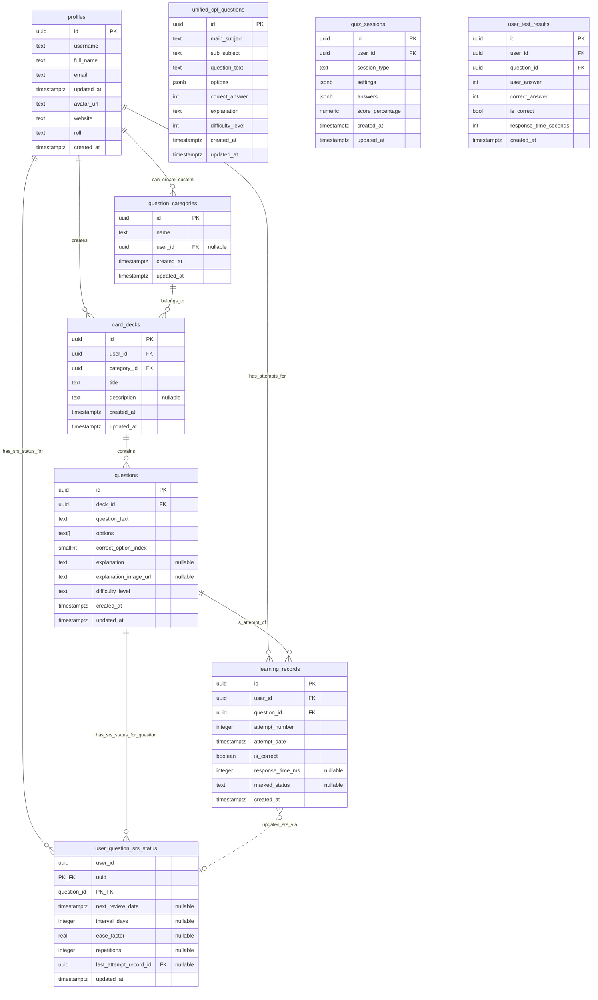
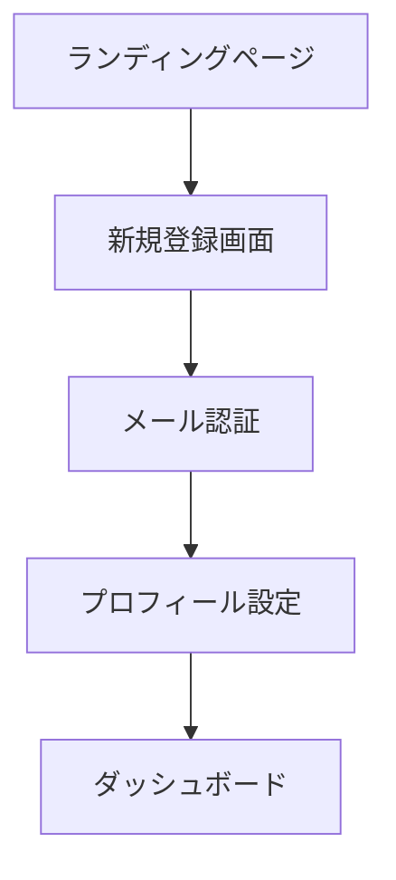
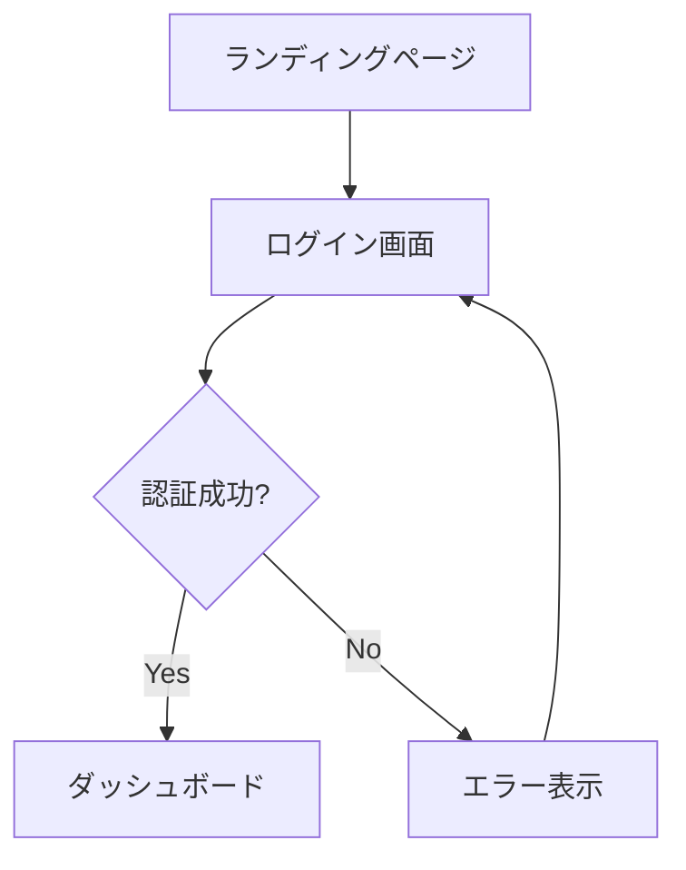
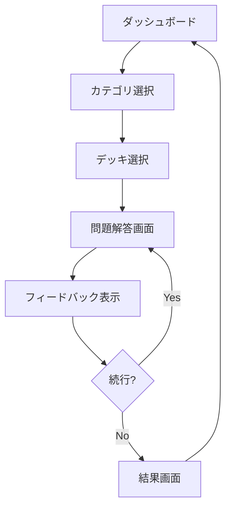

# FlightAcademyTsx 設計仕様書

## 📋 概要

このドキュメントは、FlightAcademyTsxプロジェクトの詳細な設計仕様、API仕様、データベース設計、UI/UX仕様について包括的に説明します。

**最終更新**: 2025年7月28日
**バージョン**: Design Specification v1.0

---

## 🎯 プロジェクト概要

### **目的**
本プロジェクトは、Webベースの4択問題アプリケーションを開発することを目的とします。特に、最新の脳科学や学習理論を取り入れ、効率的な暗記と長期記憶への定着を支援する機能を盛り込むことを目指します。

### **技術スタック**
- **フロントエンド**: React, TypeScript, Vite, Tailwind CSS
- **バックエンド**: Supabase (PostgreSQL, Auth, Edge Functions)
- **開発環境**: Cursor IDE, GitHub Actions, Vercel

### **開発プロセス**
- 開発チームが効率的に機能開発を進められるよう、詳細な仕様と設計を提供
- AI開発支援ツール（GitHub Copilot Workspace、LLM等）がMVP開発を効率的に進められるよう構造化
- プロジェクトの技術的な意思決定と設計根拠を文書化

---

## 👥 ターゲットユーザー

### **主要ユーザー**
- FlightAcademyの既存ユーザー
- 事業用操縦士（飛行機）国家試験の学習者
- その他、資格試験や専門知識の習得を目指す学習者全般

### **ユーザーロール**
1. **Student (一般ユーザー)**
   - 自身のプロファイル編集（一部）
   - 問題の解答
   - 自身の学習履歴・進捗の閲覧
   - 問題へのマーク付与

2. **Teacher**
   - Studentの全権限
   - （担当する）Studentの学習情報・進捗の閲覧
   - Studentへのフィードバック機能（将来検討）
   - 特定のStudentグループへの課題割り当て（将来検討）

3. **Admin**
   - Teacherの全権限（実質的に全Studentの情報を閲覧可能）
   - システム全体のユーザー管理（ロール変更など）
   - 問題カテゴリの作成・編集・削除
   - カードデッキの作成・編集・削除
   - 問題の作成・編集・削除（CSVインポート含む）
   - システム設定変更（将来検討）

---

## 🔧 機能要件

### **必須機能（MVPのコア）**

#### **ユーザー認証機能**
- ✅ ユーザー登録（メールアドレス、パスワード、ユーザー名）
- ✅ ログイン・ログアウト
- ✅ パスワードリセット（Supabase Auth標準機能利用）

#### **問題カテゴリ機能**
- ✅ 事前定義されたカテゴリ表示（例: 航法, 航空法規, 気象, 機体, 通信）
- 🔄 （Admin向け）カテゴリ作成・編集・削除機能

#### **カードデッキ機能**
- ✅ カテゴリに紐づくデッキの一覧表示
- ✅ デッキ選択機能
- 🔄 （Admin向け）デッキ作成・編集・削除機能

#### **4択問題解答機能**
- ✅ 問題文と4つの選択肢の表示
- ✅ 解答選択機能（ラジオボタン形式など）
- ✅ 解答送信機能
- ✅ 正誤判定とフィードバック表示（正解の選択肢、解説文、解説画像）
- ✅ 次の問題へ進む機能

#### **スコア・進捗管理機能**
- ✅ 学習セッションごとのスコア表示（正解数/問題数, 正解率）
- ✅ （ダッシュボード）総学習問題数、平均正解率、学習日数の表示
- 🔄 リーダーボード機能（MVP範囲外、将来検討）

### **便利機能（MVPに含める学習支援機能）**

#### **学習支援機能**
- ✅ 難易度レベル設定（問題ごとに 'easy', 'medium', 'hard' を設定）
- ✅ タイマー機能
  - システム全体で一律の規定時間（例: 60秒/問）からカウントダウン表示
  - 残り時間0秒になっても解答は続行可能
  - 解答にかかった時間を記録（`learning_records.response_time_ms`）
- ✅ 復習機能
  - 間違えた問題の再出題
  - SRS（間隔反復学習システム）による復習問題の提示
- ✅ 解説文への画像添付機能（問題作成時）

#### **エンゲージメント向上機能**
- ✅ （ダッシュボード）カテゴリ別正答率レーダーチャート（苦手分野の可視化）
- 🔄 デイリーチャレンジ（MVP範囲外、将来検討）
- 🔄 報酬・バッジシステム（MVP範囲外、将来検討）

### **脳科学的機能（SRS: 間隔反復学習システム）**

#### **間隔反復スケジューリング**
- ✅ ユーザーの解答履歴（正誤）に基づき、各問題の最適な復習タイミングを計算（簡略版SM-2アルゴリズムベース）
- ✅ 復習間隔は徐々に広げていく（例: 1日後, 3日後, 7日後, 16日後...）
- ✅ `user_question_srs_status` テーブルで管理

#### **復習問題の提示**
- ✅ （ダッシュボード）「今日の復習」セクションに、復習時期が来た問題の通知
- ✅ 学習セッション内で、復習対象の問題を優先的に出題

### **AIパーソナライズ機能**

#### **苦手カテゴリ推薦**
- ✅ ユーザーの解答履歴から、カテゴリごとの正答率と解答数を集計
- ✅ 正答率が一定以下（例: 60%）かつ解答数が一定以上（例: 10問）のカテゴリを「苦手カテゴリ」として判定
- ✅ （ダッシュボード）苦手カテゴリをいくつか推薦し、学習を促す

#### **学習状況の可視化**
- ✅ （ダッシュボード）カテゴリ別正答率レーダーチャート
- ✅ （ダッシュボード）全体的な学習進捗サマリー

---

## 🗄️ データベース設計

### **ER図（Mermaid）**



### **主要テーブル定義**

#### **profiles テーブル**
```sql
-- Supabase Authのusersテーブルと連携
CREATE TABLE profiles (
  id uuid REFERENCES auth.users(id) ON DELETE CASCADE PRIMARY KEY,
  updated_at timestamp with time zone DEFAULT timezone('utc'::text, now()) NOT NULL,
  username text UNIQUE,
  full_name text,
  avatar_url text,
  email text,
  roll text DEFAULT 'student'::text
);
```

#### **question_categories テーブル**
```sql
CREATE TABLE question_categories (
  id uuid DEFAULT gen_random_uuid() PRIMARY KEY,
  name varchar(255) NOT NULL,
  description text,
  parent_category_id uuid REFERENCES question_categories(id),
  display_order integer DEFAULT 0,
  created_at timestamp DEFAULT now(),
  updated_at timestamp DEFAULT now()
);
```

#### **card_decks テーブル**
```sql
CREATE TABLE card_decks (
  id uuid DEFAULT gen_random_uuid() PRIMARY KEY,
  name varchar(255) NOT NULL,
  description text,
  category_id uuid REFERENCES question_categories(id),
  difficulty_level integer DEFAULT 1,
  is_active boolean DEFAULT true,
  created_by uuid REFERENCES profiles(id),
  created_at timestamp DEFAULT now(),
  updated_at timestamp DEFAULT now()
);
```

#### **questions テーブル**
```sql
CREATE TABLE questions (
  id uuid DEFAULT gen_random_uuid() PRIMARY KEY,
  deck_id uuid REFERENCES card_decks(id) ON DELETE CASCADE,
  question_text text NOT NULL,
  option_a text NOT NULL,
  option_b text NOT NULL,
  option_c text NOT NULL,
  option_d text NOT NULL,
  correct_answer char(1) NOT NULL CHECK (correct_answer IN ('A', 'B', 'C', 'D')),
  explanation text,
  difficulty_level integer DEFAULT 1,
  tags text[],
  image_urls text[],
  created_at timestamp DEFAULT now(),
  updated_at timestamp DEFAULT now()
);
```

#### **learning_records テーブル**
```sql
CREATE TABLE learning_records (
  id uuid DEFAULT gen_random_uuid() PRIMARY KEY,
  user_id uuid REFERENCES profiles(id) ON DELETE CASCADE,
  question_id uuid REFERENCES questions(id) ON DELETE CASCADE,
  user_answer char(1) CHECK (user_answer IN ('A', 'B', 'C', 'D')),
  is_correct boolean,
  answer_time_seconds integer,
  session_id uuid,
  created_at timestamp DEFAULT now()
);
```

#### **user_question_srs_status テーブル**
```sql
CREATE TABLE user_question_srs_status (
  id uuid DEFAULT gen_random_uuid() PRIMARY KEY,
  user_id uuid REFERENCES profiles(id) ON DELETE CASCADE,
  question_id uuid REFERENCES questions(id) ON DELETE CASCADE,
  ease_factor real DEFAULT 2.5,
  interval_days integer DEFAULT 1,
  repetitions integer DEFAULT 0,
  next_review_date date DEFAULT CURRENT_DATE,
  last_review_date date,
  created_at timestamp DEFAULT now(),
  updated_at timestamp DEFAULT now(),
  UNIQUE(user_id, question_id)
);
```

---

## 🌐 API仕様

### **認証（Supabase Auth）**

FlightAcademyTsxでは、Supabaseの組み込み認証機能を全面的に利用します。

#### **対応フロー**
- メールアドレスとパスワードによるサインアップ
- メールアドレスとパスワードによるサインイン
- パスワードリセット（Magic Link または 確認メール経由）
- サインアウト
- セッション管理（JWTベース、Supabaseクライアントが自動処理）

### **RPC（Remote Procedure Call）関数**

#### **get_quiz_session**

**目的**: 指定されたカードデッキから、学習セッション用の問題群を取得する。

**パラメータ**:
- `p_deck_id` (uuid): 対象のカードデッキID
- `p_user_id` (uuid): 現在のユーザーID
- `p_num_questions` (integer): 取得する問題数

**レスポンス**:
```json
[
  {
    "question_id": "uuid",
    "question_text": "string",
    "options": ["string", "string", "string", "string"],
    "difficulty_level": "string"
  }
]
```

**ロジック概要**:
1. `p_user_id` と `p_deck_id` に紐づく問題を取得
2. `user_question_srs_status` を参照し、`next_review_date` が今日以前の問題を優先リストに追加
3. まだ一度も解答していない問題をリストに追加
4. `p_num_questions` 分の問題を選択して返す

#### **submit_answer**

**目的**: ユーザーの解答を記録し、SRS情報を更新する。

**パラメータ**:
- `p_user_id` (uuid): ユーザーID
- `p_question_id` (uuid): 解答した問題ID
- `p_is_correct` (boolean): 解答が正解だったかどうか
- `p_response_time_ms` (integer): 解答にかかった時間（ミリ秒）
- `p_marked_status` (text): ユーザーが付与したマーク状態

**レスポンス**:
```json
{
  "learning_record_id": "uuid",
  "srs_status_updated": true,
  "next_review_date": "timestamp with time zone",
  "correct_option_index": "smallint",
  "explanation": "string",
  "explanation_image_url": "string"
}
```

#### **get_review_questions**

**目的**: ユーザーが今日またはそれ以前に復習すべき問題のリストを取得する（SRSに基づく）。

**パラメータ**:
- `p_user_id` (uuid): ユーザーID
- `p_limit` (integer): 取得する最大問題数

**レスポンス**:
```json
[
  {
    "question_id": "uuid",
    "question_text": "string",
    "options": ["string", "string", "string", "string"],
    "difficulty_level": "string",
    "deck_id": "uuid",
    "deck_title": "string"
  }
]
```

#### **get_recommended_categories**

**目的**: ユーザーの苦手な可能性のある問題カテゴリを推薦する。

**パラメータ**:
- `p_user_id` (uuid): ユーザーID
- `p_threshold_correct_rate` (real): 正答率の閾値
- `p_min_attempts` (integer): カテゴリをおすすめするための最小解答数
- `p_recommend_limit` (integer): 推薦するカテゴリの最大数

**レスポンス**:
```json
[
  {
    "category_id": "uuid",
    "category_name": "string",
    "correct_rate": "real",
    "total_attempts": "integer"
  }
]
```

#### **import_deck_from_csv**

**目的**: CSVデータから新しいカードデッキと問題を一括でインポートする。

**パラメータ**:
- `p_user_id` (uuid): デッキ作成者となるユーザーID（Admin権限が必要）
- `p_deck_title` (text): 作成するデッキのタイトル
- `p_category_name` (text): 紐付けるカテゴリ名
- `p_csv_data` (text): CSV形式の文字列データ

**CSVフォーマット**:
```
question_text,option1,option2,option3,option4,correct_option_index,explanation,difficulty_level
```

**レスポンス**:
```json
{
  "deck_id": "uuid",
  "questions_imported_count": "integer"
}
```

#### **get_category_performance_stats**

**目的**: ユーザーのカテゴリ別パフォーマンス（解答数、正解数、正答率）を取得し、レーダーチャート表示などに利用する。

**パラメータ**:
- `p_user_id` (uuid): ユーザーID
- `p_target_categories` (text[]): 対象とするカテゴリ名の配列

**レスポンス**:
```json
[
  {
    "category_id": "uuid",
    "category_name": "string",
    "total_questions_in_category": "integer",
    "attempted_questions": "integer",
    "correct_answers": "integer",
    "total_attempts_in_category": "integer",
    "accuracy": "real"
  }
]
```

### **RLS（Row Level Security）ポリシー**

#### **基本方針**
- ユーザーは自身のデータ（profile, learning_records, user_question_srs_status, 作成したdecks/categories/questions）のみフルアクセス可能
- 公開情報（共通カテゴリ、他のユーザーが作成した公開デッキなど）は読み取り可能
- Teacherは担当Studentの学習記録を読み取り可能
- Adminはほぼ全てのデータを読み書き可能

#### **ポリシー例**

**profiles テーブル**:
```sql
-- プロファイル読み取り（自分のプロファイルのみ）
CREATE POLICY "Users can view own profile" ON profiles
FOR SELECT USING (auth.uid() = id);

-- プロファイル更新（自分のプロファイルのみ）
CREATE POLICY "Users can update own profile" ON profiles
FOR UPDATE USING (auth.uid() = id);
```

**learning_records テーブル**:
```sql
-- 学習記録読み取り（自分の記録のみ、またはAdmin/Teacher）
CREATE POLICY "Users can view own learning records" ON learning_records
FOR SELECT USING (
  auth.uid() = user_id OR
  EXISTS (
    SELECT 1 FROM profiles
    WHERE id = auth.uid()
    AND roll IN ('admin', 'teacher')
  )
);

-- 学習記録挿入（自分の記録のみ）
CREATE POLICY "Users can insert own learning records" ON learning_records
FOR INSERT WITH CHECK (auth.uid() = user_id);
```

---

## 🎨 UI/UX仕様

### **全体的なユーザーフロー**

#### **新規登録フロー**


#### **ログインフロー**


#### **標準学習フロー**


### **主要画面設計**

#### **A. 認証関連画面**

**ログイン画面**
- メールアドレス入力フィールド
- パスワード入力フィールド
- ログインボタン
- 新規登録リンク
- パスワードリセットリンク

**新規登録画面**
- メールアドレス入力フィールド
- パスワード入力フィールド
- パスワード確認フィールド
- ユーザー名入力フィールド
- 登録ボタン
- ログインリンク

#### **B. ダッシュボード画面**

**レイアウト構成**:
- ヘッダー（ナビゲーション、ユーザーメニュー）
- 学習統計サマリー（総学習問題数、平均正解率、学習日数）
- カテゴリ別正答率レーダーチャート
- 今日の復習セクション
- 苦手カテゴリ推薦セクション
- クイックアクセスボタン（学習開始、履歴確認）

#### **C. デッキ一覧・選択画面**

**機能要素**:
- カテゴリフィルター
- デッキカード（タイトル、説明、問題数、難易度）
- 検索機能
- ソート機能（名前順、難易度順、最近の学習順）

#### **D. 問題解答画面**

**レイアウト要素**:
- 進捗表示（問題番号/総問題数）
- タイマー表示
- 問題文
- 4択選択肢（ラジオボタン）
- 解答ボタン
- マーク機能ボタン（チェック、わからない）
- 前の問題/次の問題ボタン

**フィードバック表示**:
- 正誤判定
- 正解の選択肢ハイライト
- 解説文
- 解説画像（存在する場合）
- 次の問題ボタン

#### **E. 学習結果画面**

**表示要素**:
- セッション統計（正解数/問題数、正答率、経過時間）
- 間違えた問題の一覧
- カテゴリ別正答率
- 復習推奨問題
- もう一度学習ボタン
- ダッシュボードに戻るボタン

#### **F. 問題管理画面（Admin）**

**機能一覧**:
- 問題一覧表示（フィルター、検索）
- 問題作成フォーム
- 問題編集フォーム
- CSVインポート機能
- カテゴリ管理
- デッキ管理

### **レスポンシブデザイン対応**

#### **ブレークポイント**
- **モバイル**: < 768px
- **タブレット**: 768px - 1024px
- **デスクトップ**: > 1024px

#### **モバイル最適化**
- タッチフレンドリーなボタンサイズ
- スワイプジェスチャー（問題送り）
- 縦画面レイアウト最適化
- ハンバーガーメニュー

---

## 🔒 非機能要件

### **パフォーマンス**
- 問題表示、解答送信のレスポンスタイムは1秒以内
- ダッシュボード表示は2秒以内
- 同時アクセスユーザー数50人程度を想定（初期）

### **セキュリティ**
- ✅ Supabase RLS（Row Level Security）を活用し、ユーザーデータへのアクセス制御を徹底
- ✅ パスワードは適切にハッシュ化（Supabase Auth標準）
- 個人情報保護に関する配慮

### **ユーザビリティ**
- 直感的で分かりやすいUIデザイン
- モバイルフレンドリーなレスポンシブデザイン
- 主要な操作は3クリック以内で到達可能（努力目標）
- アクセシビリティ（WCAG標準など）への配慮（将来検討）

### **メンテナンス性**
- ✅ コードの可読性、保守性を高めるためTypeScriptを採用
- ✅ コンポーネントベースのUI構築（React）
- 適切なコメントとドキュメント
- 変更容易性、テスト容易性

### **スケーラビリティ**
- ✅ SupabaseのBaaSとしてのスケーラビリティを活用
- 将来的なユーザー数・データ量増加に対応できる設計を意識

### **信頼性・可用性**
- ✅ ホスティングサービス（Vercel/Firebase）のSLAに準拠
- 定期的なデータバックアップ（Supabase標準機能）

---

## 📈 実装優先度と進捗

### **Phase 1: 基盤構築（完了）**
- ✅ ユーザー認証システム
- ✅ 基本的なデータベース設計
- ✅ プロジェクト構造の確立

### **Phase 2: コア機能実装（完了）**
- ✅ 問題カテゴリ・デッキ管理
- ✅ 4択問題システム
- ✅ 基本的な学習記録

### **Phase 3: 学習支援機能（進行中）**
- ✅ SRS（間隔反復学習）システム
- ✅ タイマー機能
- ✅ 復習機能
- 🔄 AIパーソナライズ機能

### **Phase 4: 管理機能（計画中）**
- 🔄 Admin向け問題管理画面
- 🔄 CSVインポート機能
- 🔄 学習分析機能

### **Phase 5: 拡張機能（将来）**
- 🔄 デイリーチャレンジ
- 🔄 報酬・バッジシステム
- 🔄 マルチプレイヤーモード

---

## 🚀 開発環境セットアップ

### **前提ツール**
- Node.js 16.x以上
- npm 7.x以上
- Git
- Cursor IDE（推奨）

### **プロジェクトセットアップ手順**

**1. リポジトリクローン**
```bash
git clone https://github.com/yourusername/FlightAcademyTsx.git
cd FlightAcademyTsx
```

**2. 依存関係インストール**
```bash
npm install
```

**3. 環境変数設定**
```bash
cp .env.example .env.local
# .env.localに必要なAPIキーを設定
```

**4. Supabase CLI設定**
```bash
npm install -g @supabase/cli
supabase login
supabase init
```

**5. 開発サーバー起動**
```bash
npm run dev
```

### **Tailwind CSS設定**

**tailwind.config.js**:
```javascript
module.exports = {
  content: [
    "./index.html",
    "./src/**/*.{js,ts,jsx,tsx}",
  ],
  theme: {
    extend: {
      colors: {
        primary: {
          50: '#eff6ff',
          500: '#3b82f6',
          900: '#1e3a8a',
        }
      }
    },
  },
  plugins: [],
}
```

---

## 📝 今後の改善点

### **短期改善（1-3ヶ月）**
- UI/UXの継続的改善
- パフォーマンス最適化
- バグ修正とテストカバレッジ向上

### **中期改善（3-6ヶ月）**
- AI機能の強化
- 管理機能の充実
- モバイルアプリ化検討

### **長期改善（6ヶ月以上）**
- マルチテナント対応
- 高度な学習分析機能
- 外部システム連携

---

## 📚 関連ドキュメント

### **技術ドキュメント**
- **プロジェクト概要ガイド**: プロジェクト概要、機能詳細
- **技術開発ガイド**: 技術スタック、開発環境
- **計画改善ロードマップ**: 開発計画、改善提案
- **運用保守ガイド**: 自動化システム、パフォーマンス、トラブルシューティング

### **外部リソース**
- [Supabase Documentation](https://supabase.com/docs)
- [React Documentation](https://react.dev/)
- [TypeScript Documentation](https://www.typescriptlang.org/docs/)
- [Tailwind CSS Documentation](https://tailwindcss.com/docs)

---

**最終更新**: 2025年7月28日
**バージョン**: Design Specification v1.0
**管理者**: FlightAcademy開発チーム
