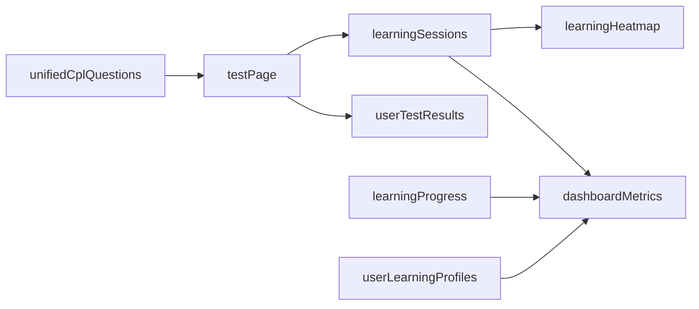

# FlightAcademyTsx 設計仕様書

## 📖 このドキュメントを読むべき人

- ✅ **AIアシスタント**: データベース構造やAPI仕様を確認したい場合
- ✅ **バックエンド開発者**: データベース設計やAPI実装を行う場合
- ✅ **フロントエンド開発者**: API仕様やデータ構造を理解したい場合

**推奨読み順**: [docs/README.md](README.md) → [02_技術開発ガイド.md](02_技術開発ガイド.md) → このドキュメント

---

## 📋 概要

このドキュメントは、FlightAcademyTsxプロジェクトの詳細な設計仕様、API仕様、データベース設計、UI/UX仕様について包括的に説明します。

**最終更新**: 2026年4月（DB スリム化マイグレーション・レガシーテーブル削除）
**バージョン**: Design Specification v4.0

---

## 📚 記事システム設計（Phase 5実装済み）

### **記事メタデータ管理**

#### **ArticleMeta型定義**

```typescript
export type ArticleMeta = {
  type: 'article';
  title: string;
  slug: string;
  tags: string[];
  series?: string;
  order?: number;
  readingTime?: number;
  excerpt?: string;
  publishedAt?: string;
  author?: string;
  heroImage?: string;
};
```

#### **記事インデックスシステム**

- **ファイルベース管理**: `import.meta.glob`による動的記事収集
- **型安全なインデックス**: `ArticleIndexEntry`による構造化管理
- **キャッシュ機能**: パフォーマンス最適化のための記事インデックスキャッシュ
- **検索・フィルタリング**: タグ、シリーズ、著者による高度な検索機能

#### **記事フォーマット仕様**

- **参考書籍セクション**: 書籍引用記事の末尾に追加
- **書籍引用のガイドライン**: 適正な引用範囲、引用形式、Amazonアソシエイトリンク
- **著作権対策**: 映画・作品コンテンツのオマージュ表現、英語セリフの日本語要約

### **記事表示システム**

#### **コンポーネント構成**

- `ArticleDetailPage`: 記事詳細ページ
- `ReadingProgressBar`: 残り時間表示・進捗管理
- `MDXLoader`: 動的記事読み込み
- `CommentSection`: コメント機能
- `TableOfContents`: 目次・ナビゲーション
- `RelatedArticles`: 関連記事推薦
- `RelatedTestsBlock`: `learning_test_mapping` を `learning_content_id` で照会し、主科目（`topic_category`）単位で `**/test`** への練習モードリンクを表示（`subject`・`sub=all`・`count`・`mode=practice`・`contentId`・必要時 `exam=ppl`）

#### **主要機能**

- 読書進捗追跡、残り時間表示、目次生成、関連記事推薦、SEO最適化、コメント機能

### **学習進捗システム（2025年10月13日実装）**

#### **データベース設計**

```sql
CREATE TABLE learning_progress (
  id UUID PRIMARY KEY DEFAULT gen_random_uuid(),
  user_id UUID REFERENCES auth.users(id) ON DELETE CASCADE,
  content_id TEXT NOT NULL,
  completed BOOLEAN DEFAULT false,
  progress_percentage INTEGER DEFAULT 0 CHECK (progress_percentage >= 0 AND progress_percentage <= 100),
  last_position INTEGER DEFAULT 0,
  last_read_at TIMESTAMPTZ,
  read_count INTEGER DEFAULT 0,
  created_at TIMESTAMPTZ DEFAULT now(),
  updated_at TIMESTAMPTZ DEFAULT now(),
  CONSTRAINT learning_progress_user_id_content_id_key UNIQUE (user_id, content_id)
);
```

#### **進捗追跡機能（2025年12月28日更新、2026年1月5日改善）**

- **useArticleProgress Hook**: セクションベースの進捗自動保存（最終セクション到達で完了判定）
- **TableOfContents**: 目次の下に進捗表示（円形メーターとパーセンテージ）
- **セクションベース進捗計算**: スクロール量ではなく、目次の見出しを基準に進捗を計算
- **関連記事の扱い**: 目次には表示するが、進捗計算からは除外（最終セクション到達で100%）
- **ProgressSidebar**: カテゴリー別進捗の集計と表示
- **データ再読み込み機能**: `refreshProgress`関数により、Supabaseから最新の進捗データを再取得可能
- **ページ遷移時の進捗保存**: `visibilitychange`イベントでページが非表示になる前に確実に進捗を保存
- **完了時の即座保存**: 記事読了時（100%到達）は遅延なしで即座にSupabaseに保存

#### **完了判定ロジック**

- 95%以上のスクロール: 自動的に`completed = true`
- 5%未満のスクロール: 保存しない（誤クリック防止）
- 5%〜95%: 進捗のみ保存、未完了として記録
- **完了時の即座保存**: 100%到達時は300msの遅延なしで即座に保存

#### **記事ステータス判定システム（2026年1月5日実装）**

- **content_idベースの進捗取得**: `article.id`（content_id）を使用してSupabaseから進捗を取得
- **ステータス表示**: 「完了」「進行中」「ロック」の3つのステータスを表示
  - `completed`: 読了済み記事（HUD Greenバッジ）
  - `in-progress`: アンロックされているが未読の記事（whiskyPapa-yellowバッジ）
  - `null`: ロックされている記事
- **ページ遷移後の自動更新**: `ArticleDashboard`に戻った際、`refreshProgress`により最新データを取得
- **Supabaseとの同期**: ローカル状態だけでなく、Supabaseの最新データを反映

### **記事コメント機能（2025年10月13日実装）**

#### **データベース設計**

```sql
CREATE TABLE learning_content_comments (
  id UUID PRIMARY KEY DEFAULT uuid_generate_v4(),
  content_id TEXT NOT NULL REFERENCES learning_contents(id) ON DELETE CASCADE,
  user_id UUID NOT NULL REFERENCES profiles(id) ON DELETE CASCADE,
  content TEXT NOT NULL,
  created_at TIMESTAMPTZ DEFAULT CURRENT_TIMESTAMP,
  updated_at TIMESTAMPTZ DEFAULT CURRENT_TIMESTAMP,
  CONSTRAINT learning_content_comments_user_content UNIQUE (id)
);
```

#### **機能仕様**

- **ログインユーザー**: コメント投稿（最大1000文字）、編集、削除、閲覧
- **ゲストユーザー**: 閲覧のみ
- **セキュリティ**: RLSポリシー適用、ユーザーIDによる権限チェック

### **シリーズ順次アンロック機能（2025年11月2日実装）**

#### **ロジック**

- **未ログインユーザー**: 各シリーズの1話のみ閲覧可能
- **ログインユーザー**: 直前話が読了で次話が解放
- **シリーズ外記事**: 常に解放

#### **実装コンポーネント**

- `useSeriesUnlock` Hook: シリーズ別記事リスト構築、解放判定
- `EnhancedArticleCard`: ロックオーバーレイ表示
- `ArticleDetailPage`: ロック時の遷移ガード

---

## 🎯 プロジェクト概要

### **目的**

Webベースの4択問題アプリケーション。最新の脳科学や学習理論を取り入れ、効率的な暗記と長期記憶への定着を支援。

### **技術スタック**

- **フロントエンド**: React, TypeScript, Vite, Tailwind CSS
- **バックエンド**: Supabase (PostgreSQL, Auth, Edge Functions)
- **開発環境**: Cursor IDE, GitHub Actions, Vercel

---

## 👥 ターゲットユーザー

### **ユーザーロール**

1. **Student (一般ユーザー)**: プロファイル編集、問題解答、学習履歴閲覧
2. **Teacher**: Studentの全権限 + Studentの学習情報閲覧
3. **Admin**: 全権限、ユーザー管理、問題管理、システム設定

---

## 🔧 機能要件

### **必須機能（MVPのコア）**

- ✅ ユーザー認証機能
- ✅ 問題カテゴリ機能
- ✅ カードデッキ機能
- ✅ 4択問題解答機能
- ✅ スコア・進捗管理機能

### **便利機能（MVPに含める学習支援機能）**

- ✅ 難易度レベル設定
- ✅ タイマー機能
- ✅ 復習機能（SRS）
- ✅ 解説文への画像添付機能
- ✅ カテゴリ別正答率レーダーチャート

### **脳科学的機能（SRS: 間隔反復学習システム）**

- ✅ 間隔反復スケジューリング（簡略版SM-2アルゴリズムベース）
- ✅ 復習問題の提示

### **AIパーソナライズ機能**

- ✅ 苦手カテゴリ推薦
- ✅ 学習状況の可視化

---

## 🗄️ データベース設計

### **DB スリム化（レガシー削除・2026年4月）**

未使用（推定 0 行・アプリ未参照）の分析系テーブルと旧 CPL ステージングを削除するマイグレーション正本:

- [scripts/database/20260411_drop_legacy_analytics_tables.sql](../scripts/database/20260411_drop_legacy_analytics_tables.sql): `adaptive_learning_paths`, `audit_log`, `content_effectiveness`, `content_recommendations`, `exam_trend_analysis`, `learning_effectiveness_metrics`, `learning_recommendations` および `log_user_creation()`（`audit_log` への INSERT 用）
- [scripts/database/20260411_drop_legacy_cpl_user_progress.sql](../scripts/database/20260411_drop_legacy_cpl_user_progress.sql): `user_progress`, `cpl_exam_questions`, `cpl_subject_master` および `handle_user_progress_upsert`, `analyze_content_gaps`, `migrate_quiz_questions`, `migrate_exam_questions_metadata`
- [scripts/database/20260411_drop_gallery_shop_purchase.sql](../scripts/database/20260411_drop_gallery_shop_purchase.sql): `fan_photo_like_counts`（ビュー）, `fan_photo_likes`, `fan_photos`, `gallery_events`, `products`, `purchase_history`、関連トリガー関数。`rank_requirements` から `purchases` / `gallery_*` 行を削除し、`check_rank_requirements` から該当分岐を除去
- [scripts/database/20260411_drop_migration_log.sql](../scripts/database/20260411_drop_migration_log.sql): 未使用の `migration_log`

**試験問題の正本**は **`unified_cpl_questions`**。アプリ内ギャラリー・ショップは撤去（`/gallery`・`/shop` はホームへリダイレクト。外部ギャラリーはリンク集ページの URL のみ）。

### **主要テーブル定義**

#### **profiles テーブル**

```sql
CREATE TABLE profiles (
  id uuid REFERENCES auth.users(id) ON DELETE CASCADE PRIMARY KEY,
  updated_at timestamp with time zone DEFAULT timezone('utc'::text, now()) NOT NULL,
  username text UNIQUE,
  full_name text,
  avatar_url text,
  email text,
  roll text DEFAULT 'student'::text
);
```

#### **unified_cpl_questions テーブル（CPL試験問題）**

- **出題**: `verification_status='verified'` の行のみ出題対象
- **主要カラム**: `main_subject`, `sub_subject`, `question_text`, `options` (JSONB), `correct_answer`（1–4）, `explanation`, `importance_score`, `**applicable_exams`（`text[]`）**
- `**applicable_exams`**: 出題してよい試験レベル。許容要素は `PPL`, `CPL`, `ATPL` の部分集合。既定は `ARRAY['CPL']`。**PPL 基礎モード**（`/test`・CPL 試験 UI）では PostgREST `cs`（`.contains`）で `PPL` を含む行のみ取得。
- **マイグレーション**: `scripts/database/20260324_add_unified_cpl_applicable_exams.sql`
- **サブ科目正規化**: `scripts/database/20260307_normalize_unified_cpl_sub_subjects.sql` で旧表記を統合
- **分類ツリーの正本**: 記事・マッピングで用いる単元の木は `**(main_subject, sub_subject 全文)` を CPL クラスタの正**とする。PPL は `applicable_exams` に `PPL` を含む行の部分集合。詳細は [docs/08_Syllabus_Management_Guide.md](08_Syllabus_Management_Guide.md)「分類ツリー：CPL クラスタを正とする」。

#### **learning_test_mapping テーブル（記事と問題の対応）**

- **主要カラム**: `learning_content_id`（`learning_contents.id` と一致）, `topic_category`, `**test_question_ids`（`text[]`）**, `**unified_cpl_question_ids`（`uuid[]`）**
- **運用規約（自然キー・列の揃え方）**: [docs/08_Syllabus_Management_Guide.md](08_Syllabus_Management_Guide.md)「問題–記事連携契約」。記事 ID と 10 の `aero-*` 対照は [docs/11_ドキュメント整合性検討.md](11_ドキュメント整合性検討.md) §2.4。
- **推奨記事表示**: [ReviewContentLink](src/pages/articles/components/learning/ReviewContentLink.tsx) は、解答後の推奨で **両列の `overlaps`** を試行（どちらかに問題 UUID が含まれればヒット）。複数行がヒットする場合は、セッションの設問 ID 集合との **重なり件数（同一 UUID は二重に数えない）が多い** `learning_test_mapping` 行を優先し、最大 5 件を表示する。
- **記事詳細からテストへ**: [RelatedTestsBlock](src/pages/articles/components/RelatedTestsBlock.tsx) が同一 `learning_content_id` のマッピング行を列挙し、`/test` へ遷移させる。
- **テスト→記事のラベル統一**: 定数 `LEARNING_ARTICLE_CTA_LABEL`（`src/constants/learningArticleNav.ts`、文言「単元記事を読む」）を [QuizResultsView](src/pages/test/components/QuizResultsView.tsx) の `contentId` 戻りリンクと [ReviewContentLink](src/pages/articles/components/learning/ReviewContentLink.tsx) の見出し・補足で共有する。記事 URL は常に `/articles/{learning_contents.id}`。
- **/test 結果画面（Practice / Exam / Review 共通）**: 3 モードとも解答完了後は同一の [QuizResultsView](src/pages/test/components/QuizResultsView.tsx)。**不正解のある `main_subject` ごと**に [ReviewContentLink](src/pages/articles/components/learning/ReviewContentLink.tsx) を出し、当該科目の**不正解設問 ID**で `learning_test_mapping` の overlaps を効かせる。**全問正解**時はセッション内の**全設問 ID**で 1 ブロック（`subjectCategory` は科目が選択済みならその主科目、未選択時はセッション内の先頭設問の `main_subject`）。記事連動で `contentId` があるときは推薦から当該記事を **`excludeContentId`** で除外。`/test` 上のカード見た目は `variant="panel"`（テーマトークン）で記事ページ側の従来スタイルと分離。
- **マッピング無し時のフォールバック**: テスト結果側の `subjectCategory` は `**main_subject`**（5 科目名）。`learning_contents` の科目は `**sub_category`** に置くのが正（`category` は `PPL` / `CPL学科` 等、[08](08_Syllabus_Management_Guide.md)）。フォールバックは `**sub_category = subjectCategory**` を優先し、0 件のときのみ `**category = subjectCategory**` を試行する。
- **パイロット例**: [docs/db/APPLICABLE_EXAMS_PILOT.md](db/APPLICABLE_EXAMS_PILOT.md)

#### **user_test_results テーブル（テスト結果）**

- **主要カラム**: `user_id`, `session_id`, `question_id`, `subject_category`, `is_correct`, `answered_at`
- **subject_category**: `main_subject` または `main_subject - sub_subject` 形式で保存
- **学習時間算出**: 各回答の `responseTimeMs` 合計を `learning_sessions` に記録

#### **learning_sessions テーブル（学習セッション）**

- **主要カラム**: `user_id`, `session_type` (reading/testing/review/practice), `content_id`, `content_type`, `session_duration` (秒), `created_at`
- **duration_minutes**: 生成列（`session_duration` から算出）
- **session_metadata**: `questions_attempted`, `correct_count`, `mode`, `wall_clock_seconds` などを格納
- **用途**: 今週の学習時間、ヒートマップの元データ

#### **user_learning_profiles テーブル（学習プロファイル）**

- **主要カラム**: `user_id`, `current_streak_days`, `longest_streak_days`, `updated_at`
- **ブートストラップ**: 初回クイズ（`learning_sessions` 挿入）または初回記事学習（`learning_progress` 挿入/更新）時に自動で行を作成
- **migration**: `20260309_bootstrap_user_learning_profiles.sql`

#### **データフロー（クイズ・学習時間）**


```mermaid
flowchart LR
  unifiedCplQuestions --> testPage
  testPage --> userTestResults
  testPage --> learningSessions
  learningSessions --> dashboardMetrics
  learningSessions --> learningHeatmap
  learningProgress --> dashboardMetrics
  userLearningProfiles --> dashboardMetrics
```


### **ゲーミフィケーションシステム（2025年1月実装）**

#### **ランクシステム（統合版）**

ユーザーは経験値（XP）と記事完了に基づいてランクに分類されます：

**基本ランク（XPベース）:**

1. **Fan** (0 XP) - ファン

**PPL中間ランク（記事完了ベース）:**
2. **PPL空力基礎初級** - 空力の基礎理論 Phase 1完了
3. **PPL空力基礎中級** - 空力の基礎理論 Phase 2完了
4. **PPL空力基礎マスター** - 空力の基礎理論 Phase 3完了
5. **PPL性能基礎初級** - 性能と耐空性 Phase 1完了
6. **PPL性能基礎中級** - 性能と耐空性 Phase 2完了
7. **PPL性能基礎マスター** - 性能と耐空性 Phase 3完了
8. **PPL航空力学マスター** - 航空力学の全セクション完了
9. **PPL航空工学マスター** - 航空工学の全カテゴリー完了
10. **PPL** (自家用操縦士) - PPL全記事（150記事）読了で取得、500XP到達

**上位ランク（XPベース）:**
11. **Wingman** (1,200 XP) - 僚機
12. **CPL** (事業用操縦士) - CPL全記事読了で取得、1,000XP到達（将来実装）
13. **Ace** (1,500 XP) - エース（将来的に航空無線通信士など）
14. **Master** (2,000 XP) - マスター（将来的に計器飛行証明など）
15. **Legend** (2,500 XP) - レジェンド

**注意**: 削除されたランク（Spectator, Trainee, Student, Apprentice, Pilot）は既存ユーザーに対して`fan`に変換されました。

#### **profiles テーブル拡張**

```sql
ALTER TABLE profiles
ADD COLUMN rank user_rank_type DEFAULT 'fan',
ADD COLUMN xp_points INTEGER DEFAULT 0;
```

#### **streak_records テーブル（連続学習日数追跡）**

```sql
CREATE TABLE streak_records (
  id UUID PRIMARY KEY DEFAULT gen_random_uuid(),
  user_id UUID REFERENCES profiles(id) ON DELETE CASCADE UNIQUE,
  current_streak INTEGER DEFAULT 0,        -- 現在の連続日数
  longest_streak INTEGER DEFAULT 0,        -- 過去最長記録
  last_activity_date DATE,                 -- 最終活動日
  streak_freeze_count INTEGER DEFAULT 0,   -- ストリークフリーズ残り回数
  streak_multiplier DECIMAL(3,2) DEFAULT 1.0,   -- XPボーナス倍率（1.00-2.99）
  created_at TIMESTAMPTZ DEFAULT now(),
  updated_at TIMESTAMPTZ DEFAULT now()
);
```

#### **user_achievements テーブル（マイルストーン報酬）**

```sql
CREATE TABLE user_achievements (
  id UUID PRIMARY KEY DEFAULT gen_random_uuid(),
  user_id UUID REFERENCES profiles(id) ON DELETE CASCADE,
  achievement_type TEXT NOT NULL,          -- 'first_article', 'streak_7', 'exam_pass', etc.
  achieved_at TIMESTAMPTZ DEFAULT now(),
  xp_bonus INTEGER DEFAULT 0,              -- 達成時のボーナスXP
  is_notified BOOLEAN DEFAULT false,       -- 通知済みフラグ
  metadata JSONB,                          -- 追加情報
  created_at TIMESTAMPTZ DEFAULT now(),
  UNIQUE(user_id, achievement_type)
);
```

#### **purchase_history（削除済み・2026年4月）**

ショップ連動用だったが [20260411_drop_gallery_shop_purchase.sql](../scripts/database/20260411_drop_gallery_shop_purchase.sql) で削除。復活時はマイグレーションで再定義する。

#### **rank_requirements テーブル（ランク条件管理）**

```sql
CREATE TABLE rank_requirements (
  id UUID PRIMARY KEY DEFAULT gen_random_uuid(),
  rank user_rank_type NOT NULL,
  requirement_type TEXT NOT NULL,          -- 条件タイプ（'xp', 'articles_read', 'exams_passed', etc.）
  requirement_value INTEGER NOT NULL,      -- 必要値
  requirement_config JSONB,                -- 詳細設定
  is_required BOOLEAN DEFAULT true,        -- 必須/任意
  alternative_group TEXT,                  -- OR条件のグループ
  priority INTEGER DEFAULT 0,
  display_name TEXT,                       -- 表示名
  description TEXT,                        -- 説明文
  icon TEXT,                               -- アイコン
  created_at TIMESTAMPTZ DEFAULT now(),
  updated_at TIMESTAMPTZ DEFAULT now(),
  UNIQUE(rank, requirement_type)
);
```

#### **経験値（XP）システム**

- **記事読了**: カテゴリや記事ごとに異なるXP（デフォルト: 25 XP）
- **記事読了ボーナス**: 初回読了ボーナス（+10 XP）
- **シリーズ完了ボーナス**: シリーズ完了時に1.5倍のXP
- **ストリークボーナス**: 連続学習日数に応じたXP倍率（最大2.5倍）

#### **PPLランクシステム（2026年1月実装）**

PPL Syllabus階層構造に基づく専門資格ランクシステム：

**データベーステーブル:**

- `**ppl_rank_definitions`**: PPLランク定義（Phase、Section、Category、Subjectレベル）
- `**user_ppl_ranks`**: ユーザーの取得済みPPLランク

**ランク階層:**

- **Phaseレベル** (rank_level=1): Phase 1-3の完了ランク
- **Sectionレベル** (rank_level=2): セクションマスター（全Phase完了）
- **Categoryレベル** (rank_level=2, section_code=NULL): カテゴリーマスター（全セクション完了）
- **Subjectレベル** (rank_level=3): 科目マスター（全カテゴリー完了）
- **PPL全体** (rank_level=4): 自家用操縦士（全科目完了）

**ランク判定の優先順位:**

1. CPL（事業用操縦士） - CPL全記事完了
2. PPL（自家用操縦士） - PPL全記事完了
3. PPL中間ランク - Phase、Section、Category、Subjectレベル
4. XPベースランク - Wingman (1,200 XP)、Ace (1,500 XP)、Master (2,000 XP)、Legend (2,500 XP)

#### **RPC関数（ゲーミフィケーション関連）**

- `**award_article_xp`**: 記事読了時のXP付与と重複防止
- `**check_rank_requirements`**: ランク条件の評価（複数条件、OR条件対応）
- `**check_rank_up**`: XPとPPL中間ランクを考慮したランクアップ判定（トリガー関数）
- `**recalculate_all_user_ranks**`: 全ユーザーのランク再計算
- `**check_and_award_ppl_ranks**`: 記事完了時にPPLランクをチェック・付与
- `**update_profile_rank_for_ppl**`: PPLランク取得時に`profiles.rank`を更新
- `**map_ppl_rank_code_to_user_rank_type**`: PPLランクコードを`user_rank_type`にマッピング

---

## 🌐 API仕様

### **航空気象API（METAR/TAF）**

#### **エンドポイント: /api/aviation-weather**

- **リクエストパラメータ**: `type` (metar/taf), `icao` (空港コード)
- **応答**: NOAA に該当報が無い場合は **HTTP 200** と空配列 `[]`（要素なし＝データなし。ブラウザの XHR 404 表示を避けるため HTTP 404 は使わない）
- **地図**: ローカル GeoJSON レイヤー用 ID **RJFA** / **RJFZ** は `airports.ts` で METAR/TAF 取得を行わない（NOAA 対象外の訓練用コードのため）
- **実装**: NOAA Aviation Weather Center APIを使用、サーバーサイドプロキシでCORS回避
- **キャッシュ戦略**: 30分有効期間、React Context APIで管理
- **運用コスト**: 無料（NOAA API + Vercel Serverless Function無料枠）

#### **型定義**

```typescript
export interface METARData {
  icaoId: string;
  temp: number; // 摂氏
  wdir: number; // 風向（度）
  wspd: number; // 風速（ノット）
  fltCat: 'VFR' | 'MVFR' | 'IFR' | 'LIFR';
  // ... その他のフィールド
}

export interface TAFData {
  icaoId: string;
  rawTAF: string;
  // ... その他のフィールド
}
```

### **認証（Supabase Auth）**

- メールアドレスとパスワードによるサインアップ/サインイン
- パスワードリセット（Magic Link経由）
- セッション管理（JWTベース）

### **RPC（Remote Procedure Call）関数**

#### **主要関数**

- `get_quiz_session`: 学習セッション用の問題群を取得
- `submit_answer`: ユーザーの解答を記録し、SRS情報を更新
- `get_review_questions`: 復習すべき問題のリストを取得
- `get_recommended_categories`: 苦手カテゴリを推薦
- `complete_mission`: ミッション達成を記録し、XPを付与
- `import_deck_from_csv`: CSVデータからデッキと問題を一括インポート
- `get_category_performance_stats`: カテゴリ別パフォーマンスを取得

### **RLS（Row Level Security）ポリシー**

#### **基本方針**

- ユーザーは自身のデータのみフルアクセス可能
- 公開情報は読み取り可能
- Teacherは担当Studentの学習記録を読み取り可能
- Adminはほぼ全てのデータを読み書き可能

#### **パフォーマンス最適化**

- `auth.uid()`を`(select auth.uid())`に変更（各行での再評価を防止）
- 同じロール・アクションに対する複数のpermissiveポリシーを統合

---

## 🎨 UI/UX仕様

### **ヘッダー/ナビゲーション**

- LESSONSは`/learning`へのリンクのみ
- HOME（`/`）リンクを追加
- PLANNINGは`/planning`へ遷移

#### **MarketingLayoutヘッダー**

- **左ブロック（コンパクト 1 行）**: **ロゴ**（`F2favicon.png`・`h-10`〜`md:h-12`）を **パネル色の半透明＋細リング**（`color-mix`＋`ring-brand-primary/25`）で背景から切り離し、右にタイポで **「Flight Academy」** と **「Learn Smart.」**（`min-[380px]` 未満は非表示）＋ 区切り線 ＋ **HUD**（`density="compact"`・md 以上）。ホームへの `**NavLink`（`end`）** はロゴ＋ワードマーク。HUD はリンク外
- **デスクトップナビ**: `NavLink` で現在ルートを `bg-brand-primary/15` 等で強調（`aria-current`）。ラベル **HOME**／**ARTICLES**（`/articles` および子パス）／**PLANNING**／**QUIZ**（`/test`）
- **UserMenu**: ドロップダウンは `bg-[var(--panel)]`・`border-brand-primary/20`・`z-[60]`。プロフィール導線は `/profile?tab=profile`
- **モバイルメニュー**: 開閉ボタンに `aria-controls`／展開時 `aria-label` 切替。パネル内フォーカスは `useMobileNavFocusTrap`（Tab 循環・Escape 閉じる・閉じたあとボタンへフォーカス復帰）
- **ヘッダー帯**: `py-2`〜`py-2.5`、ナビは `text-xs`（lg で `text-sm`）・`uppercase`・`tracking-wide` で LOGIN ボタン（`sm`）とトーンを揃える
- **HUDTimeDisplay**: `density` でヘッダー用の小さめ時刻／日付。モバイルはメニュー内のみ
- **PNG 透過**: 白〜薄〜中間灰（チェッカー市松の暗マス含む）の除去は `python scripts/transparent_public_png.py F2favicon.png` を実行。画像に焼き付いた微細な文字はアルゴリズムでは落ちない場合がある（そのときは素材差し替え／タイポのワードマークで補完）
- **透過再生成**: `python scripts/transparent_public_png.py F2favicon.png`（他ファイルも可、要 Pillow）

### **主要画面設計**

#### **Home.tsx（ランディングページ）背景画像設定（2025年12月実装）**

- **Hero Section**: `/images/ContentImages/Home/wp_cockpit_view.jpg` - パイロット視点の空中写真
  - グラデーションオーバーレイ: `from-whiskyPapa-black via-whiskyPapa-black/50 to-transparent`
  - 画像不透明度: 40%
- **Concept Section**: `/images/ContentImages/Home/wp_cockpit_instruments.jpg` - コックピット計器盤
  - 左側テキスト部分のみに背景画像を配置（右側の画像部分とは重ならない）
  - グラデーションオーバーレイ: `from-whiskyPapa-black/70 via-whiskyPapa-black/60 to-whiskyPapa-black/70`
  - 画像不透明度: 60%
- **Wingman Program Section**: `/images/ContentImages/Home/wp_aerobatic_flight2.jpg` - アクロバット飛行
  - グラデーションオーバーレイ: `from-whiskyPapa-black/75 via-whiskyPapa-black/65 to-whiskyPapa-black/75`
  - 画像不透明度: 80%
  - カード透過設定: `bg-whiskyPapa-black-light/60 backdrop-blur-sm`で背景画像が透けて見える
- **The Pilot's Narrative Section**: `/images/ContentImages/Home/wp_aerobatic_flight.jpg` - アクロバット飛行
  - グラデーションオーバーレイ: `from-whiskyPapa-black/70 via-whiskyPapa-black/60 to-whiskyPapa-black/70`
  - 画像不透明度: 45%
  - コピー・CTA: 学習記事（`/articles`）への誘導。「JOIN our Formation」は `**/articles`** へリンク
- **認証状態に応じたナビゲーション**: Hero Sectionの「JOIN our Formation」ボタンは、ログイン状態に応じて遷移先を変更
  - **ログインユーザー**: `/mission`へ遷移
  - **未ログインユーザー**: `/auth`へ遷移

#### **About.tsx（チーム紹介ページ）（2025年12月実装）**

- **THE CHIEF PILOTセクション**: 内海昌浩（MASA）の紹介とプロフィール画像
  - 画像フレーム: 丸形（`rounded-full`）で他のメンバーと統一
  - グロー効果: 特別感を演出する黄色のグローリング効果とシャドウ
  - 画像配置: テキストに近い位置に配置し、バランスを最適化
- **THE CREWセクション**: チームメンバー（Jun、Ogane、おしゅ士長、しゃどー）の紹介カード
  - 各メンバーの役割、名前、紹介文、Xアカウントリンクを表示
  - 丸形のプロフィール画像、ホバー時のエフェクト
- **EXTRA 300Lセクション**: 機体スペックのHUDスタイル表示
  - 背景画像: `/images/ContentImages/About/extra300.jpg`
  - HUDスタイルのステータス表示（STATUS: READY、FUEL: 100%）
- **SKY NOTESセクション（表示名維持・2026年4月更新）**: 会員向けナラティブ枠。旧「Mission 内 SKY NOTES / narrator MDX」は廃止し、**学習記事ハブ（`/articles`）**へ誘導する。
  - **ログインユーザー**: 「JOIN our Formation」ボタンで `**/articles`** へ遷移
  - **未ログインユーザー**: 「JOIN our Formation」ボタンで`/auth`へ遷移
  - Home.tsxと同じ認証状態判定ロジックを採用

#### **Mission Dashboard（`/mission`）**

- **学習記事タブ**: ラベルは「学習記事」。クリックで `/articles` へ遷移。
- **互換**: クエリ `?tab=blog` は `**/articles` へ `replace` リダイレクト**（旧リンクのため）。

#### **/test クイズシステム（2026年3月現行仕様）**

- **モード**: Practice / Exam / Review
  - **Practice**: 即時フィードバック、解説表示後に次へ
  - **Exam**: 解説非表示、解答する押下で即次問へ、最終問で結果画面へ
  - **Review**: ログイン必須、SRS 期限到来問題のみ出題（`user_unified_srs_status.next_review_date <= 現在`）
- **科目選択必須**: 全科目一括出題は廃止。科目 → サブ科目 → 問題数の順で絞る
- **フィルタ**: verified ベース、サブ科目正規化、優先度順/シラバス順切替、カスタム Listbox（ダークテーマ）
- **出題レベル PPL**: `?exam=ppl` または「PPL 基礎のみ」選択時、verified かつ `applicable_exams` に `PPL` を含む行のみ。主科目リストは **PPL 付き問題が存在する `main_subject` のみ**（データは `scripts/database/20260326_batch_ppl_law_navigation_comm_weather.sql` 等で拡張）。画面上部に **PPL 対象プール件数**および **選択可能な主科目数**（`data-testid`: `ppl-pool-count`, `ppl-main-subject-count`）を表示。Exam タブの CPL 試験 UI（`CPLExamSelector`）でも PPL 時のプール合計・空一覧メッセージを表示
- **回帰テスト**: `npm run test:e2e`（Playwright、`/test?exam=ppl` の件数表示、および E2E ビルド専用の `VITE_UNLOCK_ALL_SERIES_ARTICLES` で CPL スタブ記事 `/articles/CPL-Hub-Meteorology` 等の表示）
- **結果画面**: 不正解だけ復習、フラグだけ復習、フラグ+不正解、弱点科目・弱点サブ科目表示。記事連動出題で `contentId` がある場合は `**/articles/{contentId}`** へ戻るボタン（ラベルは `LEARNING_ARTICLE_CTA_LABEL`＝「単元記事を読む」）。**全モード共通**で [ReviewContentLink](src/pages/articles/components/learning/ReviewContentLink.tsx) により `learning_test_mapping` ベースの推奨記事（見出し「単元記事」、セクション見出し「関連する学習記事」）。Planning 内の CPL 試験 UI（未配線の `ExamTab` / [CPLExamResults](src/pages/test/components/quiz/CPLExamResults.tsx)）でも同コンポーネントを利用。
- **フラグ**: セッション内のみ。DB保存・Review 連携は未実装。設問画面の説明で結果画面から「フラグのみ再挑戦」へ誘導
- **出題 UI（4択）**: 進捗バー（`progressbar`）、問題パレットは問番号＋フラグバッジ＋正誤の○/×記号。問題切替時（次へ・パレット・試験の自動次問）は進捗ブロック先頭へ `scrollIntoView`（同一セットの初回マウント時のみ除外し、以降は前問インデックスが変われば必ずスクロール。問題 ID セット変更でリセット、`scroll-margin-top` で sticky ヘッダー回避）。`quizFinished` 時は結果カード先頭へスクロール（`TestPage`）。試験モードは残り1分/30秒/10秒/終了を `aria-live` で通知し、残り少で表示を強調。キーボード 1–4 は入力フォーカス時は無効、解答確定は ref で数字直後の Enter も整合。フィードバック領域は `role="status"`。図プレースホルダーは外部ダミー画像を使わず枠＋文言のみ
- **学習時間記録**: 各回答に `answeredAt` / `responseTimeMs` を付与。`learning_sessions.session_duration` は `responseTimeMs` 合計（秒、最低60秒）

#### **ダッシュボード画面**

- **Home/Dashboard統合**: ルートパス（`/`）でログイン状態に応じて自動切り替え
- **サマリーカード**: 全体進捗率、テスト正答率、今週の学習時間、連続学習日数
- **今週の学習時間**: `learning_sessions` 直近7日の `duration_minutes` 合計
- **ヒートマップ**: 縦軸=曜日（日〜土）、横軸=週（左=古い、右=新しい）。色強度=学習分数、ツールチップに学習分・セッション数
- **クイックアクション**: PLANNING、ARTICLE、LEARNING、TEST
- **Phase 1機能**: 今日の学習タスク、科目別レーダーチャート、学習履歴ヒートマップ
- **学習 XP の相対位置（参考）**: `get_learning_xp_benchmark`（`SECURITY DEFINER` RPC、`authenticated` のみ `EXECUTE`）。返却は呼び出しユーザーの XP・集計メタのみ（他者の id・メール等なし）。**母集団 `population_n`**: `profiles` のうち `coalesce(xp_points,0) > 0` の行数。`**percentile**`: その母集団のうち、呼び出しユーザーより XP が**厳密に小さい**行の割合（0–100）。`**cohort_n` / `cohort_percentile`**: 同一 `rank`（`IS NOT DISTINCT FROM`）かつ XP>0 のサブセット内で同様に算出；コホートが極小の場合は SQL 側で NULL になり得る。フロントは `**population_n` < 20** のとき数値を出さず文言のみ（`MIN_POPULATION_FOR_XP_BENCHMARK`）。取得は `fetchDashboardMetrics` 内の `safeGet`、失敗時はカード非表示。SQL 正本: `scripts/database/20260324_learning_xp_benchmark.sql`（MCP 適用時は `learning_xp_benchmark` マイグレーション名）
- **学習者ランキング（任意参加）**: `profiles.leaderboard_opt_in` が true のユーザーのみ `get_public_leaderboard(p_limit)` で一覧化（上限 `least(p_limit, 50)`）。返却列は **表示名**（`trim(leaderboard_display_name)` が空なら `trim(username)`、両方空なら `Learner`）、**xp_points**、**rank**、**leaderboard_position**（`position` は予約語のため列名回避）。メール・`full_name` は SELECT しない。ダッシュボードに表形式で表示。SQL 正本: `scripts/database/20260324_leaderboard_opt_in.sql`（MCP: `leaderboard_opt_in`）

#### **プロフィール設定画面**

- **タブナビゲーション**: プロフィール、セキュリティ、ソーシャル、通知、ランキング（任意参加の公開設定）、PPLランク
- **URL 同期**: `?tab=profile|security|social|notifications|leaderboard|ppl-ranks` で初期タブを指定可能。タブクリックで `replace` によりクエリを更新（ディープリンク・UserMenu からの遷移に利用）
- **ランキングタブ**: 参加トグル、ランキング用表示名（任意）、**初回オン時のみ**同意チェック。オフ時は `leaderboard_display_name` をクリアして更新
- **プロフィールタブ**: アバターアップローダー、基本情報フォーム
- **セキュリティタブ**: パスワード変更フォーム、パスワード情報表示

### **レスポンシブデザイン対応**

- **ブレークポイント**: モバイル < 768px、タブレット 768px-1024px、デスクトップ > 1024px
- **モバイル最適化**: タッチフレンドリーなボタンサイズ、スワイプジェスチャー、ハンバーガーメニュー

---

## 🔒 非機能要件

### **パフォーマンス**

- 問題表示、解答送信のレスポンスタイムは1秒以内
- ダッシュボード表示は2秒以内

### **セキュリティ**

- ✅ Supabase RLS（Row Level Security）を活用
- ✅ パスワードは適切にハッシュ化（Supabase Auth標準）

### **ユーザビリティ**

- 直感的で分かりやすいUIデザイン
- モバイルフレンドリーなレスポンシブデザイン
- 主要な操作は3クリック以内で到達可能

---

## ✈️ Flight Planning機能設計

### **概要**

航空機の飛行計画を作成・管理するシステム。出発地・目的地の設定、経路上のウェイポイント追加、NAVAIDからのオフセット計算、飛行時間・距離の自動計算を提供。

### **主要コンポーネント**

- **PlanningTab**: 機体プリセット・初期燃料・印刷・巡航FF/予備の一行要約。ツールバーは **ファイル**（Radix `DropdownMenu`）に JSON 書き出し／読み込み／下書き消去（下書き消去は Headless UI `Dialog` で確認）。タップ領域は概ね 44px 相当。自動保存成功時刻を **最終保存 HH:MM:SS** で表示。初回セッション向けに下書き自動保存の短い注意バナー（`sessionStorage` で閉じたら非表示）
- **RoutePlanning**: 出発空港・到着空港の選択、**WaypointAddPanel**（単一枠・3モード）、ウェイポイントリスト
- **WaypointAddPanel**: 追加モード **NAVAID / 公開 Waypoint / 座標** のセグメント切替と、共通の **ルートに追加** ボタン。NAVAID オフセットは `buildWaypointFromNavaid`、磁方位・距離のペア検証は `magneticOffsetValidation` と **WaypointForm**（座標＋オフセット）で共有
- **WaypointForm**: DMS／10 進座標入力（単独利用時は従来どおりカード表示）。埋め込み時は `embedded` / `hideSubmitButton` と `ref.tryBuildWaypoint()` で親パネルから追加
- **NavaidSelector** / **WaypointSelector**: 現状 **RoutePlanning からは未使用**（ロジックは **WaypointAddPanel** 側に集約）。ファイルは後方互換・参照用として残置可能

### **測地線計算システム**

- **calculateOffsetPoint関数**: 磁方位と距離でオフセットした地点の緯度経度を計算
- **磁気偏差補正**: 教育用モデルとして `src/utils/constants.ts` の固定磁気偏差（度）を `bearing.ts` で真方位に加算。実運航向けではない（UI に注記あり）
- **測地線計算**: Haversine Formulaを使用

### **データ型定義**（正は `src/types/index.ts` の `FlightPlan` / `Waypoint`）

```typescript
export interface Waypoint {
  id: string;
  name: string;
  type: 'custom' | 'navaid' | 'airport' | 'waypoint';
  sourceId?: string;
  ch?: string;
  coordinates: [number, number];
  latitude: number;
  longitude: number;
  nameEditable?: boolean;
  metadata?: WaypointMetadata;
}

export interface FlightPlan {
  departure?: Airport;
  arrival?: Airport;
  waypoints: Waypoint[];
  speed: number;
  altitude: number;
  departureTime: string;
  groundTempC: number;
  groundElevationFt: number;
  totalDistance: number;
  ete: string;
  eta: string;
  tas: number;
  mach: number;
  routeSegments: RouteSegment[];
  aircraftId?: string;
  initialFuelLb?: number;
  reserveFuelLb?: number;
  taxiFuelLb?: number;
  cruiseFuelFlowLbPerHr?: number;
  totalFuelUsedLb?: number;
  totalFuelRemainingLb?: number;
}
```

### **主要機能**

- **データ永続化**: JSON形式で飛行計画を保存・共有（PlanDocumentV1スキーマ）。ブラウザ内下書きは `localStorage` キー `flight-academy-plan-draft-v1`（デバウンス保存・ファイルメニューの下書き消去で初期化）。`persistFlightPlanDraft` は成功時 `true`（UI の最終保存時刻更新用）
- **レイアウト**: `WeatherCacheProvider` は `PlanningMapPage` で1つだけ（計画タブ／地図タブで気象キャッシュ共有）。`lg` 以上は計画＋地図の2カラム、未満はタブ切替（タブラベルは **計画／地図**）。`useMediaQuery` はクライアント初回から `matchMedia` の同期初期値を使い、ブレークポイント切替のチラつきを抑える
- **地図モジュール**: `MapTab`（シェル・ダブルクリックヒントバー・**地図の使い方** Headless `Dialog`）＋ `MapTabContent`（Leafletレイヤー）＋ `FlightPlanRouteLayer`（ルート線・マーカー）＋ `map/hooks/*`（リージョン・NAVAID取得、カーソル、ダブルクリック追加）。**航空機（参考・OpenSky）オーバーレイは表示範囲と日本域 BBOX の積集合で [OpenSky Network](https://opensky-network.org) を取得（`api/opensky-states` プロキシ、`useLiveTrafficLayer`）。マーカーは `public/airplane.png`（上視シルエット・透過）を `true_track`（真方位）で回転した divIcon（地上機はグレースケール）。クリック時のカードは HUD 系ポップアップ（`opensky-traffic-popup`）で他レイヤーと統一。利用者が OpenSky の API キーを設定する必要はない（匿名アクセス。任意でサーバに `OPENSKY_USERNAME` / `OPENSKY_PASSWORD`）。教育・参考のみ。降水レーダー（参考・RainViewer）は [RainViewer Weather Maps API](https://www.rainviewer.com/api/weather-maps-api.html) のマニフェスト＋タイル（`useRainViewerRadarLayer`、専用 `rainViewerPane`、タイル `maxNativeZoom: 7`）。マニフェスト直 fetch のほか、CORS 時は `VITE_RAINVIEWER_USE_MANIFEST_PROXY=true` で `/api/rainviewer-maps`（`api/rainviewer-maps.ts`・`dev-weather-server`）を利用。Open-Meteo（非商用・CC BY 4.0 帰属）: `src/services/openMeteo.ts`、`src/utils/routeOpenMeteoWind.ts`、`src/utils/windGridOpenMeteo.ts`**、`**src/utils/windComponents.ts**`。地図の格子風は `**usePlanningMapWindGrid**` が取得し `**useWindBarbLayer**` で表示（粒子アニメは負荷回避のため廃止）。`**WindGridLegendPanel**`（`MapTab` 左下・位置 HUD の上に縦積み）に FL・気圧面・代表風・予報参照（UTC／JST）を簡潔表示。バーブ矢印は **流れの向き**（吹いてくる方位＋180°）で CSS 回転を補正（`**src/utils/windBarbHtml.ts**`）。`**src/utils/pressureAltitudeIsa.ts**` で FL 用の ISA 近似。計画は `**FlightPlan.useOpenMeteoWind**` と `FlightParameters` のチェックでセグメント ETE/燃料に反映（磁方位と真風向は未補正・中点逐次取得）。**空港マーカーの気象ポップアップ**（`popups/weatherPopup.ts`・`mapStyles.css`）は要約気象を**1列の縦型**とし、**METAR/TAF は `<details>` 折りたたみ**（既定は閉、展開で生報と解説）で地図の占有面積を抑える。METAR/TAF が両方未取得のときは **METAR/TAF：No-Data** の一行のみ。地図上のキーボードショートカットはなし（座標のキーボード入力は計画タブの座標モード）
- **NOTAM（SWIM・デジタルノータム）**: **実装済み（Planning 地図）**。ブラウザは `**/api/swim-notam-search**`（Vercel `api/swim-notam-search.ts`・本体ロジック `api/lib/swimNotamCore.ts`）のみ呼び出し。サーバが `https://top.swim.mlit.go.jp/swim/webapi/login` でログインし `Set-Cookie`（`MSMSI` / `MSMAI`）を取得後、`https://web.swim.mlit.go.jp/f2dnrq/web/search` に GET（付録04）。応答 JSON の `digitalNotam` 配列（AIXM XML 文字列）を `**fast-xml-parser**` でパースし、イベント設計子・`note`・CDATA・垂直制限（FL 等）から `**headline` / `locationText` / `verticalText` / `summary` / `featureLabel`（hasMember の AIXM 種別）/ `detailNotes**`（ホワイトリスト由来の本文候補）を組み立てる（XML 全体を平坦化すると UUID・スキーマ URL 等のメタが先に並び本文が読めないため、専用抽出に切り替え済み）。`**rawXml**` は 1 件あたり文字数上限付きで JSON に含め、負荷軽減時はクエリ `**includeRawXml=0**` で省略可。`**geometry**` は GML の `posList` / `pos` から GeoJSON を推定（日本域の軸順ヒューリスティック・参考表示）。`gml:beginPosition` / `endPosition` 相当から **現在有效** / **将来有效** に分類して返す。**UI**（`popups/swimNotamPopup.ts`）はカード表示・折りたたみ（詳細・原文 XML）・「地図に表示」で Leaflet オーバーレイ（ポップアップ閉鎖で消去）。**環境変数（Vercel・ローカル `.env`、クライアントに出さない）**: `SWIM_LOGIN_ID`（メール形式）、`SWIM_LOGIN_PASSWORD`。検索 API の `userId` がログイン ID と異なる場合は `**SWIM_SEARCH_USER_ID**` も設定。**UI**: 空港は気象ポップアップおよび空港レイヤーの簡易ポップアップに **「有効NOTAM」**（`location`＝ICAO）。NAVAID は **キーワード検索**（`layers/navaids.ts`・`popups/swimNotamPopup.ts`）。フロントは `**src/services/swimNotam.ts**`。参照資料 `**docs/SWIM_Portal/README.md**`。**免責**: 画面に参考表示の旨を明示（公式ノータムで必ず確認）。**開発**: `npm run dev`（Vite のみ）でも `**vite/devWeatherApiPlugin.ts**` が `/api/swim-notam-search` を処理する（`.env.local` の `SWIM_LOGIN_*` を `loadEnv` 経由で補完）。`**npm run dev:weather**`（3001）でも同エンドポイントを提供（`.env.local` ＋ `.env.server.local` のマージ読込）。`**npm run dev:full**`（`vercel dev` ＋ `VITE_VERCEL_DEV_API_ORIGIN`）または本番デプロイでも検証可能
- **ローカル API**: `/api/swim-notam-search` は Vercel の `api/swim-notam-search.ts`（上記 NOTAM）と `**api/lib/swimNotamHttpShared.ts` を共有**。`npm run dev` では `vite/devWeatherApiPlugin.ts` が同エンドポイントを処理し、`npm run dev:weather`（3001）でも `scripts/dev-weather-server.ts` が提供する。`/api/opensky-states` は本番では Vercel の `api/opensky-states.ts`。`**npm run dev`（Vite のみ）**でも `vite/devOpenskyApiPlugin.ts` が `/api/opensky-states` を Vite 上で処理するため、OpenSky レイヤーは dev:weather なしで表示可能。`**/api/weather`（一般気象・WeatherAPI.com プロキシ）**および `**/api/aviation-weather`（NOAA・METAR/TAF）は `vite/devWeatherApiPlugin.ts` が Vite 上で処理する（本体は `api/lib/weatherApiCore.ts` / `api/lib/aviationWeatherApiCore.ts`。`lib/*` は re-export。`api/weather.ts`・`api/aviation-weather.ts` と共有）。`/api/weather` は `.env` の `WEATHER_API_KEY` があれば本番同等、未設定時は開発用モック JSON。RainViewer 等その他の `/api/*` は引き続き `VITE_API_PROXY_TARGET`（既定 `http://localhost:3001`）＋ `npm run dev:weather` が必要な場合あり。`api/lib/openskyStatesCore.ts` を本体とし、`lib/openskyStatesCore.ts` は re-export。Vite プラグイン・`api`・dev-weather で共有。または `npm run dev:full`（`vercel dev` + `VITE_VERCEL_DEV_API_ORIGIN`）でもよい。`/api/rainviewer-maps`** は RainViewer マニフェストの任意プロキシ（`api/rainviewer-maps.ts`・dev-weather）。Open-Meteo はブラウザ直叩き（キー不要）だが利用規約・非商用枠に従う。格子風はセルごと逐次取得＋短間隔、`fetchHourlyWindAloft` は同一 URL 結合・約 45 分の応答キャッシュ・HTTP 429 時のグローバルバックオフで過剰リクエストを抑える。格子全体は表示域を約 0.2° 量子化＋3 時間バケット＋約 45 分 TTL・最大 24 キーで再利用し、微小パンでも API を増やさない
- **機体プリセットシステム**: T-4練習機モック、燃料計算ロジック
- **空域→周波数の自動紐づけ**: レグの中点座標＋高度帯で該当ポリゴンを判定
- **印刷機能**: A4縦、2ページ構成（NavLog + Route Sketch）

---

## 🎨 テーマシステム設計

### **テーマ管理システム（v2.0: 固定スタイル化）**

- **HUD固定スタイル**: Dayモード（HUDグリーン `#39FF14`）を固定使用
- **テーマ切り替え機能**: 削除（固定スタイルに統一）
- **スタイル制御**: Tailwind CSSクラスとCSS変数で直接制御

### **Whisky Papa ブランド機能設計**

#### **Phase 1: Brand Foundation**

- **MarketingLayout**: 全ページ統一レイアウト（黒×黄色基調）
- **ブランドカラー**: Whisky Papa Yellow (#FFD700)、Whisky Papa Black (#121212)

#### **Phase 2: Gamification (Wingman Program)**

- **ランクシステム**: 統合ランクシステム（PPL中間ランク + XPベースランク）
  - Fan (0 XP) → PPL中間ランク（記事完了ベース） → PPL (500XP到達) → Wingman (1,200 XP) → CPL (1,000XP到達) → Ace (1,500 XP) → Master (2,000 XP) → Legend (2,500 XP)
- **ミッションタイプ**: one_time、daily、weekly
- **自動ミッション達成**: quiz_pass、article_read、plan_create

#### **Phase 3: Engagement (Shop & Gallery) — 2026年4月に DB / アプリから削除**

進展見込みが薄いため、`gallery_events` / `fan_photos` / `fan_photo_likes` / `products` / `purchase_history` をドロップ。復活時は [20260411_drop_gallery_shop_purchase.sql](../scripts/database/20260411_drop_gallery_shop_purchase.sql) を逆参照してスキーマを再構築する。外部向けギャラリーは Wix 等のリンクのみ。

---

## 🚀 開発環境セットアップ

### **前提ツール**

- Node.js 16.x以上
- npm 7.x以上
- Git
- Cursor IDE（推奨）

### **プロジェクトセットアップ手順**

1. リポジトリクローン
2. 依存関係インストール（`npm install`）
3. 環境変数設定（`.env.local`）
4. Supabase CLI設定
5. 開発サーバー起動（`npm run dev`）

---

## 記事・クイズ連携 — 今後開発（バックログ・未実装）

優先度は参考。実装時は [08_Syllabus_Management_Guide.md](08_Syllabus_Management_Guide.md) とマッピング運用と整合させる。


| 優先（参考） | 機能                | 概要                                                   |
| ------ | ----------------- | ---------------------------------------------------- |
| 中      | 記事カード「連動テストあり」バッジ | `learning_test_mapping` の有無で一覧の discoverability を上げる |
| 中      | 読了＋クイズの学習セット表示    | Mission / ダッシュボードで「読む→試す」を1カードに                      |
| 中      | 記事内目次（TOC）の強化     | 長文 MDX のナビゲーション（`TableOfContents` 拡張など）              |
| 低      | RSS / sitemap     | 公開記事の SEO・共有                                         |
| 低      | 全文検索の強化           | 本文スニペット・科目名など                                        |


---

## 📝 変更履歴

### **2026年4月10日 - /test 全モードで結果後の記事推薦（ReviewContentLink）**

- **QuizResultsView**: Practice / Exam / Review 完了後に `main_subject` 別の [ReviewContentLink](src/pages/articles/components/learning/ReviewContentLink.tsx)。全問正解時は全設問 ID で 1 ブロック。`TestPage` から `selectedSubjectForFallback` を渡す。
- **ReviewContentLink**: `excludeContentId`（記事起点テスト時の重複回避）、`variant="panel"`（`/test` のテーマ整合）。

### **2026年4月5日 - 学習記事ハブ統一・SKY NOTES / narrator 廃止・記事↔テスト導線**

- **コンテンツ**: `src/content/narrator/*.mdx` 削除。`MDXLoader` / `PrevNextNav` の narrator フォールバック削除。
- **Mission**: `BlogTab`・`mission/types.ts` 削除。タブ「学習記事」、`?tab=blog` → `/articles` リダイレクト。
- **記事詳細**: `RelatedTestsBlock` で `learning_test_mapping` から `/test` へ誘導。
- **テスト結果→記事**: `LEARNING_ARTICLE_CTA_LABEL`（「単元記事を読む」）で `QuizResultsView` と `ReviewContentLink` を揃える。
- **型**: `src/types/engagement.ts` は Shop/Gallery 廃止に伴い削除。
- **マーケページ**: About / Home の CTA を `/articles` 中心に更新。
- **ルート**: `/blog`・`/blog/:slug` → `/articles`（slug は破棄）。仕様は [01_プロジェクト概要ガイド.md](01_プロジェクト概要ガイド.md) に記載。

### **2026年1月5日 - テスト環境の修正とlintエラー対応**

- **テスト環境でのSupabase環境変数チェック修正**: `src/utils/supabase.ts`でテスト環境（`MODE === 'test'`）では環境変数チェックをスキップ
  - CI/CD環境でテストが失敗していた問題を解決
  - `setupTests.ts`にテスト環境用の環境変数モックを追加
- **コード品質改善**: 変更したファイルのlintエラーを修正
  - 未使用インポートの削除
  - switch文のcaseブロック修正（`no-case-declarations`エラー解消）
  - 定数条件の削除（`no-constant-condition`エラー解消）
  - 未使用変数の修正
  - React Hooksの依存配列修正

### **2026年1月5日 - 記事ステータス判定と進捗更新ロジックの改善**

- **記事ステータス判定の修正**: `ArticleDashboard`の`articleStatuses`計算ロジックを改善
  - `meta.slug`ではなく`article.id`（content_id）を使用して進捗を取得
  - `content_id`と`slug`の不一致による進捗取得エラーを解消
- **useArticleProgressにrefreshProgress関数を追加**: Supabaseから最新の進捗データを再取得可能に
  - ページ遷移後に`ArticleDashboard`で自動的に最新データを取得
  - プロファイルデータも同時に取得し、統計を再計算
- **ページ遷移時の進捗保存の改善**: `TableOfContents`に`beforeunload`と`visibilitychange`イベントハンドラを追加
  - ページが非表示になる前に確実に進捗を保存
  - 完了状態（100%到達）の場合は即座に保存（遅延なし）
- **ArticleDashboardでのデータ再読み込み**: `useLocation`を使用してページ遷移を検知
  - `/articles`ページに戻った際、`refreshProgress`を実行して最新データを取得
  - 記事読了後のステータスが正しく反映されるように改善

### **2025年12月28日 - 記事進捗システム改善・フリーミアム機能削除**

- **フリーミアム機能の削除**: ログインユーザーのみアクセス可能なため、フリーミアム機能を完全削除
  - `useFreemiumAccess.ts`削除
  - `FreemiumUpgradePrompt.tsx`削除
  - 関連するUI要素とロジックを削除
- **学習時間機能の削除**: 学習時間表示とデータベースカラムを削除
  - `total_study_time_minutes`カラムを`user_learning_profiles`テーブルから削除
  - UIから学習時間表示を削除
- **未使用データの削除**: `src/hooks`と`src/pages`ディレクトリの未使用ファイルを削除
  - `useLearningSessionTracker.ts`削除
  - `useLearningContentStats.ts`削除
  - `useVoiceSearch.ts`削除
  - `useHideOnScroll.ts`削除
  - `useDmsInput.ts`削除
  - `useMapRoute.ts`削除
  - `useRequireAuth`関数削除
- **シリーズ進捗計算の修正**: 記事メタデータのインデックスキー（slug/filename）の不一致を修正
  - `articleIndexByFilename`を追加して、filenameベースのルックアップを実装
- **シリーズアンロックロジックの改善**: `useSeriesUnlock`で`isArticleCompleted`を正しく使用
  - 進捗率95%以上でも完了と判定するように改善
- **記事進捗表示の改善**: 目次の下に進捗表示を追加
  - 円形メーター（`ProgressRing`）とパーセンテージ表示
  - セクション数表示（例: 2/6）
  - 読了状態の表示
- **セクションベース進捗計算**: スクロール量ベースから見出しベースの進捗計算に変更
  - 目次の見出しが画面の上部（100px以内）を通過したら「読んだ」とカウント
  - 最終セクション（関連記事の前）到達で100%判定
  - 関連記事は目次に表示するが進捗計算からは除外
- **スクロール位置と目次の追随改善**: `updateActiveHeading`関数を追加
  - スクロール時にアクティブな見出しを正確に更新
  - 50msごとにthrottleしてパフォーマンス最適化

### **2025年12月27日 - Aboutページの認証状態に応じたナビゲーション実装**

- （2026年4月5日更新）当時はログイン時 `/mission?tab=blog`。**現行は `/articles`**。以下は履歴のみ。
- SKY NOTESセクションの「JOIN our Formation」ボタンを認証状態に応じて遷移先を変更
- ログインユーザー: ~~`/mission?tab=blog`~~ → 現行 `/articles`
- 未ログインユーザー: `/auth`へ遷移
- Home.tsxと同じ認証状態判定ロジックを採用

### **2025年12月26日 - Gallery機能の段階的実装完了**

- Phase 1: 管理タブ拡張（AdminReviewPanel実装）
- Phase 2: アップロード機能復旧（Storage設定、UploadModal修正）
- Phase 3: いいね機能・Masonryレイアウト・自分の投稿タブ
- Phase 4: イベント制Gallery実装（イベント管理、投稿上限、いいねルール強化）

### **2025年12月24日 - 飛行計画機能拡張**

- JSON正本によるデータ永続化（PlanDocumentV1スキーマ）
- 機体プリセットシステム（T-4練習機モック）
- 空域→周波数の自動紐づけ
- A4印刷機能（PlanPrintViewコンポーネント）

### **2025年12月21日 - UI/UX統一・データベース修正**

- HUDテーマ削除、Whisky Papaテーマ統一
- ハンバーガーメニュー実装、Missionページ統合
- `complete_mission`関数修正、テスト結果保存修正

**詳細な変更履歴はGitのコミット履歴を参照してください。**

---

**最終更新**: 2026年4月5日
**バージョン**: Design Specification v3.9
**管理者**: FlightAcademy開発チーム