# FlightAcademyTsx 設計仕様書

## 📋 概要

このドキュメントは、FlightAcademyTsxプロジェクトの詳細な設計仕様、API仕様、データベース設計、UI/UX仕様について包括的に説明します。

**最終更新**: 2025年10月13日
**バージョン**: Design Specification v1.5

---

## 📚 記事システム設計（Phase 5実装済み）

### **記事メタデータ管理**

#### **ArticleMeta型定義**
```typescript
export type ArticleMeta = {
  type: 'article';
  title: string;
  slug: string;
  tags: string[];
  series?: string;
  order?: number;
  readingTime?: number;
  excerpt?: string;
  publishedAt?: string;
  author?: string;
  heroImage?: string;
};
```

#### **記事インデックスシステム**
- **ファイルベース管理**: `import.meta.glob`による動的記事収集
- **型安全なインデックス**: `ArticleIndexEntry`による構造化管理
- **キャッシュ機能**: パフォーマンス最適化のための記事インデックスキャッシュ
- **検索・フィルタリング**: タグ、シリーズ、著者による高度な検索機能

### **記事表示システム**

#### **コンポーネント構成**
```
ArticleDetailPage
├── ReadingProgressBar (進捗表示・プリフェッチ)
├── MDXLoader (動的記事読み込み)
│   └── MDXContent
│       ├── ArticleHeader (メタ情報表示)
│       ├── TableOfContents (目次・ナビゲーション)
│       ├── MDXContentWithTheme (記事本文)
│       └── RelatedArticles (関連記事推薦)
└── ScrollToButtons (スクロール支援)
```

#### **主要機能**
- **読書進捗追跡**: スクロール位置による進捗計算
- **残り時間表示**: 動的な読了時間予測
- **目次生成**: 見出しの自動抽出・アンカーリンク生成
- **関連記事推薦**: タグ・シリーズベースの自動推薦
- **SEO最適化**: JSON-LD、OGタグの自動生成

### **学習進捗システム（2025年10月13日実装）**

#### **データベース設計**
```sql
-- learning_progressテーブル
CREATE TABLE learning_progress (
  id UUID PRIMARY KEY DEFAULT gen_random_uuid(),
  user_id UUID REFERENCES auth.users(id) ON DELETE CASCADE,
  content_id TEXT NOT NULL,
  completed BOOLEAN DEFAULT false,
  progress_percentage INTEGER DEFAULT 0 CHECK (progress_percentage >= 0 AND progress_percentage <= 100),
  last_position INTEGER DEFAULT 0,
  last_read_at TIMESTAMPTZ,
  read_count INTEGER DEFAULT 0,
  created_at TIMESTAMPTZ DEFAULT now(),
  updated_at TIMESTAMPTZ DEFAULT now(),
  CONSTRAINT learning_progress_user_id_content_id_key UNIQUE (user_id, content_id)
);
```

#### **進捗追跡機能**

**useArticleProgress Hook**
```typescript
// Supabaseとの連携
- ページ離脱時に進捗を自動保存（95%以上で完了判定）
- 既存レコードの更新、新規レコードの挿入（UPSERT）
- ユーザーログイン時に全進捗データを自動読み込み
- ローカル状態とSupabase状態の同期管理
```

**ReadingProgressBar Component**
```typescript
// 進捗保存タイミング
- ページ離脱時（unmount時）のみ保存
- 5%未満の誤クリックは保存しない
- 95%以上のスクロールで自動的に完了マーク
- ログインユーザーのみ保存対象
```

**ProgressSidebar Component**
```typescript
// ダッシュボード表示
- カテゴリー別進捗の集計（記事のtags[0]から判定）
- 実際の進捗データに基づく統計表示
- 完了記事数、総記事数、達成率の可視化
```

#### **進捗データフロー**
```
1. ユーザーが記事を読む
   ↓
2. ReadingProgressBarがスクロール進捗を追跡
   ↓
3. ページ離脱時（別ページへ遷移、ブラウザを閉じる）
   ↓
4. useArticleProgress.updateArticleProgress()が呼ばれる
   ↓
5. Supabase learning_progressテーブルにUPSERT
   - 既存: progress_percentage, completed等を更新
   - 新規: 新しいレコードを挿入
   ↓
6. ArticlesDashboardで進捗を表示
   - useArticleProgress.loadInitialData()で全進捗取得
   - ProgressSidebarでカテゴリー別進捗を集計
```

#### **完了判定ロジック**
- **95%以上のスクロール**: 自動的に`completed = true`
- **5%未満のスクロール**: 保存しない（誤クリック防止）
- **5%〜95%**: 進捗のみ保存、未完了として記録

### **テーマ統合**
- **CSS変数活用**: `--hud-primary`, `--text-primary`, `--panel`
- **レスポンシブ対応**: モバイル・デスクトップ最適化
- **アクセシビリティ**: ARIA対応、キーボードナビゲーション

### **記事コンテンツ一覧（2025年10月12日時点）**

#### **メンタリティーカテゴリー**

**戦闘機乗りの心構えシリーズ（完結）**:
1. `1.3.1_SingleSeatMentality.mdx` - Single Seat Mentality
2. `1.3.2_WingmanMentality.mdx` - Wingman Mentality
3. `1.3.3_DebriefingMentality.mdx` - Debriefing Mentality
4. `1.3.4_ShurabaMentality.mdx` - 修羅場Mentality
5. `1.3.5_ResultsAreEverything.mdx` - **結果がすべて（NEW）**
   - 宮本武蔵の「千日の稽古を鍛とし、万日の稽古を練とす」
   - 最終検定前夜のメッセージ
   - 圧倒的な準備という確固たる自信

**７つの習慣シリーズ**:
- `1.1.1_UnconsciousSuccess.mdx` - 主体性
- `1.1.2_EndWithFuture.mdx` - 終わりを思い描くことから始める
- `1.1.3_PrioritizingMostImportant.mdx` - 最優先事項を優先する
- `1.1.4_WinWinThinking.mdx` - Win-Winを考える
- `1.1.5_SeekFirstToUnderstand.mdx` - まず理解に徹し、そして理解される
- `1.1.6_Synergize.mdx` - シナジーを創り出す

**その他メンタリティー記事**:
- `1.2.5_RightPeopleOnBoard.mdx` - ビジョナリー・カンパニー
- `1.2.6_GiveAndTake.mdx` - GIVE&TAKE その１
- `1.2.7_GiveAndTake2.mdx` - GIVE&TAKE その２

#### **思考法カテゴリー**
- `2.1.1_Thinking.mdx` - 思考法入門
- `2.1.2_ConcreteAbstract.mdx` - 具体と抽象
- `2.2.1-2.2.4_LogicalPresentation.mdx` - 論理的プレゼンテーション（4部作）
- `2.3.1-2.3.3_AnalogyThinking.mdx` - アナロジー思考（3部作）
- `2.4.1-2.4.4_MillionaireTeaching.mdx` - Millionaire Teaching（4部作）

---

## 🎯 プロジェクト概要

### **目的**
本プロジェクトは、Webベースの4択問題アプリケーションを開発することを目的とします。特に、最新の脳科学や学習理論を取り入れ、効率的な暗記と長期記憶への定着を支援する機能を盛り込むことを目指します。

### **技術スタック**
- **フロントエンド**: React, TypeScript, Vite, Tailwind CSS
- **バックエンド**: Supabase (PostgreSQL, Auth, Edge Functions)
- **開発環境**: Cursor IDE, GitHub Actions, Vercel

### **開発プロセス**
- 開発チームが効率的に機能開発を進められるよう、詳細な仕様と設計を提供
- AI開発支援ツール（GitHub Copilot Workspace、LLM等）がMVP開発を効率的に進められるよう構造化
- プロジェクトの技術的な意思決定と設計根拠を文書化

---

## 👥 ターゲットユーザー

### **主要ユーザー**
- FlightAcademyの既存ユーザー
- 事業用操縦士（飛行機）国家試験の学習者
- その他、資格試験や専門知識の習得を目指す学習者全般

### **ユーザーロール**
1. **Student (一般ユーザー)**
   - 自身のプロファイル編集（一部）
   - 問題の解答
   - 自身の学習履歴・進捗の閲覧
   - 問題へのマーク付与

2. **Teacher**
   - Studentの全権限
   - （担当する）Studentの学習情報・進捗の閲覧
   - Studentへのフィードバック機能（将来検討）
   - 特定のStudentグループへの課題割り当て（将来検討）

3. **Admin**
   - Teacherの全権限（実質的に全Studentの情報を閲覧可能）
   - システム全体のユーザー管理（ロール変更など）
   - 問題カテゴリの作成・編集・削除
   - カードデッキの作成・編集・削除
   - 問題の作成・編集・削除（CSVインポート含む）
   - システム設定変更（将来検討）

---

## 🔧 機能要件

### **必須機能（MVPのコア）**

#### **ユーザー認証機能**
- ✅ ユーザー登録（メールアドレス、パスワード、ユーザー名）
- ✅ ログイン・ログアウト
- ✅ パスワードリセット（Supabase Auth標準機能利用）

#### **問題カテゴリ機能**
- ✅ 事前定義されたカテゴリ表示（例: 航法, 航空法規, 気象, 機体, 通信）
- 🔄 （Admin向け）カテゴリ作成・編集・削除機能

#### **カードデッキ機能**
- ✅ カテゴリに紐づくデッキの一覧表示
- ✅ デッキ選択機能
- 🔄 （Admin向け）デッキ作成・編集・削除機能

#### **4択問題解答機能**
- ✅ 問題文と4つの選択肢の表示
- ✅ 解答選択機能（ラジオボタン形式など）
- ✅ 解答送信機能
- ✅ 正誤判定とフィードバック表示（正解の選択肢、解説文、解説画像）
- ✅ 次の問題へ進む機能

#### **スコア・進捗管理機能**
- ✅ 学習セッションごとのスコア表示（正解数/問題数, 正解率）
- ✅ （ダッシュボード）総学習問題数、平均正解率、学習日数の表示
- 🔄 リーダーボード機能（MVP範囲外、将来検討）

### **便利機能（MVPに含める学習支援機能）**

#### **学習支援機能**
- ✅ 難易度レベル設定（問題ごとに 'easy', 'medium', 'hard' を設定）
- ✅ タイマー機能
  - システム全体で一律の規定時間（例: 60秒/問）からカウントダウン表示
  - 残り時間0秒になっても解答は続行可能
  - 解答にかかった時間を記録（`learning_records.response_time_ms`）
- ✅ 復習機能
  - 間違えた問題の再出題
  - SRS（間隔反復学習システム）による復習問題の提示
- ✅ 解説文への画像添付機能（問題作成時）

#### **エンゲージメント向上機能**
- ✅ （ダッシュボード）カテゴリ別正答率レーダーチャート（苦手分野の可視化）
- 🔄 デイリーチャレンジ（MVP範囲外、将来検討）
- 🔄 報酬・バッジシステム（MVP範囲外、将来検討）
 - ✅ Lessons 検索/タグ/タブ（URL同期・A11y）［2025-08 追加］
 - ✅ レッスンカード共通化（進捗リング/TEST CTA/スクロールイン演出）［2025-08 追加］

### **脳科学的機能（SRS: 間隔反復学習システム）**

#### **間隔反復スケジューリング**
- ✅ ユーザーの解答履歴（正誤）に基づき、各問題の最適な復習タイミングを計算（簡略版SM-2アルゴリズムベース）
- ✅ 復習間隔は徐々に広げていく（例: 1日後, 3日後, 7日後, 16日後...）
- ✅ `user_question_srs_status` テーブルで管理

#### **復習問題の提示**
- ✅ （ダッシュボード）「今日の復習」セクションに、復習時期が来た問題の通知
- ✅ 学習セッション内で、復習対象の問題を優先的に出題

### **AIパーソナライズ機能**

#### **苦手カテゴリ推薦**
- ✅ ユーザーの解答履歴から、カテゴリごとの正答率と解答数を集計
- ✅ 正答率が一定以下（例: 60%）かつ解答数が一定以上（例: 10問）のカテゴリを「苦手カテゴリ」として判定
- ✅ （ダッシュボード）苦手カテゴリをいくつか推薦し、学習を促す

#### **学習状況の可視化**
- ✅ （ダッシュボード）カテゴリ別正答率レーダーチャート
- ✅ （ダッシュボード）全体的な学習進捗サマリー

---

## 🗄️ データベース設計

### **ER図（Mermaid）**


### **主要テーブル定義**

#### **profiles テーブル**
```sql
-- Supabase Authのusersテーブルと連携
CREATE TABLE profiles (
  id uuid REFERENCES auth.users(id) ON DELETE CASCADE PRIMARY KEY,
  updated_at timestamp with time zone DEFAULT timezone('utc'::text, now()) NOT NULL,
  username text UNIQUE,
  full_name text,
  avatar_url text,
  email text,
  roll text DEFAULT 'student'::text
);
```

#### **question_categories テーブル**
```sql
CREATE TABLE question_categories (
  id uuid DEFAULT gen_random_uuid() PRIMARY KEY,
  name varchar(255) NOT NULL,
  description text,
  parent_category_id uuid REFERENCES question_categories(id),
  display_order integer DEFAULT 0,
  created_at timestamp DEFAULT now(),
  updated_at timestamp DEFAULT now()
);
```

#### **card_decks テーブル**
```sql
CREATE TABLE card_decks (
  id uuid DEFAULT gen_random_uuid() PRIMARY KEY,
  name varchar(255) NOT NULL,
  description text,
  category_id uuid REFERENCES question_categories(id),
  difficulty_level integer DEFAULT 1,
  is_active boolean DEFAULT true,
  created_by uuid REFERENCES profiles(id),
  created_at timestamp DEFAULT now(),
  updated_at timestamp DEFAULT now()
);
```

#### **questions テーブル**
```sql
CREATE TABLE questions (
  id uuid DEFAULT gen_random_uuid() PRIMARY KEY,
  deck_id uuid REFERENCES card_decks(id) ON DELETE CASCADE,
  question_text text NOT NULL,
  option_a text NOT NULL,
  option_b text NOT NULL,
  option_c text NOT NULL,
  option_d text NOT NULL,
  correct_answer char(1) NOT NULL CHECK (correct_answer IN ('A', 'B', 'C', 'D')),
  explanation text,
  difficulty_level integer DEFAULT 1,
  tags text[],
  image_urls text[],
  created_at timestamp DEFAULT now(),
  updated_at timestamp DEFAULT now()
);
```

#### **learning_records テーブル**
```sql
CREATE TABLE learning_records (
  id uuid DEFAULT gen_random_uuid() PRIMARY KEY,
  user_id uuid REFERENCES profiles(id) ON DELETE CASCADE,
  question_id uuid REFERENCES questions(id) ON DELETE CASCADE,
  user_answer char(1) CHECK (user_answer IN ('A', 'B', 'C', 'D')),
  is_correct boolean,
  answer_time_seconds integer,
  session_id uuid,
  created_at timestamp DEFAULT now()
);
```

#### **user_question_srs_status テーブル**
```sql
CREATE TABLE user_question_srs_status (
  id uuid DEFAULT gen_random_uuid() PRIMARY KEY,
  user_id uuid REFERENCES profiles(id) ON DELETE CASCADE,
  question_id uuid REFERENCES questions(id) ON DELETE CASCADE,
  ease_factor real DEFAULT 2.5,
  interval_days integer DEFAULT 1,
  repetitions integer DEFAULT 0,
  next_review_date date DEFAULT CURRENT_DATE,
  last_review_date date,
  created_at timestamp DEFAULT now(),
  updated_at timestamp DEFAULT now(),
  UNIQUE(user_id, question_id)
);
```

---

## 🌐 API仕様

### **認証（Supabase Auth）**

FlightAcademyTsxでは、Supabaseの組み込み認証機能を全面的に利用します。

#### **対応フロー**
- メールアドレスとパスワードによるサインアップ
- メールアドレスとパスワードによるサインイン
- パスワードリセット（Magic Link または 確認メール経由）
- サインアウト
- セッション管理（JWTベース、Supabaseクライアントが自動処理）

### **RPC（Remote Procedure Call）関数**

#### **get_quiz_session**

**目的**: 指定されたカードデッキから、学習セッション用の問題群を取得する。

**パラメータ**:
- `p_deck_id` (uuid): 対象のカードデッキID
- `p_user_id` (uuid): 現在のユーザーID
- `p_num_questions` (integer): 取得する問題数

**レスポンス**:
```json
[
  {
    "question_id": "uuid",
    "question_text": "string",
    "options": ["string", "string", "string", "string"],
    "difficulty_level": "string"
  }
]
```

**ロジック概要**:
1. `p_user_id` と `p_deck_id` に紐づく問題を取得
2. `user_question_srs_status` を参照し、`next_review_date` が今日以前の問題を優先リストに追加
3. まだ一度も解答していない問題をリストに追加
4. `p_num_questions` 分の問題を選択して返す

#### **submit_answer**

**目的**: ユーザーの解答を記録し、SRS情報を更新する。

**パラメータ**:
- `p_user_id` (uuid): ユーザーID
- `p_question_id` (uuid): 解答した問題ID
- `p_is_correct` (boolean): 解答が正解だったかどうか
- `p_response_time_ms` (integer): 解答にかかった時間（ミリ秒）
- `p_marked_status` (text): ユーザーが付与したマーク状態

**レスポンス**:
```json
{
  "learning_record_id": "uuid",
  "srs_status_updated": true,
  "next_review_date": "timestamp with time zone",
  "correct_option_index": "smallint",
  "explanation": "string",
  "explanation_image_url": "string"
}
```

#### **get_review_questions**

**目的**: ユーザーが今日またはそれ以前に復習すべき問題のリストを取得する（SRSに基づく）。

**パラメータ**:
- `p_user_id` (uuid): ユーザーID
- `p_limit` (integer): 取得する最大問題数

**レスポンス**:
```json
[
  {
    "question_id": "uuid",
    "question_text": "string",
    "options": ["string", "string", "string", "string"],
    "difficulty_level": "string",
    "deck_id": "uuid",
    "deck_title": "string"
  }
]
```

#### **get_recommended_categories**

**目的**: ユーザーの苦手な可能性のある問題カテゴリを推薦する。

**パラメータ**:
- `p_user_id` (uuid): ユーザーID
- `p_threshold_correct_rate` (real): 正答率の閾値
- `p_min_attempts` (integer): カテゴリをおすすめするための最小解答数
- `p_recommend_limit` (integer): 推薦するカテゴリの最大数

**レスポンス**:
```json
[
  {
    "category_id": "uuid",
    "category_name": "string",
    "correct_rate": "real",
    "total_attempts": "integer"
  }
]
```

#### **import_deck_from_csv**

**目的**: CSVデータから新しいカードデッキと問題を一括でインポートする。

**パラメータ**:
- `p_user_id` (uuid): デッキ作成者となるユーザーID（Admin権限が必要）
- `p_deck_title` (text): 作成するデッキのタイトル
- `p_category_name` (text): 紐付けるカテゴリ名
- `p_csv_data` (text): CSV形式の文字列データ

**CSVフォーマット**:
```
question_text,option1,option2,option3,option4,correct_option_index,explanation,difficulty_level
```

**レスポンス**:
```json
{
  "deck_id": "uuid",
  "questions_imported_count": "integer"
}
```

#### **get_category_performance_stats**

**目的**: ユーザーのカテゴリ別パフォーマンス（解答数、正解数、正答率）を取得し、レーダーチャート表示などに利用する。

**パラメータ**:
- `p_user_id` (uuid): ユーザーID
- `p_target_categories` (text[]): 対象とするカテゴリ名の配列

**レスポンス**:
```json
[
  {
    "category_id": "uuid",
    "category_name": "string",
    "total_questions_in_category": "integer",
    "attempted_questions": "integer",
    "correct_answers": "integer",
    "total_attempts_in_category": "integer",
    "accuracy": "real"
  }
]
```

### **RLS（Row Level Security）ポリシー**

#### **基本方針**
- ユーザーは自身のデータ（profile, learning_records, user_question_srs_status, 作成したdecks/categories/questions）のみフルアクセス可能
- 公開情報（共通カテゴリ、他のユーザーが作成した公開デッキなど）は読み取り可能
- Teacherは担当Studentの学習記録を読み取り可能
- Adminはほぼ全てのデータを読み書き可能

#### **ポリシー例**

**profiles テーブル**:
```sql
-- プロファイル読み取り（自分のプロファイルのみ）
CREATE POLICY "Users can view own profile" ON profiles
FOR SELECT USING (auth.uid() = id);

-- プロファイル更新（自分のプロファイルのみ）
CREATE POLICY "Users can update own profile" ON profiles
FOR UPDATE USING (auth.uid() = id);
```

**learning_records テーブル**:
```sql
-- 学習記録読み取り（自分の記録のみ、またはAdmin/Teacher）
CREATE POLICY "Users can view own learning records" ON learning_records
FOR SELECT USING (
  auth.uid() = user_id OR
  EXISTS (
    SELECT 1 FROM profiles
    WHERE id = auth.uid()
    AND roll IN ('admin', 'teacher')
  )
);

-- 学習記録挿入（自分の記録のみ）
CREATE POLICY "Users can insert own learning records" ON learning_records
FOR INSERT WITH CHECK (auth.uid() = user_id);
```

---

## 🎨 UI/UX仕様

### **ヘッダー/ナビゲーション（更新）**
- 旧: LESSONS ドロップダウンによるカテゴリ遷移
- 新: LESSONS は `/learning` へのリンクのみ。ページ内タブ/検索で補完（2025-08）
- 追加: `HOME`（`/`）リンクをヘッダー（PC/モバイル）に追加（2025-09）
- 変更: `PLANNING` は `/planning` へ遷移（2025-09）

#### **ルーティング（更新: 2025-09）**
- `/` → `HomePage`（ランディング/登録CTA）
- `/planning` → `PlanningMapPage`（旧トップ）
- `AuthPage` は `?mode=signup|reset` クエリで初期モード切替

### **全体的なユーザーフロー**

#### **新規登録フロー**

```mermaid
flowchart TD
    A[ランディングページ] --> B[新規登録画面]
    B --> C[メール認証]
    C --> D[プロフィール設定]
    D --> E[ダッシュボード]
```


#### **ログインフロー**

```mermaid
flowchart TD
    A[ランディングページ] --> B[ログイン画面]
    B --> C{認証成功?}
    C -->|Yes| D[ダッシュボード]
    C -->|No| E[エラー表示]
    E --> B
```


#### **標準学習フロー**

```mermaid
flowchart TD
    A[ダッシュボード] --> B[カテゴリ選択]
    B --> C[デッキ選択]
    C --> D[問題解答画面]
    D --> E[フィードバック表示]
    E --> F{続行?}
    F -->|Yes| D
    F -->|No| G[結果画面]
    G --> A
```


### **主要画面設計**

#### **A. 認証関連画面**

**ログイン画面**
- メールアドレス入力フィールド
- パスワード入力フィールド
- ログインボタン
- 新規登録リンク
- パスワードリセットリンク

**新規登録画面**
- メールアドレス入力フィールド
- パスワード入力フィールド
- パスワード確認フィールド
- ユーザー名入力フィールド
- 登録ボタン
- ログインリンク

#### **B. ダッシュボード画面**

**レイアウト構成**:
- ヘッダー（ナビゲーション、ユーザーメニュー）
- 学習統計サマリー（総学習問題数、平均正解率、学習日数）
- カテゴリ別正答率レーダーチャート
- 今日の復習セクション
- 苦手カテゴリ推薦セクション
- クイックアクセスボタン（学習開始、履歴確認）

#### **C. デッキ一覧・選択画面**

**機能要素**:
- カテゴリフィルター
- デッキカード（タイトル、説明、問題数、難易度）
- 検索機能
- ソート機能（名前順、難易度順、最近の学習順）

#### **D. 問題解答画面**

**レイアウト要素**:
- 進捗表示（問題番号/総問題数）
- タイマー表示
- 問題文
- 4択選択肢（ラジオボタン）
- 解答ボタン
- マーク機能ボタン（チェック、わからない）
- 前の問題/次の問題ボタン

**フィードバック表示**:
- 正誤判定
- 正解の選択肢ハイライト
- 解説文
- 解説画像（存在する場合）
- 次の問題ボタン

#### **E. 学習結果画面**

**表示要素**:
- セッション統計（正解数/問題数、正答率、経過時間）
- 間違えた問題の一覧
- カテゴリ別正答率
- 復習推奨問題
- もう一度学習ボタン
- ダッシュボードに戻るボタン

#### **F. 問題管理画面（Admin）**

**機能一覧**:
- 問題一覧表示（フィルター、検索）
- 問題作成フォーム
- 問題編集フォーム
- CSVインポート機能
- カテゴリ管理
- デッキ管理

### **レスポンシブデザイン対応**

#### **ブレークポイント**
- **モバイル**: < 768px
- **タブレット**: 768px - 1024px
- **デスクトップ**: > 1024px

#### **モバイル最適化**
- タッチフレンドリーなボタンサイズ
- スワイプジェスチャー（問題送り）
- 縦画面レイアウト最適化
- ハンバーガーメニュー

---

## 🔒 非機能要件

### **パフォーマンス**
- 問題表示、解答送信のレスポンスタイムは1秒以内
- ダッシュボード表示は2秒以内
- 同時アクセスユーザー数50人程度を想定（初期）

### **セキュリティ**
- ✅ Supabase RLS（Row Level Security）を活用し、ユーザーデータへのアクセス制御を徹底
- ✅ パスワードは適切にハッシュ化（Supabase Auth標準）
- 個人情報保護に関する配慮

### **ユーザビリティ**
- 直感的で分かりやすいUIデザイン
- モバイルフレンドリーなレスポンシブデザイン
- 主要な操作は3クリック以内で到達可能（努力目標）
- アクセシビリティ（WCAG標準など）への配慮（将来検討）

### **メンテナンス性**
- ✅ コードの可読性、保守性を高めるためTypeScriptを採用
- ✅ コンポーネントベースのUI構築（React）
- 適切なコメントとドキュメント
- 変更容易性、テスト容易性

### **スケーラビリティ**
- ✅ SupabaseのBaaSとしてのスケーラビリティを活用
- 将来的なユーザー数・データ量増加に対応できる設計を意識

### **信頼性・可用性**
- ✅ ホスティングサービス（Vercel/Firebase）のSLAに準拠
- 定期的なデータバックアップ（Supabase標準機能）

---

## 📈 実装優先度と進捗

### **Phase 1: 基盤構築（完了）**
- ✅ ユーザー認証システム
- ✅ 基本的なデータベース設計
- ✅ プロジェクト構造の確立

### **Phase 2: コア機能実装（完了）**
- ✅ 問題カテゴリ・デッキ管理
- ✅ 4択問題システム
- ✅ 基本的な学習記録

### **Phase 3: 学習支援機能（進行中）**
- ✅ SRS（間隔反復学習）システム
- ✅ タイマー機能
- ✅ 復習機能
- 🔄 AIパーソナライズ機能

### **Phase 4: 管理機能（計画中）**
- 🔄 Admin向け問題管理画面
- 🔄 CSVインポート機能
- 🔄 学習分析機能

### **Phase 5: 拡張機能（将来）**
- 🔄 デイリーチャレンジ
- 🔄 報酬・バッジシステム
- 🔄 マルチプレイヤーモード

---

## ✈️ Flight Planning機能設計

### **概要**

Flight Planning機能は、航空機の飛行計画を作成・管理するための包括的なシステムです。出発地・目的地の設定、経路上のウェイポイント追加、NAVAIDからのオフセット計算、飛行時間・距離の自動計算などを提供します。

### **主要コンポーネント**

#### **RoutePlanning（経路計画）**
```typescript
interface RoutePlanningProps {
  flightPlan: FlightPlan;
  setFlightPlan: React.Dispatch<React.SetStateAction<FlightPlan>>;
  airportOptions: AirportGroupOption[];
  navaidOptions: NavaidOption[];
  selectedNavaid: NavaidOption | null;
  setSelectedNavaid: React.Dispatch<React.SetStateAction<NavaidOption | null>>;
  waypointOptions: WaypointOption[]; // ⭐追加 (2025年10月13日)
  selectedWaypoint: WaypointOption | null; // ⭐追加 (2025年10月13日)
  setSelectedWaypoint: React.Dispatch<React.SetStateAction<WaypointOption | null>>; // ⭐追加 (2025年10月13日)
}
```

**機能**:
- 出発空港・到着空港の選択（react-select使用）
- NAVAIDの選択と追加
- Waypointの選択と追加 ⭐NEW (2025年10月13日)
- 緯度経度によるカスタムウェイポイント追加
- ウェイポイントリストの表示・編集・並べ替え

#### **NavaidSelector（NAVAID選択）**
```typescript
interface NavaidSelectorProps {
  options: NavaidOption[];
  selectedNavaid: NavaidOption | null;
  setSelectedNavaid: React.Dispatch<React.SetStateAction<NavaidOption | null>>;
  onAdd: (waypoint: Waypoint) => void;
}
```

**機能**:
- NAVAIDの選択（VOR、TACAN、VORTAC）
- 磁方位（0-360度）の入力
- 距離（海里）の入力
- オフセット地点の自動計算と追加

**重要な実装**:
```typescript
const handleAddWaypoint = () => {
  // 磁方位と距離からオフセット地点を計算
  const offset = calculateOffsetPoint(
    selectedNavaid.latitude,
    selectedNavaid.longitude,
    parseFloat(bearing),
    parseFloat(distance)
  );

  // 計算されたオフセット座標をウェイポイントとして登録
  const waypoint: Waypoint = {
    coordinates: [offset.lon, offset.lat], // GeoJSON format
    latitude: offset.lat,
    longitude: offset.lon,
    metadata: {
      baseNavaid: selectedNavaid.name,
      bearing: parseFloat(bearing),
      distance: parseFloat(distance),
      baseLatitude: selectedNavaid.latitude,
      baseLongitude: selectedNavaid.longitude
    }
  };
};
```

#### **WaypointSelector（Waypoint選択）** ⭐NEW (2025年10月13日追加)
```typescript
interface WaypointSelectorProps {
  options: WaypointOption[];
  selectedWaypoint: WaypointOption | null;
  setSelectedWaypoint: React.Dispatch<React.SetStateAction<WaypointOption | null>>;
  onAdd: (waypoint: Waypoint) => void;
  flightPlan: FlightPlan;
}
```

**機能**:
- 日本全国のWaypoint（報告点）の選択（約246KBのデータから検索可能）
- 選択したWaypointの詳細情報表示：
  - ID、名前、タイプ（Non-Compulsoryなど）
  - 緯度・経度（DMS形式）
  - 前のポイント（出発地または最後のウェイポイント）からの磁方位・距離
  - 到着地までの磁方位・距離（到着地設定時）
- Waypointの直接追加（オフセット計算不要）

**データソース**:
- `/geojson/Waypoints.json` (GeoJSON FeatureCollection形式、約246KB)
- 各Waypoint: `{ properties: { id, type, name1 }, geometry: { coordinates: [lon, lat] } }`

**表示情報の計算**:
```typescript
// 前のポイントからの磁方位・距離計算
const calculateFromPrevious = () => {
  let prevPoint = flightPlan.waypoints.length > 0
    ? flightPlan.waypoints[flightPlan.waypoints.length - 1]
    : flightPlan.departure;

  if (!prevPoint) return null;

  return {
    distance: calculateDistance(prevPoint, selectedWaypoint),
    bearing: calculateMagneticBearing(prevPoint, selectedWaypoint)
  };
};

// 到着地までの磁方位・距離計算
const calculateToNext = () => {
  if (!flightPlan.arrival) return null;

  return {
    distance: calculateDistance(selectedWaypoint, flightPlan.arrival),
    bearing: calculateMagneticBearing(selectedWaypoint, flightPlan.arrival)
  };
};
```

**追加されるWaypoint構造**:
```typescript
{
  id: selectedWaypoint.value,
  name: selectedWaypoint.name,
  type: 'waypoint',
  coordinates: [selectedWaypoint.longitude, selectedWaypoint.latitude],
  latitude: selectedWaypoint.latitude,
  longitude: selectedWaypoint.longitude,
  nameEditable: true,
  metadata: {
    baseNavaid: selectedWaypoint.name,
    baseLatitude: selectedWaypoint.latitude,
    baseLongitude: selectedWaypoint.longitude
  }
}
```

#### **WaypointForm（ウェイポイント追加）**
```typescript
interface WaypointFormProps {
  flightPlan: FlightPlan;
  setFlightPlan: React.Dispatch<React.SetStateAction<FlightPlan>>;
}
```

**機能**:
- DMS（度分秒）形式での座標入力
- 10進数形式での座標入力
- オフセット計算（方位・距離指定可能）
- カスタムウェイポイントの追加

**座標入力モード**:
- **DMS**: `N334005, E1234005` 形式
- **Decimal**: `33.667361, 123.668056` 形式

### **測地線計算システム**

#### **calculateOffsetPoint関数**
```typescript
/**
 * 指定された緯度経度から、指定された方位と距離だけオフセットした地点の緯度経度を計算する
 * @param lat 基準点の緯度
 * @param lon 基準点の経度
 * @param magneticBearing 磁方位（度）
 * @param distanceNM 距離（海里）
 * @returns オフセット地点の緯度経度、計算エラー時はnull
 */
export function calculateOffsetPoint(
  lat: number,
  lon: number,
  magneticBearing: number,
  distanceNM: number
): { lat: number; lon: number } | null
```

**実装詳細**:

1. **磁気偏差補正**
   - 日本の平均磁気偏差: **8度**
   - 真方位 = 磁方位 - 磁気偏差
   ```typescript
   const MAGNETIC_DECLINATION = 8; // 日本の平均磁気偏差（度）
   const trueBearing = (magneticBearing - MAGNETIC_DECLINATION + 360) % 360;
   ```

2. **単位変換**
   - 1海里（NM）= 1852メートル
   - 地球半径: 6,371,000メートル
   ```typescript
   const EARTH_RADIUS = 6371000; // メートル
   const distanceMeters = distanceNM * 1852;
   ```

3. **測地線計算（Haversine Formula）**
   ```typescript
   // 新たな緯度（ラジアン）
   const newLatRad = Math.asin(
     Math.sin(latRad) * Math.cos(distanceMeters / EARTH_RADIUS) +
     Math.cos(latRad) * Math.sin(distanceMeters / EARTH_RADIUS) * Math.cos(bearingRad)
   );

   // 新たな経度（ラジアン）
   const newLonRad = lonRad + Math.atan2(
     Math.sin(bearingRad) * Math.sin(distanceMeters / EARTH_RADIUS) * Math.cos(latRad),
     Math.cos(distanceMeters / EARTH_RADIUS) - Math.sin(latRad) * Math.sin(newLatRad)
   );
   ```

4. **精度保証**
   - 緯度・経度: 小数点以下6桁（約0.1メートルの精度）
   - 磁気偏差: 地域平均値を使用
   - 地球形状: 球体近似（実用航法レベルで十分な精度）

### **磁気偏差について**

#### **日本における磁気偏差**
- **平均値**: 西偏約8度（2025年現在）
- **地域差**: 北海道（7度）〜沖縄（9度）
- **年変化**: 約0.1度/年で東進中

#### **航空航法での扱い**
- **磁方位（Magnetic Bearing）**: パイロットが使用する方位
- **真方位（True Bearing）**: 地図上の北を基準とした方位
- **換算式**: 真方位 = 磁方位 - 磁気偏差

**例**:
```
磁方位 030度 → 真方位 = 030 - 8 = 022度
磁方位 270度 → 真方位 = 270 - 8 = 262度
```

#### **実装上の注意点**
1. **地域別補正**: より高精度が必要な場合は地域別偏差テーブルを実装
2. **年変化**: 定期的な偏差値の更新が必要
3. **ICAOチャート**: 公式航空図の偏差値と整合性を保つ

### **データ型定義**

#### **Waypoint型**
```typescript
export interface Waypoint {
  id: string;
  name: string;
  type: 'custom' | 'navaid' | 'airport' | 'waypoint'; // ⭐'waypoint'追加 (2025年10月13日)
  sourceId?: string;
  ch?: string;
  coordinates: [number, number]; // GeoJSON format: [longitude, latitude]
  latitude: number;
  longitude: number;
  nameEditable?: boolean;
  metadata?: WaypointMetadata;
}
```

**タイプ説明**:
- `custom`: ユーザーが緯度経度で直接追加したウェイポイント
- `navaid`: NAVAIDからのオフセット計算で追加したウェイポイント
- `airport`: 空港
- `waypoint`: Waypoints.jsonから選択して追加した報告点 ⭐NEW

#### **WaypointMetadata型**
```typescript
export interface WaypointMetadata {
  baseNavaid: string;        // 基準となるNAVAID名またはWaypoint名
  bearing?: number;          // 磁方位（度）⭐オプショナル化 (2025年10月13日)
  distance?: number;         // 距離（海里）⭐オプショナル化 (2025年10月13日)
  baseLatitude: number;      // 基準点の緯度
  baseLongitude: number;     // 基準点の経度
}
```

**変更内容** (2025年10月13日):
- `bearing`と`distance`をオプショナル化：Waypoint直接追加時はオフセット情報が不要なため

#### **FlightPlan型**
```typescript
export interface FlightPlan {
  departure?: Airport;        // 出発空港
  arrival?: Airport;          // 到着空港
  waypoints: Waypoint[];      // ウェイポイントリスト
  speed: number;              // 速度（ノット）
  altitude: number;           // 高度（フィート）
  departureTime: string;      // 出発時刻
  groundTempC: number;        // 地上気温（摂氏）
  groundElevationFt: number;  // 地上標高（フィート）
  totalDistance: number;      // 総距離（海里）
  ete: string;                // 所要時間（hh:mm:ss）
  eta: string;                // 到着予定時刻
  tas: number;                // 真対気速度（ノット）
  mach: number;               // マッハ数
  routeSegments: RouteSegment[]; // ルートセグメント
}
```

#### **WaypointOption型** ⭐NEW (2025年10月13日追加)
```typescript
export interface WaypointOption extends CustomSelectOption {
  value: string;      // Waypoint ID (例: "ABASA", "ADNEX")
  label: string;      // 表示名 "ID - name1"形式 (例: "ABASA - アバサ")
  name: string;       // Waypoint名 (例: "アバサ")
  type: string;       // Waypointタイプ (例: "Non-Compulsory")
  latitude: number;   // 緯度
  longitude: number;  // 経度
}
```

**用途**:
- react-selectでのWaypoint選択オプション
- Waypoints.jsonから読み込んだ報告点データの型
- 検索可能なWaypointリストの表示

### **使用例**

#### **Waypointの選択と追加** ⭐NEW (2025年10月13日)
```typescript
// Waypoints.jsonから読み込んだWaypointを選択
const selectedWaypoint: WaypointOption = {
  value: 'ADNEX',
  label: 'ADNEX - アドネクス',
  name: 'アドネクス',
  type: 'Non-Compulsory',
  latitude: 33.667361,
  longitude: 130.668056
};

// 前のポイントからの情報を計算・表示
const fromPrevious = calculateFromPrevious(); // { bearing: 45.2, distance: 12.5 }
const toNext = calculateToNext();             // { bearing: 180.0, distance: 50.3 }

// Waypointを直接追加（オフセット計算不要）
const waypoint: Waypoint = {
  id: selectedWaypoint.value,
  name: selectedWaypoint.name,
  type: 'waypoint',
  coordinates: [selectedWaypoint.longitude, selectedWaypoint.latitude],
  latitude: selectedWaypoint.latitude,
  longitude: selectedWaypoint.longitude,
  metadata: {
    baseNavaid: selectedWaypoint.name,
    baseLatitude: selectedWaypoint.latitude,
    baseLongitude: selectedWaypoint.longitude
    // bearing, distanceはオプショナルなので省略可能
  }
};
```

#### **NAVAIDからのウェイポイント追加**
```typescript
// AHT（芦屋TACAN）から磁方位030度、23海里の地点
const navaid = { name: 'AHT', latitude: 33.8814, longitude: 130.6517 };
const bearing = 30;  // 磁方位
const distance = 23; // 海里

const offset = calculateOffsetPoint(
  navaid.latitude,
  navaid.longitude,
  bearing,
  distance
);

// 結果: offset = { lat: 34.xxxx, lon: 130.xxxx }
// ウェイポイント名: "AHT/030°/23nm"
```

### **将来の拡張予定**

#### **短期（1-3ヶ月）**
- **風補正**: 風向・風速を考慮した飛行時間計算
- **燃料計算**: 消費燃料量の自動計算
- **NOTAM連携**: 航空情報の自動取得・表示

#### **中期（3-6ヶ月）**
- **SID/STAR**: 標準出発・到着方式の自動設定
- **Airways**: 航空路の自動生成
- **地形回避**: 最低安全高度の自動チェック

#### **長期（6ヶ月以上）**
- **複数ルート比較**: 最適ルートの自動提案
- **天気予報連携**: リアルタイム気象情報の統合
- **ATC連携**: 管制承認ルートの自動取得

### **パフォーマンス要件**

- **オフセット計算**: < 10ms
- **ルート更新**: < 100ms
- **地図再描画**: < 50ms
- **総ウェイポイント数**: 最大100個

### **テスト項目**

#### **単体テスト**
- [ ] calculateOffsetPoint関数の精度検証
- [ ] 磁気偏差補正の正確性
- [ ] 境界値テスト（0度、360度、極地付近）

#### **統合テスト**
- [ ] NAVAID選択から追加までのフロー
- [ ] ウェイポイントの編集・削除
- [ ] 複数ウェイポイントの順序変更

#### **E2Eテスト**
- [ ] 完全なフライトプラン作成
- [ ] 地図上での視覚的確認
- [ ] 飛行時間・距離の計算精度

---

## 🎨 テーマシステム設計（v1.2追加）

### **テーマ管理システム**

#### **ThemeContext設計**
```typescript
interface ThemeContextType {
  theme: 'day' | 'dark' | 'auto';
  effectiveTheme: 'day' | 'dark';
  setTheme: (theme: 'day' | 'dark' | 'auto') => void;
}
```

#### **テーマ切り替えロジック**
- **Dayテーマ**: 明るい背景、HUDグリーンアクセント
- **Darkテーマ**: 暗い背景、コックピット赤色照明デザイン
- **Autoテーマ**: 時間帯に応じて自動切り替え（6:00-18:00: Day、18:00-6:00: Dark）

### **HUDスタイルシステム**

#### **CSS変数定義**
```css
/* Dayテーマ */
.day {
  --hud-primary: #39FF14;
  --hud-secondary: #00FF00;
  --hud-dim: #00CC00;
  --hud-glow: #39FF14;
  --hud-grid: #00FF00;
  --bg: #0b1d3a;
  --panel: #1a2a4a;
  --text-primary: #ffffff;
  --text-muted: #a0a0a0;
  --ring: #39FF14;
}

/* Darkテーマ */
.dark {
  --hud-primary: #ff4444;
  --hud-secondary: #ff6666;
  --hud-dim: #cc3333;
  --hud-glow: #ff4444;
  --hud-grid: #ff4444;
  --bg: #0a0a0a;
  --panel: #1a1a1a;
  --text-primary: #ffffff;
  --text-muted: #888888;
  --ring: #ff4444;
}
```

#### **HUDユーティリティクラス**
```css
.hud-text { color: var(--text-primary); }
.hud-input { background: var(--panel); color: var(--text-primary); }
.hud-border { border-color: var(--hud-primary); }
.hud-surface { background: var(--panel); }
.hud-line { border-color: var(--hud-primary); }
.hud-glow { box-shadow: 0 0 10px var(--hud-glow); }
```

### **コンポーネント別テーマ適用**

#### **Articlesページ統一デザイン**
- **ArticleDashboard**: NavyBlue背景（`#0b1d3a`）、HUD枠線
- **記事カード**: `hud-surface`背景、`hover:bg-white/10`ホバー効果
- **統計カード**: HUDスタイル統一、グラデーション効果

#### **学習進捗ダッシュボード**
- **ProgressSummaryHeader**: 統計カード、今日の目標セクション
- **ProgressSidebar**: カテゴリー別進捗、シリーズ別進捗
- **EnhancedArticleCard**: 記事カード、進捗表示

#### **分析カード統一**
- **「更に詳しい学習分析を体験」**: HUDスタイル、グラデーションテキスト
- **「もっと詳しい分析を見る」**: HUDスタイル、ホバー効果

### **登録ボタン機能設計**

#### **遷移システム**
```typescript
// ArticleDashboard.tsx
const showRegistrationModal = useCallback(() => {
  navigate('/auth');
}, [navigate]);
```

#### **ボタン配置**
- **ProgressSummaryHeader**: 「✨ 無料で登録」ボタン
- **ProgressSidebar**: 「無料で始める」ボタン
- **EnhancedArticleCard**: 「登録して見る」ボタン
- **ArticleDashboard**: 「更に詳しい学習分析を体験」ボタン

---

## 🚀 開発環境セットアップ

### **前提ツール**
- Node.js 16.x以上
- npm 7.x以上
- Git
- Cursor IDE（推奨）

### **プロジェクトセットアップ手順**

**1. リポジトリクローン**
```bash
git clone https://github.com/yourusername/FlightAcademyTsx.git
cd FlightAcademyTsx
```

**2. 依存関係インストール**
```bash
npm install
```

**3. 環境変数設定**
```bash
cp .env.example .env.local
# .env.localに必要なAPIキーを設定
```

**4. Supabase CLI設定**
```bash
npm install -g @supabase/cli
supabase login
supabase init
```

**5. 開発サーバー起動**
```bash
npm run dev
```

### **Tailwind CSS設定**

**tailwind.config.js**:
```javascript
module.exports = {
  content: [
    "./index.html",
    "./src/**/*.{js,ts,jsx,tsx}",
  ],
  theme: {
    extend: {
      colors: {
        primary: {
          50: '#eff6ff',
          500: '#3b82f6',
          900: '#1e3a8a',
        }
      }
    },
  },
  plugins: [],
}
```

---

## 🎨 Articlesページテーマ統一設計仕様

### **テーマシステム設計**

#### **Dayテーマ（HUDグリーンスタイル）**
```css
/* カードデザイン */
.card-day {
  background: var(--hud-surface);
  border: 2px solid rgba(34, 197, 94, 0.5); /* border-green-500/50 */
  border-radius: 0.75rem; /* rounded-xl */
  box-shadow: 0 10px 15px -3px rgba(34, 197, 94, 0.1); /* shadow-green-900/10 */
  padding: 1.25rem; /* p-5 */
}

/* テキストカラー */
.text-day {
  color: #39FF14; /* HUDグリーン */
}

/* 背景 */
.bg-day {
  background: #0b1d3a; /* NavyBlue */
}
```

#### **Darkテーマ（コックピット赤色照明デザイン）**
```css
/* カードデザイン */
.card-dark {
  background: var(--hud-surface);
  border: 2px solid rgba(239, 68, 68, 0.6); /* border-red-500/60 */
  border-radius: 0.75rem; /* rounded-xl */
  box-shadow: 0 10px 15px -3px rgba(239, 68, 68, 0.2); /* shadow-red-900/20 */
  padding: 1.25rem; /* p-5 */
}

/* テキストカラー */
.text-dark {
  color: #ffffff; /* 白色 */
}

/* 背景 */
.bg-dark {
  background: var(--bg); /* CSS変数 */
}
```

### **統一されたカードデザイン仕様**

#### **基本カード構造**
```typescript
interface CardDesign {
  borderRadius: 'rounded-xl'; // 統一された角丸
  borderWidth: 'border-2'; // 統一された枠線太さ
  shadow: 'shadow-lg'; // 統一されたシャドウ
  padding: 'p-5' | 'p-3 sm:p-4'; // 適切なパディング
  backdropBlur: 'backdrop-blur-sm'; // 背景ブラー
}
```

#### **テーマ対応カラー**
```typescript
interface ThemeColors {
  day: {
    border: 'border-green-500/50';
    shadow: 'shadow-green-900/10';
    text: 'text-[#39FF14]';
    background: '#0b1d3a';
  };
  dark: {
    border: 'border-red-500/60';
    shadow: 'shadow-red-900/20';
    text: 'text-white';
    background: 'var(--bg)';
  };
}
```

### **コンポーネント別デザイン仕様**

#### **ArticleSearch & ArticleSortControls**
- **角丸**: `rounded-xl`
- **枠線**: `border-2` + テーマ対応色
- **シャドウ**: `shadow-lg` + テーマ対応色
- **パディング**: `p-5`

#### **ProgressSidebar**
- **カテゴリー別進捗カード**: `rounded-xl border-2 shadow-lg p-5`
- **シリーズ別進捗カード**: `rounded-xl border-2 shadow-lg p-5`
- **最近の活動カード**: `rounded-xl border-2 shadow-lg p-5`

#### **EnhancedArticleCard**
- **角丸**: `rounded-xl`
- **枠線**: `border-2` + テーマ対応色
- **シャドウ**: `shadow-lg hover:shadow-xl` + テーマ対応色
- **ホバー効果**: `hover:bg-white/10`

#### **ProgressSummaryHeader**
- **メインカード**: `rounded-xl border-2 shadow-lg p-6`
- **統計カード**: `rounded-xl border-2 shadow-lg p-3 sm:p-4`

## 📝 今後の改善点

### **短期改善（1-3ヶ月）**
- UI/UXの継続的改善
- パフォーマンス最適化
- バグ修正とテストカバレッジ向上

### **中期改善（3-6ヶ月）**
- AI機能の強化
- 管理機能の充実
- モバイルアプリ化検討

### **長期改善（6ヶ月以上）**
- マルチテナント対応
- 高度な学習分析機能
- 外部システム連携

---

## 📚 関連ドキュメント

### **技術ドキュメント**
- **プロジェクト概要ガイド**: プロジェクト概要、機能詳細
- **技術開発ガイド**: 技術スタック、開発環境
- **計画改善ロードマップ**: 開発計画、改善提案
- **運用保守ガイド**: 自動化システム、パフォーマンス、トラブルシューティング

## 🔐 記事カード統計データ表示統一設計仕様（v1.3追加）

### **統計データ表示の統一設計**

#### **ログイン状態に応じた表示制御**
```typescript
// EnhancedArticleCard.tsx
const { user } = useAuth();
const isLoggedIn = !!user;

// 統計データの表示制御
{stats && (
  <div className="flex items-center space-x-3 text-xs">
    {/* いいね・コメントはログインユーザーのみ表示 */}
    {isLoggedIn && (
      <>
        <div className="likes-display">
          <span className={stats.user_liked ? '❤️' : '🤍'}></span>
          <span>{stats.likes_count}</span>
        </div>
        <div className="comments-display">
          <span>💬</span>
          <span>{stats.comments_count}</span>
        </div>
      </>
    )}

    {/* 閲覧数は常に表示 */}
    <div className="views-display">
      <span>👀</span>
      <span>{stats.views_count}</span>
    </div>
  </div>
)}
```

#### **統計データ読み込みの統一設計**
```typescript
// ArticleDashboard.tsx
// 記事コンテンツがロードされた後に統計データを読み込み
React.useEffect(() => {
  if (articleContents.length > 0) {
    const articleIds = articleContents.map(content => content.id);
    loadArticleStats(articleIds);
  }
}, [articleContents, loadArticleStats]);

// 統計データの取得（デフォルト値を提供）
const stats = socialStats[article.id] || {
  likes_count: 0,
  comments_count: 0,
  views_count: 0,
  user_liked: false
};
```

#### **閲覧数自動カウント設計**
```typescript
// ArticleDashboard.tsx
const handleArticleClick = async (articleId: string) => {
  try {
    await recordView({ article_id: articleId });
  } catch (error) {
    console.error('閲覧数の記録に失敗しました:', error);
  }
};

// EnhancedArticleCard.tsx
<Link
  to={`/articles/${article.id}`}
  onClick={onArticleClick}
  className="article-title-link"
>
  {articleMeta?.title || article.title}
</Link>
```

#### **いいね・コメント機能の制限設計**
```typescript
// useArticleStats.ts
const toggleLike = useCallback(async (request: ToggleLikeRequest) => {
  if (!user) {
    alert('いいねするにはログインが必要です');
    return;
  }

  // ログインユーザーのみのいいね処理
  // ...
}, [user, stats, supabase]);

const createComment = useCallback(async (request: CreateCommentRequest) => {
  if (!user) {
    alert('コメントするにはログインが必要です');
    return;
  }

  // ログインユーザーのみのコメント処理
  // ...
}, [user, supabase, loadComments]);
```

#### **公開日の統一表示設計**
```typescript
// EnhancedArticleCard.tsx
{(articleMeta?.publishedAt || article.created_at) && (
  <div className="published-date">
    <span>📅</span>
    <span>
      {new Date(articleMeta?.publishedAt || article.created_at).toLocaleDateString('ja-JP', {
        year: 'numeric',
        month: 'short',
        day: 'numeric'
      })}
    </span>
  </div>
)}
```

### **データフロー設計**

#### **統計データの流れ**
1. **記事コンテンツ読み込み** → `articleContents`が更新
2. **統計データ読み込み** → `useEffect`で`loadArticleStats`を呼び出し
3. **統計データ表示** → `EnhancedArticleCard`でログイン状態に応じて表示
4. **閲覧数記録** → 記事クリック時に`recordView`を呼び出し

#### **ログイン状態の判定フロー**
1. **認証状態確認** → `useAuth`フックでユーザー情報を取得
2. **表示制御** → `isLoggedIn`フラグで表示内容を制御
3. **機能制限** → いいね・コメント機能でログイン必須チェック

### **セキュリティ設計**

#### **ログイン制限の実装**
- **フロントエンド制限**: UI表示の制御
- **バックエンド制限**: SupabaseのRLS（Row Level Security）でデータアクセス制御
- **ユーザー体験**: 匿名ユーザーにはログイン促進メッセージを表示

#### **データ整合性の確保**
- **デフォルト値の提供**: 統計データが存在しない場合の統一表示
- **エラーハンドリング**: 統計データ読み込み失敗時の適切な処理
- **型安全性**: TypeScriptによる型チェック

### **外部リソース**
- [Supabase Documentation](https://supabase.com/docs)
- [React Documentation](https://react.dev/)
- [TypeScript Documentation](https://www.typescriptlang.org/docs/)
- [Tailwind CSS Documentation](https://tailwindcss.com/docs)

---

**最終更新**: 2025年9月23日
**バージョン**: Design Specification v1.3
**管理者**: FlightAcademy開発チーム
