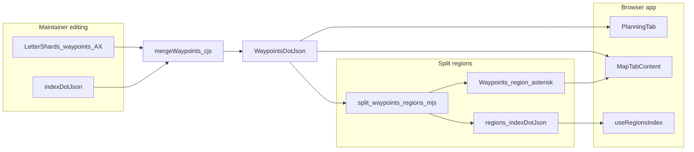

# GeoJSON・ウェイポイント・静的地図資産

> **配置**（2026-04）: 旧 `public/geojson/README.md`・`public/geojson/waypoints/README.md` の内容を本ファイルに集約。リポジトリ上の JSON/GeoJSON 実体は引き続き `public/geojson/`（ビルド成果物用）。

## 正本・編集用シャード・ランタイム読込（AI / 開発者向け）

ウェイポイント周りだけ **3つの役割** に分けると、アプリ読込と運用編集が切り離せます。

| 層 | パス・実体の例 | アプリから参照されるか | 説明 |
|----|----------------|------------------------|------|
| **編集時の入力（アルファベット別）** | `public/geojson/waypoints/waypoints_[A-Z].json`, `public/geojson/waypoints/index.json` | **しない** (`src/` にパス無し） | 部分編集・ソート用。`scripts/waypoints/mergeWaypoints.cjs` で結合される。 |
| **結合正本・地図用分割** | `public/geojson/Waypoints.json`（全件）, `public/geojson/waypoints/waypoints_region_*.json`, `public/geojson/waypoints/regions_index.json` | **する** | マップは地域タイル読込＋フォールバックで全件。計画タブでも全件取得。 |
| **その他レイヤ GeoJSON** | `Airports.geojson`, `Navaids.geojson`, `ACC_*`, `TrainingArea*` 等 | **する** | 計画／地図タブ共通。 |

**実行時フェッチの正本コード**: [`PlanningTab.tsx`](../src/pages/planning/components/flight/PlanningTab.tsx)（`/geojson/Waypoints.json` 等）、[`MapTabContent.tsx`](../src/pages/planning/components/map/MapTabContent.tsx)、[`useRegionsIndex.ts`](../src/pages/planning/components/map/hooks/useRegionsIndex.ts)。



**本番デプロイの補足**: アルファベット別シャードはブラウザが読まないため、**.vercelignore** で **Vercel へのアップロードのみ**から除外できる（転送・ビルド入力の軽量化）。**Git とローカル `npm run build` は従来どおり**。ローカルのマージ／分割フローは変えない。

---

## データ構造

FlightAcademyのウェイポイントデータは以下の階層で管理されています：

```
public/geojson/
├── Waypoints.json               # すべてのウェイポイントを統合したメインファイル
├── waypoints/                   # 分割されたウェイポイントデータディレクトリ
│   ├── waypoints_A.json         # アルファベット順（編集用・マージ入力。アプリは未フェッチ）
│   ├── waypoints_B.json
│   ├── ... (他のアルファベット)
│   ├── waypoints_region_hokkaido.json  # 地域別（地図の遅延読込用）
│   ├── waypoints_region_tohoku.json
│   ├── ... (他の地域)
│   ├── index.json               # アルファベット順シャード一覧（編集チェーン用）
│   └── regions_index.json       # 地域一覧（ランタイム）
scripts/waypoints/
├── mergeWaypoints.cjs           # シャード → Waypoints.json
├── split-waypoints.mjs          # Waypoints.json → アルファベット別シャード
└── split-waypoints-regions.mjs  # Waypoints.json → 地域別
```

### サブディレクトリ `waypoints/` について

アルファベット別（`waypoints_A.json` …）と地域別（`waypoints_region_*.json`）に分割し、`index.json` / `regions_index.json` で参照します。`FeatureCollection` 形式・座標系 CRS84 については、追加・編集時に既存ファイルと同じ骨子に揃えてください。

## ウェイポイントデータ形式

各ウェイポイントはGeoJSON形式で、以下の構造を持ちます：

```json
{
  "type": "Feature",
  "properties": {
    "id": "WAYPOINT_ID",      // 識別子（通常5文字）
    "type": "Compulsory",     // タイプ：Compulsory または Non-Compulsory
    "name1": "ウェイポイント名" // 日本語名称
  },
  "geometry": {
    "type": "Point",
    "coordinates": [
      139.7670,              // 経度（ddd.dddd形式、小数点以下4桁）
      35.6814                // 緯度（dd.dddd形式、小数点以下4桁）
    ]
  }
}
```

## ウェイポイントの分類

ウェイポイントは以下の方法で分類されています：

1. **アルファベット別**: ウェイポイントIDの先頭文字によるファイル分け
2. **地域別**: 以下の10地域に分類
   - 北海道地域、東北地域、関東地域、中部地域、近畿地域
   - 中国地域、四国地域、九州地域、沖縄地域、その他地域

## 新しいウェイポイントの追加手順

新しいウェイポイントを追加する手順は以下の通りです：

1. **アルファベット別ファイルに追加**

   適切なアルファベットファイル（例：`waypoints_A.json`）に新しいウェイポイントを追加します。

   ```json
   {
     "type": "Feature",
     "properties": {
       "id": "ANEW1",
       "type": "Non-Compulsory",  // または "Compulsory"
       "name1": "新規ポイント"
     },
     "geometry": {
       "type": "Point",
       "coordinates": [
         135.4500,
         34.6800
       ]
     }
   }
   ```

2. **マージスクリプトの実行**

   すべてのウェイポイントをマージして `Waypoints.json` を更新します：

   ```bash
   node scripts/waypoints/mergeWaypoints.cjs
   ```

3. **地域分割スクリプトの実行**

   地域別ファイルを更新します（リポジトリルートから）：

   ```bash
   node scripts/waypoints/split-waypoints-regions.mjs
   ```

## ソート順とデータ整合性

* 各アルファベット別ファイル内のウェイポイントは、ID（例：ABASA, ABASI, ...）のアルファベット順に並べられています
* 新しいウェイポイントを追加した後、ファイル内のウェイポイントを再ソートするには、以下のようなスクリプトを実行します：

  ```bash
  node scripts/waypoints/sortWaypointsX.cjs  # Xは対象のアルファベット（A, B, C等）
  ```

* すべてのウェイポイントの座標は、経度：ddd.dddd、緯度：dd.dddd形式で統一されています

## 注意事項

- **データの整合性**: 常に上記の手順に従い、必ずマージと分割の両方を実行してください。
- **タイプの保持**: ウェイポイントの`type`属性（`Compulsory`または`Non-Compulsory`）は維持されます。
- **IDの重複**: 同じIDのウェイポイントが存在しないように注意してください。
- **バックアップ**: 重要な変更を行う前には、既存のファイルをバックアップしてください。

## 開発向け情報

- マージスクリプト（`scripts/waypoints/mergeWaypoints.cjs`）は CommonJS です。
- 分割スクリプト（`scripts/waypoints/split-waypoints.mjs`, `scripts/waypoints/split-waypoints-regions.mjs`）は ES Modules です（作業ディレクトリはリポジトリルート前提）。
- 地域の座標範囲は `split-waypoints-regions.mjs` 内の `regions` で定義されています。

## その他のGeoJSONデータ

- `ACC_Sector_High.geojson` - 高高度セクター情報
- `ACC_Sector_Low.geojson` - 低高度セクター情報
- `Airports.geojson` - 空港データ
- `Navaids.geojson` - 航法援助施設データ
- `RAPCON.geojson` - レーダー進入管制データ
- `RestrictedAirspace.geojson` - 制限空域データ
- `TrainingAreaCivil.geojson` - 民間訓練区域
- `TrainingAreaHigh.geojson` - 高高度訓練区域
- `TrainingAreaLow.geojson` - 低高度訓練区域

## 利用方法

**フロント実行時**: ウェイポイントは **`/geojson/Waypoints.json`（全件）** と、地図向け **`/geojson/waypoints/waypoints_region_*.json` + `regions_index.json`** が使われます。アルファベット別ファイルは読み込みません。

大域表示やフォールバックで全件を扱う箇所ではメインファイルを、閲覧範囲が地域に限定できる UI では地域ファイルだけで描画コストを下げられます。

## トラブルシューティング

- **データが反映されない**: ブラウザのキャッシュをクリアするか、強制リロード（Ctrl+F5）してください
- **Non-Compulsoryデータが消失**: マージと分割の両方のスクリプトがプロパティを維持していることを確認してください
- **スクリプトエラー**: Node.jsのバージョンが互換性があることを確認してください（v14以上推奨）

## 更新履歴

- 2026-05-05: 正本／編集シャード／ランタイム読込の表・Mermaid、スクリプトパス修正、`.vercelignore` との関係を追記
- 2025-03-28: ウェイポイントのname1を修正（OMUTA: オオムタ→オームタ, OTAKI: オオタキ→オタキ）
- 2025-03-27: O始まりのウェイポイントを47件追加
- 2025-03-26: Oのウェイポイントをアルファベット順にソート
- 2025-03-25: 座標形式を統一（経度：ddd.dddd、緯度：dd.dddd）
- 2025-03-24: A〜Cのウェイポイントをアルファベット順にソート
- 2025-03-23: 新規ウェイポイントの追加（A, B領域）
- 2025-03-23: Non-Compulsoryタイプのウェイポイントデータ修正、READMEの包括的更新
- 2025-03-22: ウェイポイントデータをアルファベット別および地域別に分割
- 2026-04-25: 当ドキュメントを `docs/` に集約（`public/geojson` の README をスタブ化）
