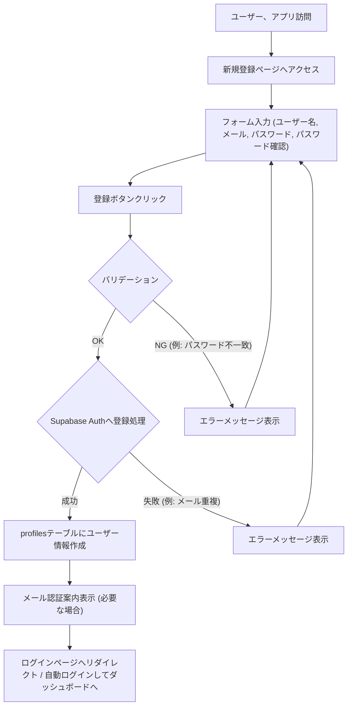
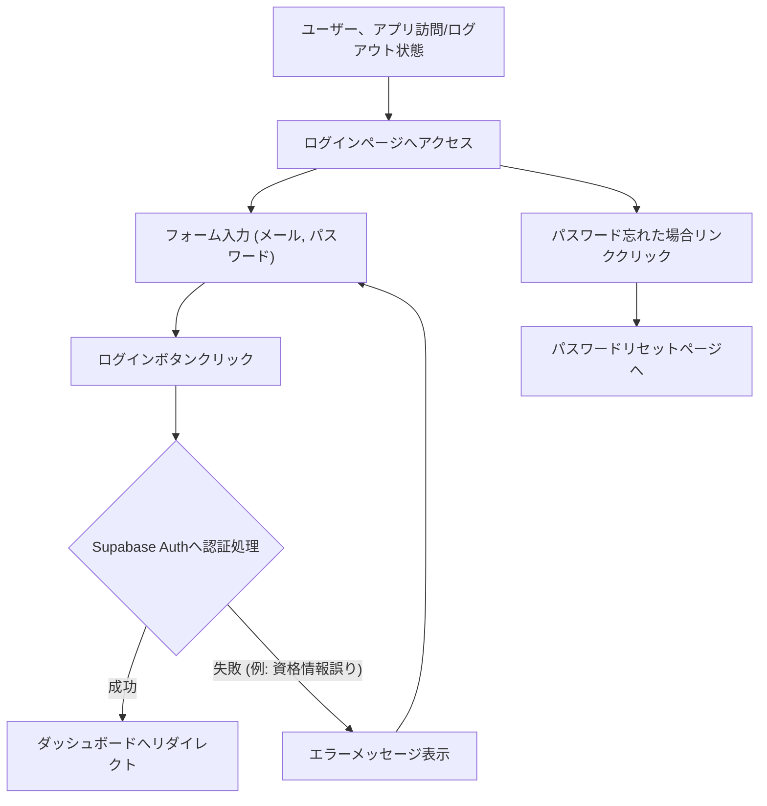

# 04 UI/UX仕様書

本ドキュメントでは、Web4択問題アプリのユーザーインターフェース (UI) とユーザーエクスペリエンス (UX) の仕様を定義します。ワイヤーフレームはテキストベースで表現し、主要な画面構成とインタラクションを記述します。

## 1. 全体的なユーザーストーリー/フロー (Mermaid)

### 1.1 新規登録フロー


### 1.2 ログインフロー


### 1.3 標準学習フロー（今日の復習から開始)
```mermaid
graph TD
    A[ユーザー、ログイン済み] --> B[ダッシュボード表示];
    B --> C["「今日の復習」セクション確認"];
    C -- 復習問題あり --> D["「復習を開始する」ボタンクリック"];
    D --> E["`get_review_questions` RPC実行"];
    E --> F[問題解答画面表示 (1問目)];
    F -- 解答選択 & 「解答する」 --> G["`submit_answer` RPC実行"];
    G --> H[正誤・解説表示];
    H --> I{次の問題あり?};
    I -- Yes --> F;
    I -- No --> J[学習結果画面表示];
    J --> K["スコア・結果確認"];
    K --> B;
    C -- 復_習問題なし / または別のアクション --> L{他の学習方法を選択};
    L -- おすすめカテゴリ --> M[ダッシュボードのおすすめカテゴリ選択];
    M --> N[該当カテゴリのデッキ一覧/選択へ (TBD)];
    N --> F;
    L -- すべてのデッキを見る --> O[デッキ一覧画面へ];
    O -- デッキ選択 --> F;

```

### 1.4 問題管理フロー
```mermaid
graph TD
    A[Adminユーザー、ログイン済み] --> B[問題管理ページへアクセス];
    B --> C["CSVインポートセクションへ"];
    C --> D["デッキ名入力"];
    D --> E["カテゴリ名入力/選択"];
    E --> F["CSVファイル選択"];
    F --> G["「インポート開始」ボタンクリック"];
    G --> H["フロントエンドでファイル読み込み・バリデーション(簡易)"];
    H --> I["`import_deck_from_csv` RPC実行 (CSVデータ送信)"];
    I -- 成功 --> J["インポート結果表示 (成功件数)"];
    J --> B;
    I -- 失敗 --> K["エラーメッセージ表示 (詳細)"];
    K --> C;

```

### 1.5 デッキ学習フロー
```mermaid
graph TD

## 2. 主要画面ワイヤーフレーム（テキストベース）

### 2.1.A 認証画面関連
*   **A-1. ログイン画面 (`/login`)**
    ```
    --------------------------------------------------
    | FlightAcademy Quiz - ログイン                  | (ヘッダー)
    --------------------------------------------------
    | メールアドレス: [入力フィールド]               |
    | パスワード:   [入力フィールド (type=password)] |
    | [ログイン] ボタン                             |
    |                                                |
    | パスワードをお忘れですか？ (リンク -> /reset-password) |
    | アカウントをお持ちでない場合 (リンク -> /signup)   |
    --------------------------------------------------
    ```
*   **A-2. 新規登録画面 (`/signup`)**
    ```
    --------------------------------------------------
    | FlightAcademy Quiz - 新規登録                  | (ヘッダー)
    --------------------------------------------------
    | ユーザー名:   [入力フィールド]                 |
    | メールアドレス: [入力フィールド]               |
    | パスワード:   [入力フィールド (type=password)] |
    | パスワード確認: [入力フィールド (type=password)] |
    | [登録する] ボタン                             |
    |                                                |
    | 既にアカウントをお持ちの場合 (リンク -> /login) |
    --------------------------------------------------
    ```
*   **A-3. パスワードリセット要求画面 (`/request-password-reset`)**
    ```
    --------------------------------------------------
    | FlightAcademy Quiz - パスワードリセット        | (ヘッダー)
    --------------------------------------------------
    | メールアドレス: [入力フィールド]               |
    | [パスワードリセットメールを送信] ボタン         |
    |                                                |
    | ログイン画面へ戻る (リンク -> /login)          |
    --------------------------------------------------
    ```
*   **A-4. パスワード更新画面 (`/update-password` - メール内のリンク先)**
    ```
    --------------------------------------------------
    | FlightAcademy Quiz - 新しいパスワード設定      | (ヘッダー)
    --------------------------------------------------
    | 新しいパスワード: [入力フィールド (type=password)] |
    | 新しいパスワード確認: [入力フィールド (type=password)] |
    | [パスワードを更新] ボタン                       |
    --------------------------------------------------
    ```

### 2.2.B ダッシュボード画面(/dashboard)
```
--------------------------------------------------------------------
| (ヘッダー) FlightAcademy Quiz | ようこそ、[ユーザー名]さん | (ログアウトボタン) |
--------------------------------------------------------------------
| セクション1: 学習進捗サマリー                                      |
|   - 総学習問題数: XXX問                                         |
|   - 平均正解率: XX%                                            |
|   - 学習日数: XX日                                             |
--------------------------------------------------------------------
| セクション2: 今日の復習 (XXX問)                                   |
|   (復習問題がある場合) [復習を開始する] ボタン                      |
|   (復習問題がない場合) "今日の復習はありません！素晴らしいです。"        |
--------------------------------------------------------------------
| セクション3: おすすめ学習カテゴリ (苦手カテゴリがある場合)           |
|   - [苦手カテゴリA名 (正答率XX%)]: [学習開始] ボタン                |
|   - [苦手カテゴリB名 (正答率YY%)]: [学習開始] ボタン                |
--------------------------------------------------------------------
| セクション4: カテゴリ別正答率 (レーダーチャート)                     |
|   [レーダーチャートコンポーネントエリア]                             |
|   (軸: 航法, 航空法規, 気象, 機体, 通信など、主要カテゴリ固定)       |
|   (各軸のスケールは0-100%)                                       |
--------------------------------------------------------------------
| セクション5: アクション                                            |
|   [すべてのデッキを見る] ボタン (-> /decks)                       |
|   (Adminの場合) [問題管理へ] ボタン (-> /admin/questions)          |
--------------------------------------------------------------------
```

### 2.3.C デッキ一覧・選択画面（/decks)
```
--------------------------------------------------------------------
| (ヘッダー) FlightAcademy Quiz - デッキ一覧 | (ダッシュボードへ戻る) |
--------------------------------------------------------------------
| フィルタ:                                                        |
|   カテゴリ: [ドロップダウン: すべて, 航法, 航空法規, ...]           |
|   (検索バー: デッキ名で検索)                                     |
| (Adminの場合) [+ 新規デッキ作成] ボタン (-> /admin/decks/new)    |
--------------------------------------------------------------------
| デッキリストエリア (スクロール可能):                               |
|   -------------------------------------------------------------- |
|   | デッキタイトル: [デッキAのタイトル]                            |
|   | カテゴリ: [カテゴリ名] | 問題数: XX問                      |
|   | あなたの進捗: YY%完了 (最後に学習: YYYY/MM/DD)             |
|   | [このデッキを学習開始] ボタン (-> /quiz/[deck_id])            |
|   | (Admin/作成者の場合) [編集] [削除] ボタン                    |
|   -------------------------------------------------------------- |
|   | デッキタイトル: [デッキBのタイトル]                            |
|   | ...                                                          |
|   -------------------------------------------------------------- |
|   (デッキがない場合) "表示できるデッキがありません。"               |
--------------------------------------------------------------------
```

### 2.4.D 問題解答画面(/quiz/[deck_id])
```
--------------------------------------------------------------------
| (ヘッダー) [デッキ名] - 問題 [現在の問題番号]/[総問題数] | タイマー: [MM:SS] | (終了ボタン) |
--------------------------------------------------------------------
| プログレスバー: [||||||----] (現在の進捗)                       |
--------------------------------------------------------------------
| 問題文エリア:                                                    |
|   <p class="text-xl">Q. [ここに問題文がHTML形式で入る可能性も考慮]</p> |
--------------------------------------------------------------------
| 選択肢エリア (ラジオボタン or カスタムコンポーネント):               |
|   <div class="my-2 p-2 border rounded hover:bg-gray-100">        |
|     <input type="radio" name="option" value="0" id="opt0">       |
|     <label for="opt0">[選択肢Aの内容]</label>                     |
|   </div>                                                         |
|   <div class="my-2 p-2 border rounded hover:bg-gray-100">        |
|     <input type="radio" name="option" value="1" id="opt1">       |
|     <label for="opt1">[選択肢Bの内容]</label>                     |
|   </div>                                                         |
|   ... (選択肢C, D)                                               |
--------------------------------------------------------------------
| アクションボタンエリア:                                            |
|   [解答する] ボタン (選択肢が1つ選ばれるまで非活性)                |
--------------------------------------------------------------------
| (解答後表示エリア - 「解答する」ボタン押下後に表示、ボタンは非表示に) |
|   <div class="p-4 mt-4 border-t">                                |
|     <h3 class="text-lg font-semibold">結果: [正解！/不正解...]</h3> |
|     <p>あなたの解答: [選択した選択肢の内容]</p>                     |
|     (不正解の場合) <p>正解: [正解の選択肢の内容]</p>               |
|     <hr class="my-2">                                            |
|     <h4 class="font-semibold">解説:</h4>                           |
|     <p>[ここに解説文が入ります]</p>                                |
|     (解説画像がある場合)  |
|     <p>解答時間: XX秒</p>                                        |
|   </div>                                                         |
|   [次の問題へ] ボタン (最終問題でない場合)                         |
|   [結果を見る] ボタン (最終問題の場合 -> /quiz/[deck_id]/results) |
--------------------------------------------------------------------
| 下部アクションエリア:                                              |
|   マーク: [チェック]ボタン [わからない]ボタン (トグル式)           |
--------------------------------------------------------------------
```

### 2.5.E 学習結果画面(/quiz/[deck_id]/results)
```
--------------------------------------------------------------------
| (ヘッダー) FlightAcademy Quiz - 学習結果: [デッキ名] | (ダッシュボードへ) |
--------------------------------------------------------------------
| 結果サマリー:                                                      |
|   - スコア: XX問 / YY問 (正解率: ZZ%)                             |
|   - 総解答時間: MM分SS秒                                           |
--------------------------------------------------------------------
| 解答一覧 (スクロール可能):                                         |
|   -------------------------------------------------------------- |
|   | 問題1: [問題文の冒頭...] - [正解/不正解] (あなたの解答: X, 正解: Y) |
|   |   [詳細を見る/解説を開く] (クリックでモーダル表示 or アコーディオン展開) |
|   -------------------------------------------------------------- |
|   | ...                                                          |
|   -------------------------------------------------------------- |
--------------------------------------------------------------------
| アクション:                                                        |
|   [もう一度このデッキに挑戦する] ボタン (-> /quiz/[deck_id])        |
|   [間違えた問題だけ復習する] ボタン (-> 新しいセッション開始、ロジック要検討) |
|   [デッキ一覧へ戻る] ボタン (-> /decks)                           |
--------------------------------------------------------------------
```

### 2.6.F 問題管理画面(Admin)(/admin/*)
*   **F-1. Adminダッシュボード/ナビゲーション (`/admin`)**
    ```
    --------------------------------------------------------------------
    | (ヘッダー) FlightAcademy Quiz - 管理画面 | (メインサイトへ) | (ログアウト) |
    --------------------------------------------------------------------
    | ナビゲーション:                                                  |
    |   - [カテゴリ管理] (-> /admin/categories)                      |
    |   - [デッキ管理] (-> /admin/decks)                            |
    |   - [問題管理 (CSVインポート含む)] (-> /admin/questions)         |
    |   - [ユーザー管理] (-> /admin/users) (MVP+?)                    |
    --------------------------------------------------------------------
    | (メインエリアに選択された管理機能が表示される)                     |
    ```
*   **F-2. カテゴリ管理 (`/admin/categories`)**
    *   カテゴリ一覧 (ID, 名前, 作成者(ユーザーorシステム))
    *   新規作成フォーム (名前)
    *   編集/削除ボタン
*   **F-3. デッキ管理 (`/admin/decks`)**
    *   デッキ一覧 (ID, タイトル, カテゴリ, 作成者, 問題数)
    *   新規作成フォーム (タイトル, 説明, カテゴリ選択)
    *   編集/削除ボタン
    *   各デッキに紐づく問題一覧へのリンク
*   **F-4. 問題管理・CSVインポート (`/admin/questions`)**
    *   **CSVインポートセクション**:
        *   デッキ名入力フィールド
        *   カテゴリ名入力/選択フィールド
        *   CSVファイルアップロードフィールド
        *   [インポート実行] ボタン
    *   **問題一覧・編集セクション**:
        *   デッキ選択ドロップダウン (選択されたデッキの問題を表示)
        *   問題一覧 (ID, 問題文冒頭, 難易度)
        *   新規問題作成フォーム (デッキ選択, 問題文, 選択肢1-4, 正解インデックス, 解説, 解説画像URL, 難易度)
        *   編集/削除ボタン

### 2.7.G 学習分析画面(Admin/Teacher-MVP+)
*   (*MVP+のため詳細は後日詰めるが、基本的な構成要素案*)
*   Student一覧 (名前、メール、最終ログイン日、総学習時間など)
*   Student選択後の詳細:
    *   学習カレンダー/ヒートマップ
    *   カテゴリ別正答率・進捗 (表形式 + レーダーチャート)
    *   デッキ別正答率・進捗
    *   最近間違えた問題リスト