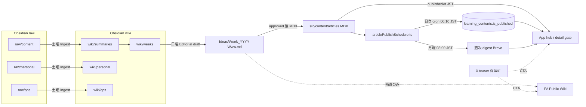

# 週末コンテンツ・パイプライン（正本）

**作成**: 2026-08-01  
**用途**: Obsidian raw → wiki → Ideas → Articles / Notion Public Wiki / X  
**頭脳**: Cursor（土曜 Ingest / 日曜 Editorial）。毎朝無人実行はしない。

関連 Skill: `.cursor/skills/weekend-ingest/` · `.cursor/skills/weekend-editorial/`

---

## 1. チャネル契約

| 層 | 役割 | 正本性 |
|----|------|--------|
| **Articles**（`src/content/articles/*.mdx`） | 記事正本。将来マネタイズ核 | 最高 |
| **Notion FA Public Wiki** | 読者向け補遺 Wiki（用語・細部） | 中（Articles の代替ではない） |
| **X** | 案内・フック → 長文着地（Public Wiki **または** Articles） | 入口のみ |
| **Obsidian** | 非公開の原料・蒸留・週次設計 | 運営用（公開しない） |
| **Notion T-4 ハブ** | 受け持ち学生専用。週次集客導線に使わない | 別系統 |

### 導線

```text
X（案内）
  → Articles（正本） または FA Public Wiki（補遺）
T-4｜学習ホーム →（一方通行）→ FA Public Wiki
FA Public Wiki → T-4 へのリンクは禁止
```

### Notion URL（2026-08-01）

| ページ | URL | 共有方針 |
|--------|-----|----------|
| **FA Public Wiki** | https://app.notion.com/p/3afc93b5d5148110a3e1efd43c8e9598 | X 誘導可（Web / リンク共有） |
| Wiki Pages DB | https://app.notion.com/p/42d1e748a563420a93f021cbbf0cf2fe | Public Wiki 配下 |
| **T-4｜学習ホーム** | https://app.notion.com/p/3a8c93b5d514813abf5ada500efc75fa | **受け持ち学生のみ**（招待制推奨） |
| **T-4｜教官作業場** | https://app.notion.com/p/3a8c93b5d51481a5adccde676ae6f56e | 教官のみ |

**一方通行の実装**: Public Wiki は T-4 の子にしない（独立ページ）。T-4 側にのみ Public Wiki への mention を置く。Public Wiki・Wiki Pages・X 文面に T-4 URL を書かない。  
**共有設定は人手**: Notion MCP では ACL を変えられない。T-4 を「リンクを知る全ユーザー」のままにすると一方通行リンクだけでは流入を止められない。受け持ち学生専用に絞ること。

---

## 2. フォルダ契約（Obsidian Vault）

Vault: `iCloud~md~obsidian` / `FlightAcademy/`

```text
raw/content/     … FA 発信候補（Web Clipper 既定）
raw/personal/    … 英語・AI・私生活など（消さない・週次弧に入れない）
raw/ops/         … 開発・MCP・セキュリティ（消さない・発信しない）
wiki/summaries/  … content の要約
wiki/personal/   … personal の整理要約
wiki/ops/        … ops メタ要約
wiki/weeks/      … 土曜の週次表紙
Ideas/           … Week_YYYY-Www.md（日曜成果物）
ops/failure-log/ … 却下理由→生成ルール
Lessons/         … 触らない（学科正本ミラー）
Articles/        … ミラー参照のみ。正本は Git MDX
```

**Inbox**: 新規クリップは `raw/content`（または personal/ops）。旧 `メモ/` は 2026-W31 Ingest で廃止。

**Lessons 独立**: raw/wiki 経路に学科正本を入れない。

### 2.1 状態グラフ（運用ノード）

エージェント自動オーケストレーションはしない。人間が週末に動かすときのゲート付き地図。



**ゲート（破ると契約違反）**

| ゲート | ルール |
|--------|--------|
| personal/ops → Ideas | 入れない（消さない） |
| Ideas → MDX | `status: approved` 後のみ |
| MDX → 読者表示 | `publishedAt <= 今日(JST)` かつ DB `is_published` |
| 公開 CTA | Articles or Public Wiki。**T-4 禁止** |
| Public Wiki | T-4 へリンクしない |

関連 Skill: `weekend-ingest` / `weekend-editorial` / `weekly-article-digest` / `article-publish-check` / `learning-contents-registration`

---

## 3. 読者・品質

- 読者: パイロットを目指す若者（訓練生〜志望層）
- 1週1原則。パターン A–E をローテ（ナラティブ / PREP / 結論先出し / PAS / So what）
- 本数: 目標 5、最低合格 3。水増し禁止
- wiki 文章の Articles へのコピペ禁止（論点のみ Ideas 経由）

---

## 4. 既存メモ初回振分（2026-08-01 確定）

| メモ | bucket |
|------|--------|
| ラッキー｜Obsidian活用術 | ops（パイプライン設計図） |
| 噛みくだくん｜第二の脳 | ops |
| とろテック｜失敗ログ | ops |
| もとやま｜当たり前の基準値 | **content**（最優先） |
| 前田｜部下が辞めない上司 | **content** |
| そう｜GitHub急上昇 | ops |
| キム｜MCP 8選 | ops |
| チャエン｜codex-security | ops |

---

## 5. 土曜プロンプト（Ingest + Lint）

Skill `weekend-ingest` と同一。チャットに貼る場合もこの節を正とする。

```markdown
# 役割
あなたは FlightAcademy 運営の「週末インジェスト係」です。
今日は土曜。Ingest（取り込み）と軽い Lint だけ。
来週の発信弧・Articles執筆・X投稿・Notionページ量産は禁止。

# 必読
先に docs/ops/Weekend_Content_Pipeline.md を読み、契約に従う。
Obsidian MCP（vault: iCloud~md~obsidian）で FlightAcademy/ を操作する。

# チャネル契約（今日は Obsidian 内のみ）
- Articles = 正本 / Notion FA Public Wiki = 公開補遺 / X = 案内→Articles or Public Wiki
- T-4 ハブは受け持ち学生専用。Public Wiki から T-4 へリンクしない（一方通行）
- FA に使えない個人ネタも消さない（personal / ops）

# フォルダ
raw/content, raw/personal, raw/ops,
wiki/summaries, wiki/personal, wiki/ops, wiki/weeks,
Ideas, ops/failure-log
無ければ作成。新規クリップは raw/* へ（旧 メモ/ は廃止）。

# 振分
1 content  2 personal  3 ops  4 discard_candidate（消さずマークのみ）

# content Ingest
wiki/summaries/YYYY-MM-DD_slug.md に:
source_url, saved_at, bucket, 3行要約, 論点≤3,
youth_pilot_translation（または impossible）,
articles_seed（使える/保留/不向き）,
notion_seed（Public Wiki ページ案 or none）,
x_seed（案内1投稿の核。CTAは Articles or Public Wiki。T-4禁止）,
series_hint
本文コピペ再利用禁止。リンクのみなら「本文未取得」でスキップ理由を書く。

# personal / ops
それぞれ wiki/personal または wiki/ops に短く残す。週次弧に入れない。消さない。

# 週次表紙
wiki/weeks/YYYY-Www.md を更新（件数・使える一覧・スキップ・日曜への注意）。

# 軽い Lint
矛盾・重複を weeks に列挙。深い再編はしない。

# 禁止
Lessons/Articles MDX/Notion実投稿/X実投稿、日曜ストーリー確定、ファイル削除、
一般ビジネスの無理な航空翻訳、T-4 URL を公開導線に書くこと。

# 完了
日曜向け1段落サマリーをチャットに出す。
```

---

## 6. 日曜プロンプト（Editorial → Ideas）

Skill `weekend-editorial` と同一。

```markdown
# 役割
あなたは FlightAcademy の「日曜編集長」。来週の発信弧を Ideas に落とす。設計まで。承認前に公開しない。

# 必読
docs/ops/Weekend_Content_Pipeline.md
wiki/weeks 直近、wiki/summaries（使える/保留）、Ideas/SeriesBible と FusionPlan（あれば）、
ops/failure-log（関連ルールのみ）

# チャネル
X（案内）→ Articles または Notion FA Public Wiki（長文）
T-4 ハブは CTA に使わない。Public Wiki に T-4 リンクを書かない。

**Articles 公開（2026-08）**: 週末に MDX 一括コミット可。日次表示は `publishedAt`（JST）+ cron `article-publish-sync`。
週次メール案内（X 保留時）: cron `article-weekly-digest`（日曜 17:00 JST／来週予告＋今週リマインド）。一時的に明示メールOFF以外へブロードキャスト。詳細は [04_Operations_Guide.md](../04_Operations_Guide.md)。

# パターン（1つ。先週と同じなら理由）
A ナラティブ B PREP C 結論先出し D PAS E So what

# 本数
目標5・最低3。水増し禁止。

# 出力
Ideas/Week_YYYY-Www.md（status: draft のまま）
各日: working_title, beat, emotion_goal, key_point,
articles_angle, notion_angle（Public Wiki or none）,
x_draft（案内＋CTA先を Articles or Public Wiki で明示。T-4禁止）,
series_hook（週あたり最大1）

# 品質ゲート
- 明日の自習/Brief/同期会話に落ちる
- Articles/Notion/X の役割が重複しない
- personal/ops が本線を汚染していない
- Lessons 非接触・盗用なし・approved にしない

# 完了
パス提示 → タイトル一覧 → approved 可否を私に確認して停止。
```

---

## 7. 変更履歴

| 日付 | 内容 |
|------|------|
| 2026-08-01 | 初版。週末運用・一方通行 Notion・土日プロンプト・振分表 |
| 2026-08-01 | W31 Ingest。旧 `メモ/` Inbox 廃止。クリップは `raw/*` のみ |
| 2026-08-01 | 連続性ロック: 過去＝同期／現在＝二人とも教官（見習い道真廃止）。詳細は Ideas/SeriesBible |
| 2026-08-01 | Gemini回顧プロンプト正本: [Gemini_Memoir_Article_System_Prompt.md](Gemini_Memoir_Article_System_Prompt.md)。W32 Mon MDX `4.1.1_ChoresAreTheJob` |
| 2026-08-08 | §2.1 状態グラフ。Skills `weekly-article-digest` / `article-publish-check`。Articles ドリップ＋週次メール運用をグラフに接続 |
